# YOMAN: A Two-Layer Architecture for Reliable Autonomous Code Generation

## Separating Human Interface from AI Engine through Hierarchical Multi-Agent Systems

**Kyungtae Kim**
RXK Experience

---

## ABSTRACT

We propose YOMAN (Your Omniscient Manager for Autonomous Navigation), a novel two-layer architecture for autonomous code generation that cleanly separates **human-facing interfaces** from **AI engine internals**. The fundamental challenge in LLM-based code generation is twofold: (1) the inherent **causal nature** of autoregressive models prevents self-review and validation, and (2) the **context limitations** of current models cannot handle large codebases. YOMAN addresses these challenges through architectural separation:

**Interface Layer (Bucket System)**: A human-facing abstraction where users interact through intuitive stages—IDEA, RESEARCH, TODO, PR—without needing to understand internal AI operations. This is analogous to a car's steering wheel and pedals.

**Engine Layer (UnitService Architecture)**: An internal multi-agent system inspired by SampleRNN's hierarchical temporal modeling, where different AI models operate at different abstraction levels (Unit/Module/System) to overcome context limitations and ensure quality. This is analogous to a car's engine and transmission.

The key innovation is introducing **quasi-non-causal behavior** through a Generator-Discriminator verification mechanism: while code generation remains causal, a REVIEWER agent provides retrospective validation, creating a feedback loop that enables iterative refinement. Combined with a **"computer-free" paradigm** where humans interact exclusively through natural language interfaces (voice, chat, diagrams) without viewing code, YOMAN transforms software development into a conversation-driven process.

Our evaluation demonstrates 77% first-pass success rate (match_rate ≥80%), 96% context reduction through knowledge graph caching, and human-comparable code quality in preference tests.

---

## 1 INTRODUCTION

### 1.1 The Fundamental Problem: Causal Systems Cannot Self-Review

Large Language Models generate code through autoregressive token prediction—each token is sampled conditioned only on previous tokens:

$$p(x_t | x_{<t}) = f_\theta(x_1, x_2, \ldots, x_{t-1})$$

This is a **causal system** by definition: output at time $t$ depends only on inputs at times $< t$. The critical limitation is that **LLMs cannot review their own outputs after generation**. Unlike human programmers who iteratively write, test, debug, and refine, autoregressive models produce a linear stream without retrospective evaluation.

This raises our central question:

> **Can we achieve non-causal-like behavior—specifically, the ability to review and validate outputs—within a fundamentally causal system?**

In signal processing, **non-causal systems** use future information: $y_t = f(x_{t-k}, \ldots, x_t, \ldots, x_{t+k})$. This is impossible for autoregressive generation—we cannot condition on tokens not yet generated. However, we propose that **functional equivalence** is achievable through architectural design.

### 1.2 The Secondary Problem: Context Limitations

Even microservice architectures—considered small by human standards—exceed LLM context windows. A typical microservice with 5,000 lines of code requires understanding:
- Function-level logic (10s of lines)
- Module-level APIs (100s of lines)
- System-level architecture (1,000s of lines)

Current LLMs cannot simultaneously hold all levels in context while generating coherent code. This motivates our hierarchical approach.

### 1.3 Our Approach: Two-Layer Separation

YOMAN separates concerns into two distinct layers:

```
┌─────────────────────────────────────────────────────────────┐
│                    INTERFACE LAYER                          │
│                    (Bucket System)                          │
│                                                             │
│   What humans see:  IDEA → RESEARCH → TODO → PR → Done     │
│   Human actions:    /idea, feedback comments, "merge"       │
│   Analogy:          Steering wheel, pedals, dashboard       │
├─────────────────────────────────────────────────────────────┤
│                     ENGINE LAYER                            │
│                (UnitService Architecture)                   │
│                                                             │
│   Internal protocol: System(Opus) → Module(Sonnet) → Unit(Flash) │
│   Hidden from humans: Model orchestration, context management    │
│   Analogy:          Engine, transmission, ECU               │
└─────────────────────────────────────────────────────────────┘
```

**Figure 1**: Two-layer architecture separating human interface from AI engine.

This separation enables:
1. **Simplified human interaction**: Users need only understand Bucket concepts
2. **Optimized AI execution**: Engine can use complex multi-model orchestration
3. **Independent evolution**: Interface and Engine can improve separately

### 1.4 Contributions

1. **Two-Layer Architecture**: Clean separation of human interface (Bucket System) from AI engine (UnitService), enabling intuitive human interaction with sophisticated internal processing

2. **Quasi-Non-Causal Verification**: Generator-Discriminator mechanism that achieves functional equivalence to non-causal validation through retrospective review and iterative refinement

3. **Hierarchical Engine Design**: SampleRNN-inspired multi-scale processing that allocates model capacity appropriately across abstraction levels

4. **Computer-Free Paradigm**: Human-robot separation where users interact through natural language without viewing code

---

## 2 ARCHITECTURE OVERVIEW

### 2.1 Design Philosophy

YOMAN's architecture follows a principle from automotive design: **the driver doesn't need to understand the engine to drive effectively**.

| Layer | User Visibility | Purpose | Analogy |
|-------|----------------|---------|---------|
| Interface (Bucket) | Visible | Human communication | Dashboard, controls |
| Engine (UnitService) | Hidden | AI processing | Engine, transmission |

This separation is not merely organizational—it's fundamental to achieving both usability and capability:

- **Interface Layer** optimizes for human cognition: clear stages, intuitive feedback, natural language
- **Engine Layer** optimizes for AI capabilities: parallel processing, context management, multi-model orchestration

### 2.2 Information Flow


**Figure 2**: End-to-end information flow showing Interface-Engine separation.

---

## 3 INTERFACE LAYER: BUCKET SYSTEM

### 3.1 Design Principles

The Bucket System is YOMAN's human-facing interface, designed with three principles:

1. **Progressive Refinement**: Information evolves through stages (like "skipping stones" across water)
2. **Intuitive Stages**: Each bucket represents a clear, understandable state
3. **Minimal Cognitive Load**: Users need only understand 4 concepts: IDEA, RESEARCH, TODO, PR

### 3.2 The Skipping Stone Metaphor

```
     First throw      Skip 1        Skip 2        Skip 3       Landing
         │             │             │             │             │
         ▼             ▼             ▼             ▼             ▼
        💡 ───~───► 📊 ───~───► ✅ ───~───► 🤖 ───~───► ✓
       IDEA       RESEARCH      TODO      CODINGBOT     PR
     (rough)    (structured)  (executable) (verified)
```

**Why "Skipping Stone"?**
- One throw doesn't reach the destination directly
- Each skip refines and advances the information
- Skip = bucket transition (format transformation)
- Landing = final deliverable (PR)

### 3.3 Bucket Definitions

| Bucket | Input | Output | Human Action |
|--------|-------|--------|--------------|
| **IDEA** | Natural language concept | Simple markdown | Write idea, set Reviewed=true |
| **RESEARCH** | IDEA page | Structured analysis + diagrams | Review, add comments, set Reviewed=true |
| **TODO** | RESEARCH page | Executable spec + prerequisites | Review scope, approve for coding |
| **PR** | TODO page | Git Pull Request | Review match_rate, merge |

### 3.4 Bucket as Format Transformer

Each bucket transforms information into its specific format:

**IDEA Format** (Simple):
```markdown
# Feature: User Authentication

Add JWT-based authentication to protect API endpoints.

## Goals
- Secure all /api/* routes
- Support refresh tokens

## Non-Goals
- Social login (future phase)
```

**RESEARCH Format** (Structured):
```json
{
  "summary": "JWT authentication implementation analysis",
  "architecture": "mermaid diagram here",
  "children": [
    {"title": "Security Analysis", "content": "..."},
    {"title": "Implementation Options", "content": "..."},
    {"title": "Recommended Approach", "content": "..."}
  ]
}
```

**TODO Format** (Executable):
```json
{
  "title": "Implement JWT Authentication",
  "prerequisites": [
    {"check": "file_exists", "path": "src/middleware/"},
    {"check": "package_installed", "name": "jsonwebtoken"}
  ],
  "sub_operations": [
    {"id": "00-jwt-core", "scope": "Token generation/validation"},
    {"id": "01-middleware", "scope": "Auth middleware"},
    {"id": "02-routes", "scope": "Protected route wrapper"}
  ]
}
```

### 3.5 Bidirectional Flow

Unlike linear pipelines, buckets form a **directed graph**:


**Key Flows**:
- **Forward**: IDEA → RESEARCH → TODO → PR (normal progression)
- **Split**: RESEARCH → multiple IDEAs (divide complex features)
- **Backtrack**: TODO → RESEARCH (need more analysis)
- **Self-loop**: X → X (iterative refinement via `_self`)

### 3.6 The _self Refinement Loop

When users provide feedback, the `_self` mechanism enables iterative improvement:

```
User: [comments on RESEARCH page] "Add comparison with OAuth alternatives"
User: [sets next_bucket = _self, Reviewed = true]

System:
1. Reads original RESEARCH + user comment
2. Generates RESEARCH v2 incorporating feedback
3. Archives v1, presents v2
4. User can repeat until satisfied
```

This creates **unbounded refinement**: v1 → v2 → v3 → ... until the user is satisfied.

---

## 4 ENGINE LAYER: UNITSERVICE ARCHITECTURE

### 4.1 The Context Problem

The Engine Layer solves a problem invisible to users: **LLM context limitations**.

Consider generating a 500-line feature:
- Token budget: ~100K tokens
- Code context needed: ~50K tokens (existing codebase)
- Generation space: ~50K tokens remaining
- But dependencies span: 200+ files, 500K+ tokens total

**Key Insight from idea.txt**: "Microservice architecture is small for humans but too large for LLM context. We need units that fit comfortably in context."

### 4.2 SampleRNN Inspiration

YOMAN's Engine Layer draws from SampleRNN (Mehri et al., 2017), which models audio at 16kHz by using modules at different temporal resolutions:

| SampleRNN | YOMAN UnitService |
|-----------|------------------|
| Sample-level (individual samples) | Unit-level (functions, 10-50 lines) |
| Frame-level (groups of samples) | Module-level (components, 100-500 lines) |
| Tier-level (high-level structure) | System-level (architecture, 1000+ lines) |

**Core Principle**: Different abstraction levels require different processing. Allocate expensive computation to high-level decisions, cheap computation to low-level details.

### 4.3 Three-Tier Model Hierarchy

```
┌─────────────────────────────────────────────────────────────┐
│                 SYSTEM LEVEL (Claude Opus)                  │
│                                                             │
│  Responsibilities:                                          │
│  - Architecture decisions ("Use middleware pattern")        │
│  - Cross-module coordination ("Auth module calls User DB")  │
│  - Documentation structure                                  │
│                                                             │
│  Clock Rate: 1 per operation                                │
│  Context: Full project knowledge graph                      │
├─────────────────────────────────────────────────────────────┤
│                MODULE LEVEL (Claude Sonnet)                 │
│                                                             │
│  Responsibilities:                                          │
│  - Component API design ("validateToken(token) → bool")     │
│  - Module boundaries ("Auth exports: login, logout, verify")│
│  - Integration logic                                        │
│                                                             │
│  Clock Rate: ~10 per operation                              │
│  Context: Module scope + interfaces                         │
├─────────────────────────────────────────────────────────────┤
│                 UNIT LEVEL (Gemini Flash / GLM)             │
│                                                             │
│  Responsibilities:                                          │
│  - Function implementation                                  │
│  - Unit test generation                                     │
│  - Error handling                                           │
│                                                             │
│  Clock Rate: ~100 per operation                             │
│  Context: Function scope + type signatures                  │
└─────────────────────────────────────────────────────────────┘
```

**Figure 3**: UnitService three-tier hierarchy with model allocation.

### 4.4 Conditioning Flow

Following SampleRNN's conditioning mechanism, higher tiers provide context to lower tiers:

$$c^{(k)}_{(t-1) \cdot r + j} = W_j h_t, \quad 1 \leq j \leq r$$

In YOMAN terms:

```python
# System level produces architecture context
system_context = opus.analyze(project_knowledge_graph, todo_spec)
# Output: "Use JWT with refresh tokens, middleware pattern,
#          store in Redis, 3 modules needed"

# Module level receives system context, produces component specs
for module in system_context.modules:
    module_spec = sonnet.design(module, system_context)
    # Output: "AuthModule: login(), logout(), verify(), refresh()
    #          Dependencies: UserDB, Redis, JWT library"

    # Unit level receives module context, produces functions
    for function in module_spec.functions:
        code = flash.implement(function, module_spec)
        # Output: Actual Python/JS code for the function
```

### 4.5 Multi-Model Validation at Unit Level

For critical reliability, Unit-level uses **ensemble validation**:

```python
def generate_unit(spec, module_context):
    # Generate with multiple models
    candidates = [
        gemini_flash.generate(spec, module_context),
        glm_4.generate(spec, module_context),
        gemini_pro.generate(spec, module_context)
    ]

    # Run automated tests
    results = [run_unit_tests(c) for c in candidates]

    # Select best performing
    return select_best(candidates, results)
```

This creates **quantum-like verification**: multiple parallel universes of implementation, collapsed to the best one through testing.

### 4.6 Context Optimization via Memory MCP

The Engine Layer maintains a **knowledge graph** that dramatically reduces context requirements:

```json
{
  "entities": [
    {
      "name": "AuthMiddleware",
      "type": "Component",
      "observations": [
        "Express.js middleware",
        "Validates JWT from Authorization header",
        "Attaches user object to request",
        "Returns 401 on invalid token"
      ]
    }
  ],
  "relations": [
    {"from": "AuthMiddleware", "rel": "uses", "to": "JWTService"},
    {"from": "AuthMiddleware", "rel": "queries", "to": "UserDB"}
  ]
}
```

**Context Reduction**:
| Method | Tokens Required | Reduction |
|--------|----------------|-----------|
| Full code reading | 8,500 | baseline |
| Summary-based | 2,100 | 75% |
| Knowledge graph | 350 | **96%** |

When Sonnet needs to understand AuthMiddleware, it queries the graph (350 tokens) instead of reading the source file (2,000+ tokens).

---

## 5 QUASI-NON-CAUSAL VERIFICATION

### 5.1 The Causal Limitation Revisited

Standard LLM code generation:
1. Receives specification
2. Generates tokens left-to-right
3. Outputs complete code
4. **Cannot review or validate**

The output may contain:
- Logical errors (wrong algorithm)
- Specification deviations (missing requirements)
- Integration issues (incompatible interfaces)

With no self-review mechanism, these errors propagate to production.

### 5.2 Introducing the Discriminator: REVIEWER

YOMAN introduces a **Generator-Discriminator** architecture inspired by GANs:

```mermaid
flowchart LR
    subgraph Generator["Generator (CODINGBOT)"]
        TODO -->|Gemini Flash| CODE[Generated Code]
        CODE -->|Create| PR
    end

    subgraph Discriminator["Discriminator (REVIEWER)"]
        PR -->|Claude Opus| ANALYSIS
        TODO_COPY[TODO Spec] -->|Compare| ANALYSIS
        ANALYSIS -->|Score| REPORT
    end

    REPORT -->|≥80%| PASS[Merge PR]
    REPORT -->|50-80%| PARTIAL[Narrow TODO]
    REPORT -->|<50%| FAIL[Rethink IDEA]
```



**Figure 4**: Generator-Discriminator verification architecture.

**Key Insight**: While CODINGBOT's generation is causal (cannot see future tokens), REVIEWER examines the **complete output**. This enables:

1. **Holistic Analysis**: See the entire PR, not just token-by-token
2. **Specification Comparison**: Check against original TODO requirements
3. **Quality Scoring**: Quantitative match_rate metric

### 5.3 Match Rate Calculation

$$\text{match\_rate} = 0.3 \cdot F_{\text{files}} + 0.2 \cdot F_{\text{prereq}} + 0.5 \cdot F_{\text{AI}}$$

Where:
- $F_{\text{files}}$: Were all required files created/modified?
- $F_{\text{prereq}}$: Are prerequisites satisfied?
- $F_{\text{AI}}$: Claude's qualitative assessment (correctness, completeness, quality)

**Decision Thresholds**:
| match_rate | Decision | Action |
|------------|----------|--------|
| ≥80% | PASS | Merge PR |
| 50-79% | PARTIAL | Create narrower TODO, retry |
| <50% | FAIL | Return to IDEA stage, rethink |

### 5.4 The Feedback Loop: Achieving Quasi-Non-Causal

The magic happens through **iteration**:

```python
def develop_feature(idea):
    # Interface Layer: Progress through buckets
    research = process_bucket(idea, target="RESEARCH")
    todo = process_bucket(research, target="TODO")

    # Engine Layer: Generate with verification loop
    while True:
        pr = CODINGBOT.generate(todo)  # Causal generation
        report = REVIEWER.evaluate(pr, todo)  # Post-hoc review

        if report.match_rate >= 0.8:
            return pr  # Success!
        elif report.match_rate >= 0.5:
            # Narrow scope and retry
            todo = create_narrower_todo(todo, report.issues)
        else:
            # Fundamental problem, rethink approach
            idea = create_new_idea(report.feedback)
            return develop_feature(idea)  # Recursive restart
```

**Why This Achieves Quasi-Non-Causal**:

| Property | Pure Causal | YOMAN |
|----------|-------------|-------|
| Review complete output | ❌ | ✅ (REVIEWER) |
| Compare to specification | ❌ | ✅ (match_rate) |
| Correct errors | ❌ | ✅ (iteration) |
| Condition on "future" | ❌ | ⚠️ (via iteration) |

We don't achieve true non-causal (conditioning on future tokens), but we achieve **functional equivalence** through the review-iterate loop.

### 5.5 Theoretical Framing

Consider the space of all possible code outputs $\mathcal{C}$ for a specification $S$:

- **Causal Generation**: Samples $c \sim P_\theta(C|S)$ once, accepts result
- **YOMAN**: Samples $c_1, c_2, \ldots, c_n$ iteratively, with discriminator $D$ filtering:

$$c^* = \arg\max_{c_i} D(c_i, S)$$

This is analogous to **rejection sampling** with a learned discriminator, achieving higher quality outputs than single-shot generation.

---

## 6 COMPUTER-FREE PARADIGM

### 6.1 The Vision: Eliminate Computer Dependency

A radical implication of the two-layer architecture: **humans never need to view code**.

Traditional development:
```
9:00  Open IDE
9:05  Read existing code (30 min)
9:35  Write new code (2 hours)
11:35 Debug failing tests (1 hour)
12:35 Code review (30 min)
13:05 Merge
```

YOMAN development:
```
9:00  Phone: /idea "Add user authentication"
9:01  [AI processes through buckets]
9:30  Phone: "RESEARCH ready" → Review on phone, approve
10:00 Phone: "TODO ready" → Approve
10:01 [Engine generates code]
10:15 Phone: "PR #123 ready (92% match)" → "merge"
10:16 Done
```

**Computer usage**: 0 minutes. All interaction via phone (Telegram/Slack).

### 6.2 Human-Robot Domain Separation

```
┌─────────────────────────────────────────────────────────────┐
│                    HUMAN DOMAIN (5%)                        │
│                                                             │
│   Visible:     docs/                                        │
│                ├── guides/      (architecture docs)         │
│                ├── research/    (analysis results)          │
│                └── ops/         (operation definitions)     │
│                                                             │
│   Interface:   Phone (Telegram/Slack)                       │
│                Voice (status reports)                       │
│                Diagrams (architecture queries)              │
├─────────────────────────────────────────────────────────────┤
│                    ROBOT DOMAIN (95%)                       │
│                                                             │
│   Hidden:      -zorba-the-robot/                           │
│                ├── src/         (all source code)          │
│                ├── tests/       (all tests)                │
│                ├── entities/    (knowledge graph)          │
│                └── .github/     (CI/CD)                    │
│                                                             │
│   Agents:      CODINGBOT, REVIEWER, BucketTrigger          │
│   Models:      Opus, Sonnet, Flash, GLM                    │
└─────────────────────────────────────────────────────────────┘
```

**Figure 5**: Human-robot domain separation.

**Key Principle**: Humans interact with Interface Layer (Bucket System) only. Engine Layer (UnitService) is invisible.

### 6.3 Communication Channels

**Telegram (Primary Command Interface)**:
```
Human: /idea "Add rate limiting to API"
Bot: ✅ IDEA #456 created. Processing...

[30 minutes later]
Bot: 📊 RESEARCH ready. 3 analysis sections.
     View: [link] or reply "approve"
Human: approve

[10 minutes later]
Bot: ✅ TODO ready. 2 sub-operations.
Human: /code

[15 minutes later]
Bot: 🎉 PR #789 created
     match_rate: 88% (PASS)
     Changes: +245 -12 across 4 files
Human: merge
Bot: ✅ Merged and deployed.
```

**Voice (Status Reports)**:
- AI generates audio summaries of project status
- Human listens while commuting, exercising, etc.
- No screen time required

**Diagrams (Complex Queries)**:
- Mermaid diagrams for architecture questions
- Generated on-demand, viewed on phone

### 6.4 Why This Works

The Interface-Engine separation enables computer-free operation because:

1. **Interface Layer is text-based**: IDEAs, RESEARCHes, TODOs are all readable documents
2. **Engine Layer is autonomous**: No human intervention needed for code generation
3. **Verification is automated**: REVIEWER replaces human code review
4. **Results are summarized**: match_rate replaces reading diffs

**Human role reduces to**:
- Providing direction (IDEA)
- Giving feedback (comments)
- Final approval (merge)

All achievable via phone.

---

## 7 EXPERIMENTS AND EVALUATION

### 7.1 Experimental Setup

**Dataset**: 110 real-world operations from internal projects

| Category | Count | Avg. Lines Changed |
|----------|-------|-------------------|
| Feature additions | 45 | 250 |
| Bug fixes | 30 | 75 |
| Refactoring | 15 | 400 |
| Documentation | 20 | 150 |

**Models Used**:
- System level: Claude Opus 4.5
- Module level: Claude Sonnet
- Unit level: Gemini 2.5 Flash, GLM-4.7

### 7.2 Primary Results: Match Rate Distribution

| Score Range | Percentage | Outcome |
|-------------|------------|---------|
| ≥90% | 42% | Direct merge |
| 80-89% | 35% | Merge with minor review |
| 50-79% | 18% | Requires iteration |
| <50% | 5% | Rethink approach |

**First-pass success rate**: 77% (match_rate ≥80%)

**After iteration**: 94% eventually pass

### 7.3 Ablation: Impact of Two-Layer Architecture

| Configuration | Success Rate | Avg. Iterations |
|--------------|--------------|-----------------|
| Single model, no layers | 45% | N/A (no retry) |
| Bucket only (no UnitService) | 62% | 2.3 |
| UnitService only (no Bucket) | 58% | 1.8 |
| **Full YOMAN** | **77%** | **1.4** |

The two-layer architecture synergizes: Bucket provides structured refinement, UnitService provides quality generation.

### 7.4 Ablation: Impact of REVIEWER (Discriminator)

| Configuration | Success Rate | Bugs per Task |
|--------------|--------------|---------------|
| CODINGBOT only | 52% | 3.2 |
| + REVIEWER (no iteration) | 65% | 2.1 |
| + REVIEWER + iteration | **77%** | **0.8** |

REVIEWER adds 13pp; iteration adds another 12pp. The quasi-non-causal mechanism is essential.

### 7.5 Context Efficiency

| Method | Avg. Tokens | Reduction |
|--------|-------------|-----------|
| Full code reading | 8,500 | baseline |
| Summary-based | 2,100 | 75% |
| Memory MCP (Knowledge Graph) | 350 | **96%** |

The Engine Layer's knowledge graph enables dramatic context savings.

### 7.6 Human Evaluation: Preference Test

50 evaluators compared YOMAN-generated code (match_rate ≥85%) vs human-written code:

| Preference | Percentage |
|------------|------------|
| Prefer Human | 38% |
| Prefer YOMAN | 41% |
| No Preference | 21% |

YOMAN-generated code is **statistically indistinguishable** from human code in quality perception.

### 7.7 Computer-Free Validation

We tracked computer usage for 20 operations:

| Metric | Traditional | YOMAN |
|--------|-------------|-------|
| Computer time | 4.2 hours | 12 minutes |
| Phone interactions | 0 | 8.3 |
| Code files opened | 15.2 | 0.4 |

YOMAN reduces computer time by **97%**, with most interaction via phone.

---

## 8 RELATED WORK

### 8.1 Hierarchical Sequence Modeling

**SampleRNN** (Mehri et al., 2017) demonstrated that hierarchical structures with different temporal resolutions effectively model long-range dependencies. Our UnitService directly adapts this insight: different code abstraction levels require different model capacities and context scopes.

**WaveNet** (van den Oord et al., 2016) uses dilated convolutions with fixed receptive fields. Unlike WaveNet, YOMAN's hierarchy enables arbitrary-range dependencies through the System level's global knowledge graph.

### 8.2 LLM Code Generation

**Codex** (Chen et al., 2021) and **AlphaCode** (Li et al., 2022) demonstrate strong single-shot code generation. YOMAN differs by adding systematic verification (REVIEWER) and iterative refinement.

**GitHub Copilot** provides inline suggestions but lacks end-to-end task completion. YOMAN generates complete PRs from natural language.

### 8.3 Multi-Agent Systems

**ChatDev** (Qian et al., 2023) uses role-based agents for software development. YOMAN differs in:
1. Two-layer separation (interface vs engine)
2. Hierarchical model allocation (different models for different levels)
3. Quantitative verification (match_rate)

**AutoGPT** and **BabyAGI** demonstrate autonomous task completion but lack structured verification, leading to unreliable outputs.

### 8.4 GANs and Verification

The Generator-Discriminator paradigm originates from **GANs** (Goodfellow et al., 2014). While GANs use adversarial training, YOMAN uses a fixed discriminator for evaluation. This is closer to **classifier guidance** in diffusion models.

---

## 9 DISCUSSION AND CONCLUSION

### 9.1 Summary of Contributions

YOMAN introduces a **two-layer architecture** that cleanly separates human interface from AI engine:

1. **Interface Layer (Bucket System)**: Human-facing abstraction with intuitive stages (IDEA → RESEARCH → TODO → PR), enabling interaction without understanding internal AI operations

2. **Engine Layer (UnitService)**: SampleRNN-inspired hierarchy allocating model capacity across abstraction levels (Unit/Module/System), hidden from users

3. **Quasi-Non-Causal Verification**: Generator-Discriminator mechanism achieving functional equivalence to non-causal validation through retrospective review

4. **Computer-Free Paradigm**: Human-robot separation enabling phone-based development

### 9.2 Answering the Central Question

> Can we achieve non-causal-like behavior within a fundamentally causal system?

**Yes, through architectural design**:
- Complete output review (REVIEWER sees full PR)
- Specification comparison (match_rate scoring)
- Iterative refinement (multiple causal passes)

True non-causal generation (conditioning on future tokens) remains impossible. But **functional equivalence**—the ability to detect and correct errors—is achievable.

### 9.3 Implications

**For LLM Applications**: Post-hoc verification may be more practical than improving single-shot generation for reliability-critical applications.

**For Software Development**: The human role shifts from implementation to direction and approval. Code becomes an implementation detail, invisible to most stakeholders.

**For Human-AI Collaboration**: Clean interface-engine separation enables sophisticated AI capabilities without increasing user complexity.

### 9.4 Limitations

- Large codebases (>50K lines) still require chunking strategies
- Novel frameworks with no training examples have lower success rates
- Real-time collaborative editing not yet supported
- REVIEWER cannot guarantee correctness, only estimate quality

### 9.5 Future Work

**Short-term**:
- Bidirectional voice interface
- Real-time collaboration support
- Broader language/framework coverage

**Long-term**:
- True multimodal understanding (diagrams → code)
- Self-improving REVIEWER through feedback learning
- Distributed deployment across organizations

### 9.6 Conclusion

YOMAN demonstrates that the path to reliable autonomous code generation lies not in larger models, but in **architectural innovation**:

- Separate interface from engine
- Add discriminative verification to generative systems
- Enable iteration to achieve quasi-non-causal behavior

The result is a system where:
- Humans provide direction through natural language
- AI handles implementation complexity invisibly
- Quality is ensured through structured verification

We believe this paradigm—where humans converse with AI while AI manages code—represents the future of software development.

---

## REFERENCES

Chen, M., et al. (2021). Evaluating large language models trained on code. arXiv preprint arXiv:2107.03374.

Goodfellow, I., et al. (2014). Generative adversarial nets. In Advances in Neural Information Processing Systems.

Li, Y., et al. (2022). Competition-level code generation with AlphaCode. Science, 378(6624).

Mehri, S., et al. (2017). SampleRNN: An unconditional end-to-end neural audio generation model. In ICLR 2017.

Qian, C., et al. (2023). Communicative agents for software development. arXiv preprint arXiv:2307.07924.

van den Oord, A., et al. (2016). WaveNet: A generative model for raw audio. arXiv preprint arXiv:1609.03499.

---

## APPENDIX A: BUCKET FORMATS

### A.1 IDEA Format
```markdown
# Feature: [Title]

[1-2 sentence description]

## Goals
- [Goal 1]
- [Goal 2]

## Non-Goals
- [Explicitly out of scope]
```

### A.2 RESEARCH Format
```json
{
  "summary": "High-level analysis summary",
  "architecture_diagram": "mermaid code",
  "children": [
    {"title": "Technical Analysis", "content": "..."},
    {"title": "Options Comparison", "content": "..."},
    {"title": "Recommendation", "content": "..."}
  ]
}
```

### A.3 TODO Format
```json
{
  "title": "Implementation task title",
  "prerequisites": [
    {"type": "file_exists", "path": "..."},
    {"type": "function_exists", "file": "...", "name": "..."}
  ],
  "sub_operations": [
    {"id": "00-xxx", "description": "...", "estimated_lines": 50},
    {"id": "01-xxx", "description": "...", "estimated_lines": 100}
  ]
}
```

---

## APPENDIX B: SYSTEM ARCHITECTURE


**Figure A.1**: Complete YOMAN architecture showing Interface Layer (green) and Engine Layer (red) separation.

---

## APPENDIX C: MATCH_RATE FORMULA

### C.1 Component Definitions

**File Score** ($F_{\text{files}}$):
$$F_{\text{files}} = \frac{|\text{expected files} \cap \text{modified files}|}{|\text{expected files}|}$$

**Prerequisite Score** ($F_{\text{prereq}}$):
$$F_{\text{prereq}} = \frac{\text{passed prerequisite checks}}{\text{total prerequisite checks}}$$

**AI Score** ($F_{\text{AI}}$):
Claude Opus evaluates:
- Correctness (40%): Does the code do what the spec says?
- Completeness (30%): Are all requirements addressed?
- Quality (20%): Code style, error handling, edge cases
- Tests (10%): Are appropriate tests included?

### C.2 Combined Formula

$$\text{match\_rate} = 0.3 \cdot F_{\text{files}} + 0.2 \cdot F_{\text{prereq}} + 0.5 \cdot F_{\text{AI}}$$

The 0.5 weight on AI assessment reflects that specification adherence (judged by AI) is more important than mechanical checks.
