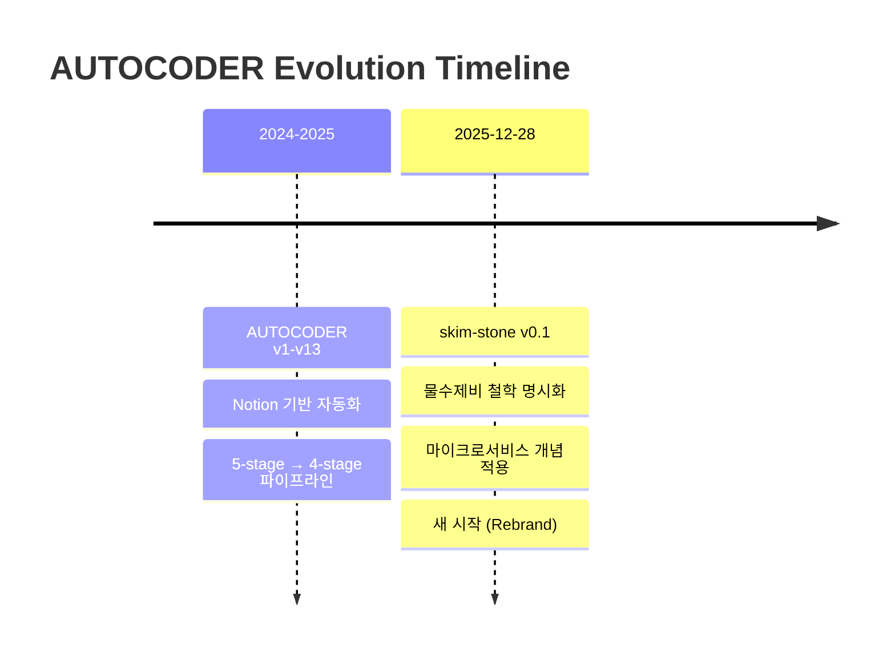

# 00-overview: AUTOCODER → skim-stone 변경 사항 개요

## Timeline



## Core Philosophy Change

### Before: AUTOCODER v13
- **이름**: "자동 코더" (도구 중심 명명)
- **철학**: 명시되지 않음 (기능 나열)
- **설명**: "아이디어를 PR로" (기능적 설명)

### After: skim-stone v0.1
- **이름**: "물수제비" (비유적 명명)
- **철학**: 5가지 핵심 원칙 명시
- **설명**: "돌멩이가 물 위를 여러 번 튀며 나아가듯..."

## 물수제비 메타포 (Skipping Stone)

```
첫 던짐 (IDEA) → ~ → 두 번째 튀김 (RESEARCH) → ~ → 세 번째 튀김 (TODO) → ~ → 착지 (PR)
```

**왜 물수제비인가?**
- 한 번에 완성 ✗, 여러 단계 거쳐 정제 ✓
- 각 단계마다 정보가 더 명확해짐
- 튀김 = 버킷 간 이동 (포맷 변환)
- 착지 = 최종 코드 (PR)

## 5가지 핵심 원칙

### 1. 한 번에 완성 ✗, 여러 단계 거쳐 정제 ✓
- 첫 던짐(IDEA): 러프한 아이디어
- 두 번째 튀김(RESEARCH): 구조화된 분석
- 세 번째 튀김(TODO): 실행 가능한 작업
- 착지(PR): 검증된 코드

### 2. 버킷 = 포맷 변환기
- 정보가 버킷에 들어오면 그 버킷 스타일로 AI가 재생산
- IDEA 버킷: 간단한 아이디어 형식 (Gemini 2.5 Flash)
- RESEARCH 버킷: 구조화된 리서치 (Claude 4.5, JSON + Mermaid)
- TODO 버킷: 소작전 분할 + Prerequisites (Gemini/Claude, JSON)

### 3. 방향 없는 그래프
- `next_bucket`으로 어디든 갈 수 있음
- 필요하면 되돌아가거나 쪼개거나 재처리 가능
- RESEARCH → IDEA: 1개 → 2개 이상 분할 가능 (쪼개기)

### 4. 재귀 루프 (_self)
- 유저 피드백 반영하며 버전업 (v1 → v2 → v3...)
- 단순 재생산 ✗, 코멘트 기반 개선 ✓
- 무한 반복 가능 (완벽할 때까지)

### 5. GAN 검증
- CODINGBOT (Generator): TODO → 코드 구현 → PR
- REVIEWER (Discriminator): PR body vs Git Diff 검증
- 이중 검증으로 품질 보장

## Major Version Changes

| Version | Date | Key Changes |
|---------|------|-------------|
| v10 | 2025-12-22 | PLAN 제거 (5-stage → 4-stage), AI 업그레이드 |
| v11 | 2025-12-23 | RESEARCH 안정화 (Claude 4.5 전용) |
| v12 | 2025-12-25 | TODO 소작전 분할, 그래프 구조 명확화 |
| v13 | 2025-12-25 | DLG LLM 마이그레이션, BT-DLG 통합 |
| **skim-stone v0.1** | **2025-12-28** | **물수제비 철학 명시 + 마이크로서비스 적용** |

## What's Changed

### 1. Name & Branding
- **AUTOCODER** → **skim-stone** (물수제비)
- 도구 중심 → 철학 중심

### 2. Documentation Restructuring
- **docs/** → **docs/guides/** (Main docs)
- **_research/** → **docs/research/** (Research materials)
- **NEW**: **docs/ops/** (5 operation folders)

### 3. Microservices Philosophy Applied
- Operation = Microservices for project management
- Each operation = Single responsibility + Limited scope
- Independent completion, minimal dependencies

### 4. Core Concepts Clarified
- 버킷 = 포맷 변환기 개념 확립
- 그래프 구조 (방향 없음) 명시
- _self 재처리 = 유저 피드백 반영

## Next Sections

- [01-philosophy.md](01-philosophy.md): 5가지 핵심 원칙 상세
- [02-graph-structure.md](02-graph-structure.md): 방향 없는 그래프 구조
- [03-bucket-formats.md](03-bucket-formats.md): 버킷별 포맷 규칙
- [04-microservices-ops.md](04-microservices-ops.md): 마이크로서비스 개념 적용
- [05-v13-changes.md](05-v13-changes.md): v13 주요 변경사항
- [06-migration-path.md](06-migration-path.md): v13 → skim-stone 마이그레이션
- [07-expected-benefits.md](07-expected-benefits.md): 기대 효과 (토큰 절감, 속도 개선)
- [08-references.md](08-references.md): 참고 문서 링크
