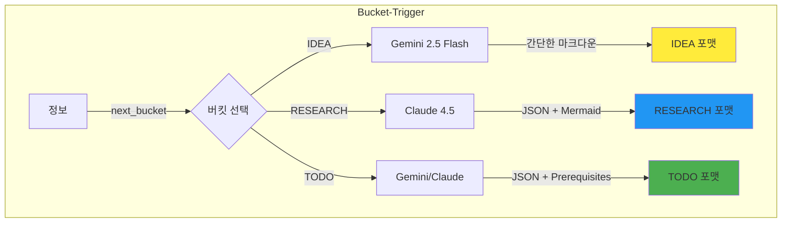
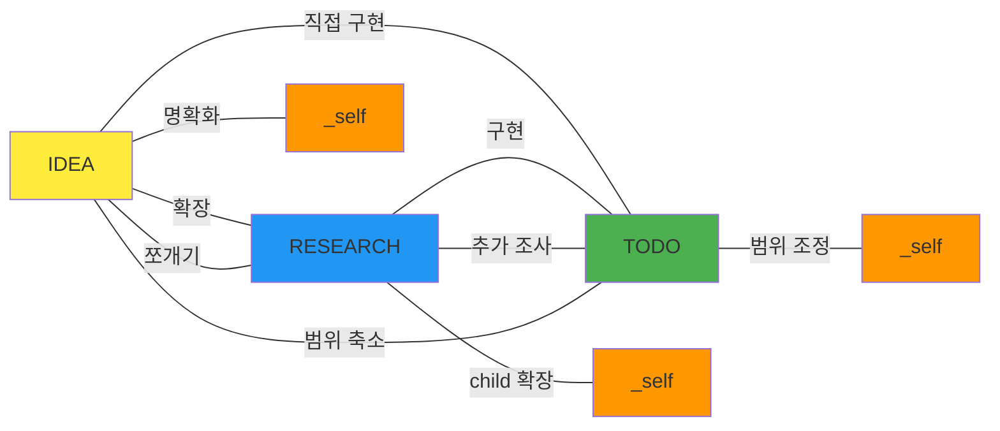
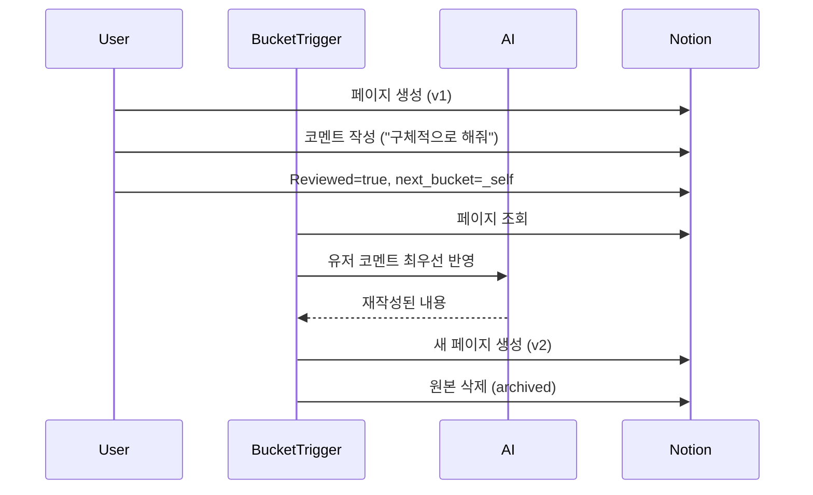
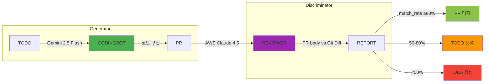

# 01-philosophy: skim-stone 핵심 철학 상세

## Why "물수제비" (Skipping Stone)?

### Visual Metaphor

```
      던짐        튀김1       튀김2       튀김3       착지
       │          │          │          │          │
       ▼          ▼          ▼          ▼          ▼
      💡 ───~───► 📊 ───~───► ✅ ───~───► 🤖 ───~───► ✓
     IDEA      RESEARCH     TODO    CODINGBOT    PR
   (러프)     (구조화)    (실행가능)  (검증완료)
```

### Why Not "자동 코더" (AUTOCODER)?

| AUTOCODER | skim-stone |
|-----------|------------|
| 도구 중심 명명 | 철학 중심 명명 |
| "자동으로 코드 생성" | "여러 단계 거쳐 정제" |
| 결과 강조 | 과정 강조 |
| 마법처럼 완성 기대 | 점진적 개선 기대 |

**문제점**: "AUTOCODER"는 한 번에 완성되는 느낌
**개선**: "skim-stone"은 여러 번 튀는 과정 강조

## 5가지 핵심 원칙 상세

### 1. 한 번에 완성 ✗, 여러 단계 거쳐 정제 ✓


**핵심**:
- 첫 던짐(IDEA): "AI 에이전트로 Notion 자동 정리" (러프)
- 두 번째 튀김(RESEARCH): Notion API 조사, 아키텍처 설계 (구조화)
- 세 번째 튀김(TODO): Prerequisites + 소작전 분할 (실행 가능)
- 착지(PR): 코드 구현 + 검증 완료 (검증됨)

**각 단계마다 정보가 더 명확해짐**:
- IDEA: "뭘 하자는거지?"
- RESEARCH: "어떻게 할 건지 구조가 보임"
- TODO: "지금 바로 코딩 가능함"
- PR: "실제로 작동하는 코드"

### 2. 버킷 = 포맷 변환기

**핵심 개념**: 정보가 버킷에 들어오면 그 버킷 스타일로 AI가 재생산



**예시**:

| 입력 | 버킷 | AI | 출력 포맷 |
|------|------|----|----|
| "AI 에이전트 만들기" | IDEA | Gemini | 간단한 마크다운 |
| IDEA 페이지 ID | RESEARCH | Claude 4.5 | JSON (main + children + Mermaid) |
| RESEARCH 페이지 ID | TODO | Gemini | JSON (Prerequisites + 소작전) |

**왜 "포맷 변환기"인가?**
- 같은 정보도 버킷에 따라 다르게 재생산됨
- IDEA: 핵심만 간결하게
- RESEARCH: 구조화된 분석 + 다이어그램
- TODO: 실행 가능한 작업 단위

### 3. 방향 없는 그래프

**핵심**: `next_bucket`으로 어디든 갈 수 있음



**특별 규칙**:
- **IDEA → RESEARCH**: 1개 → 1개 (하나로 확장)
- **RESEARCH → IDEA**: 1개 → 2개 이상 가능 (쪼개기)
- **TODO 분할**: 소작전 단위로 분할 (Cloud Run Job 크기)

**왜 "방향 없음"인가?**
- 필요하면 되돌아갈 수 있음 (TODO → RESEARCH)
- 필요하면 쪼갤 수 있음 (RESEARCH → IDEA 2개)
- 필요하면 재처리할 수 있음 (X → _self)

### 4. 재귀 루프 (_self)

**핵심**: 유저 피드백 반영하며 버전업 (v1 → v2 → v3...)



**단순 재생산 ✗, 코멘트 기반 개선 ✓**:
- **단순 재생산**: 같은 내용 다시 생성
- **코멘트 기반 개선**: 유저 지시 최우선 반영

**사용 예시**:
- IDEA → _self: "구체적으로 뭘 하자는건지 명확하게 해줘"
- RESEARCH → _self: "Vector DB 비교 분석 추가해줘"
- TODO → _self: "인증 부분만 먼저 구현하는걸로 좁혀줘"

**무한 반복 가능**: v1 → v2 → v3 → ... (완벽할 때까지)

### 5. GAN 검증

**핵심**: Generator (CODINGBOT) + Discriminator (REVIEWER) = 품질 보장



**GAN (Generative Adversarial Network) 비유**:
- **Generator (CODINGBOT)**: 코드 생성
- **Discriminator (REVIEWER)**: 진짜 vs 가짜 판별
- **Adversarial**: 서로 견제하며 품질 향상

**match_rate 계산 (v10)**:
- 파일(30%) + Prerequisites(20%) + AI(50%)
- AI 분석: Claude 4.5가 코드 품질 평가

**이중 검증으로 품질 보장**:
1. CODINGBOT: "이렇게 구현했어"
2. REVIEWER: "이 부분 빠졌네, 저 부분 잘못됐네"
3. match_rate 계산 → PASS/PARTIAL/FAIL

## Philosophy Summary

| 원칙 | 핵심 메시지 |
|------|-------------|
| 1. 여러 단계 거쳐 정제 | 한 번에 완성 기대 ✗, 점진적 개선 ✓ |
| 2. 버킷 = 포맷 변환기 | 정보가 버킷 스타일로 재생산됨 |
| 3. 방향 없는 그래프 | 되돌아가거나 쪼개거나 재처리 가능 |
| 4. 재귀 루프 (_self) | 유저 피드백 반영하며 버전업 |
| 5. GAN 검증 | Generator + Discriminator = 품질 보장 |

**결론**: skim-stone은 "아이디어를 PR로 자동 변환"이 아니라, "여러 단계 거쳐 점진적으로 정제하는 시스템"임.
