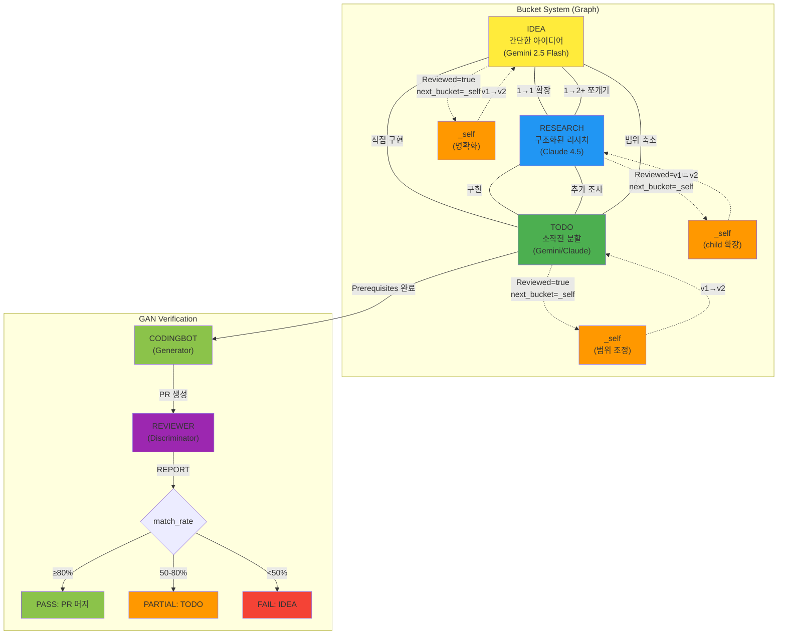

# 02-graph-structure: 방향 없는 그래프 구조 상세

## Graph Visualization



## Navigation Rules (튀김 규칙)

### 1. IDEA → RESEARCH (확장)

**규칙**: 1개 → 1개 (하나로 확장)

```
IDEA: "AI 에이전트로 Notion 자동 정리"
  ↓ next_bucket=RESEARCH
RESEARCH:
  - main: "Notion API로 DB 조작하는 방법"
  - children:
    - 00-notion-api
    - 01-ai-integration
    - 02-architecture
    - 03-vector-db
```

**AI 역할**: 러프한 아이디어 → 구조화된 리서치 (JSON + Mermaid)

### 2. RESEARCH → IDEA (쪼개기)

**규칙**: 1개 → 2개 이상 가능 (쪼개기)

```
RESEARCH: "AI 에이전트 시스템 전체 설계"
  - children: 00-overview, 01-auth, 02-agent, 03-db, 04-ui
  ↓ next_bucket=IDEA (코멘트: "인증 부분과 에이전트 부분 각각 IDEA로 분할해줘")
IDEA 1: "사용자 인증 시스템"
IDEA 2: "AI 에이전트 엔진"
```

**왜 필요한가?**
- RESEARCH가 너무 크면 TODO로 못 갈 수 있음
- 독립적인 2개 프로젝트로 쪼개서 각각 진행

### 3. IDEA → TODO (직접 구현)

**규칙**: RESEARCH 스킵하고 바로 구현

```
IDEA: "간단한 헬스체크 엔드포인트 추가"
  ↓ next_bucket=TODO (리서치 불필요)
TODO:
  - main: "헬스체크 엔드포인트 구현"
  - prerequisites: (없음)
  - children: 00-health-endpoint
```

**언제 사용?**
- 리서치 불필요한 간단한 작업
- 이미 방법을 알고 있는 경우

### 4. RESEARCH → TODO (구현)

**규칙**: 리서치 완료 후 구현 단계로

```
RESEARCH: "JWT vs OAuth 비교"
  - children: 00-overview, 01-jwt, 02-oauth, 03-recommendation
  ↓ next_bucket=TODO
TODO:
  - main: "JWT 인증 시스템 구현"
  - prerequisites:
    - [ ] JWT secret key 생성
    - [ ] PostgreSQL 설치
  - children: 00-jwt-core, 01-jwt-middleware
```

**AI 역할**: 리서치 결과 → 실행 가능한 작업 (Prerequisites + 소작전)

### 5. TODO → RESEARCH (추가 조사)

**규칙**: 구현 중 막혔을 때 리서치로 복귀

```
TODO: "Vector DB 통합"
  - children: 00-setup, 01-indexing, 02-search
  ↓ 01-indexing 읽다가 막힘
  ↓ next_bucket=RESEARCH (코멘트: "Embedding 모델 비교 조사 필요")
RESEARCH: "Embedding 모델 비교"
  - children: 00-overview, 01-openai, 02-sentence-transformers
  ↓ 조사 완료
  ↓ next_bucket=TODO
TODO v2: "Vector DB 통합 (조사 결과 반영)"
```

**왜 필요한가?**
- 구현 단계에서 예상 못한 기술적 선택 필요
- 리서치 다시 하고 TODO 버전업

### 6. TODO → IDEA (범위 축소)

**규칙**: TODO가 너무 클 때 범위 축소

```
TODO: "전체 결제 시스템 구현"
  - children: 00-payment-gateway, 01-card, 02-kakaopay, 03-refund, 04-subscription
  ↓ 너무 큼
  ↓ next_bucket=IDEA (코멘트: "카드 결제만 먼저")
IDEA: "카드 결제 기능"
  ↓ next_bucket=TODO
TODO v2: "카드 결제 구현"
  - children: 00-card-gateway, 01-card-validation
```

**왜 필요한가?**
- TODO 소작전이 Cloud Run Job 제한 초과
- 범위 축소해서 다시 시작

### 7. X → _self (재처리)

**규칙**: 유저 피드백 반영하며 버전업 (v1 → v2 → v3...)

```
IDEA v1: "AI 에이전트 만들기" (불명확)
  ↓ 코멘트: "구체적으로 뭘 하자는건지 명확하게 해줘"
  ↓ next_bucket=_self
IDEA v2: "Notion DB를 자동으로 정리하는 AI 에이전트 (매일 2시 실행)" (명확)

RESEARCH v1: "Notion API 조사"
  - children: 00-overview, 01-database, 02-page
  ↓ 코멘트: "Block API 분석 추가해줘"
  ↓ next_bucket=_self
RESEARCH v2: "Notion API 조사"
  - children: 00-overview, 01-database, 02-page, 03-block (추가)

TODO v1: "전체 인증 시스템 구현"
  - children: 00-auth, 01-oauth, 02-jwt
  ↓ 코멘트: "JWT만 먼저 구현하는걸로 좁혀줘"
  ↓ next_bucket=_self
TODO v2: "JWT 인증 구현"
  - children: 00-jwt-core (축소)
```

**왜 필요한가?**
- 단순 재생산 ✗, 유저 지시 최우선 반영 ✓
- 무한 반복 가능 (완벽할 때까지)

## Special Rules

### IDEA → RESEARCH (1→1)
- **규칙**: 반드시 1개 → 1개
- **이유**: 확장 단계는 하나로 집중

### RESEARCH → IDEA (1→2+)
- **규칙**: 1개 → 2개 이상 가능
- **이유**: 너무 큰 RESEARCH 쪼개기

### TODO 분할
- **규칙**: 소작전 단위로 분할 (Cloud Run Job 크기)
- **기준**:
  - 시간 제한: CODINGBOT 25분 + REVIEWER 10분 = 35분 이내
  - 메모리 제한: CODINGBOT 1GiB + REVIEWER 512MiB
  - 코드 규모: ~500줄 이하 권장

## Graph vs Pipeline

### Before: Pipeline (AUTOCODER v9)
```
IDEA → RESEARCH → TODO → PLAN → DEV
(일방향, 되돌아가기 어려움)
```

### After: Graph (skim-stone v0.1)
```
     IDEA ←→ RESEARCH
       ↑ ↘    ↗ ↓
       |    ✕   |
       ↓  ↗  ↘ ↑
     TODO ←→ _self
(양방향, 자유롭게 이동)
```

**차이점**:
- Pipeline: 정해진 순서, 되돌아가기 어려움
- Graph: 필요에 따라 자유롭게 이동

## Lineage (블록체인 추적)

```
IDEA-2cab1234 → RESEARCH-2cab5678 → TODO-2cbb9abc → TODO-2cbb3456 (v2)
     v1              v1→v2               v1             v2
```

**Lineage Property**:
- 전체 이동 경로 기록
- 어디서 왔는지 추적 가능
- 블록체인처럼 변경 불가능

**예시**:
```
lineage: "IDEA-2cab1234 → RESEARCH-2cab5678 → TODO-2cbb9abc"
```

## _ARCHIVE (히스토리)

- 원본 페이지 삭제 전 항상 백업
- moved_at, lineage, properties 모두 보존
- 전체 히스토리 영구 보관

**예시**:
```
_ARCHIVE:
  - IDEA v1 (2025-12-20)
  - IDEA v2 (2025-12-21)
  - RESEARCH v1 (2025-12-22)
  - RESEARCH v2 (2025-12-23)
  - TODO v1 (2025-12-24)
```

## Summary

| 이동 | 규칙 | 언제 사용? |
|------|------|------------|
| IDEA → RESEARCH | 1→1 확장 | 러프한 아이디어 → 구조화 |
| RESEARCH → IDEA | 1→2+ 쪼개기 | 너무 큰 RESEARCH 분할 |
| IDEA → TODO | 직접 구현 | 리서치 불필요 |
| RESEARCH → TODO | 구현 | 리서치 완료 후 |
| TODO → RESEARCH | 추가 조사 | 구현 중 막힘 |
| TODO → IDEA | 범위 축소 | TODO 너무 큼 |
| X → _self | 재처리 | 유저 피드백 반영 |
