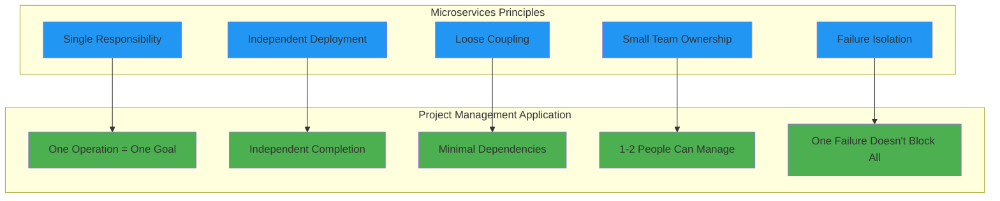
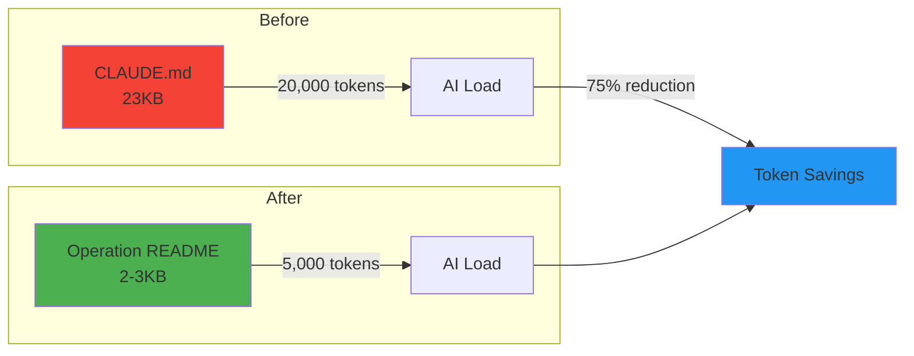
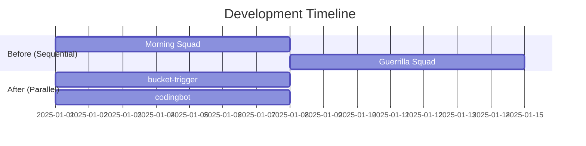
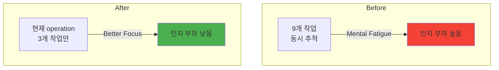
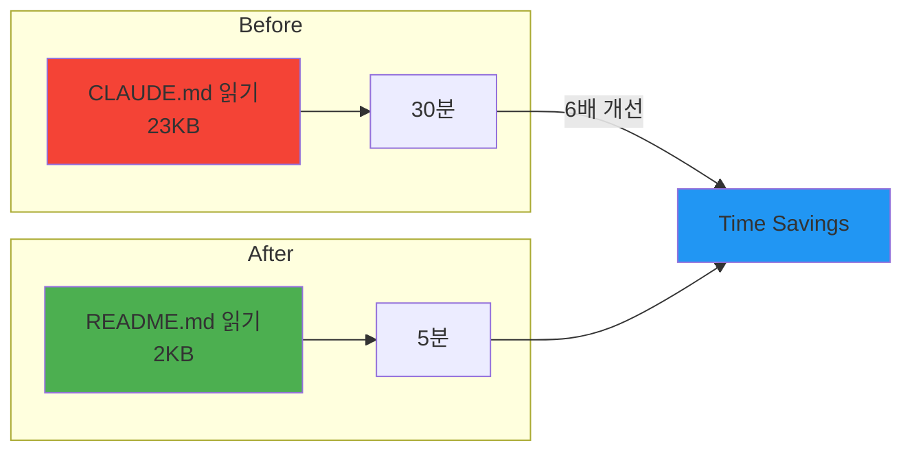

# 04-microservices-ops: 마이크로서비스 개념 적용 상세

## Microservices for Project Management

### Core Concept

**마이크로서비스 철학 → 프로젝트 관리 적용**



## Documentation Restructuring (v13.4.0)

### Before: Monolithic Structure

```
_AUTOCODER/
├── docs/
│   ├── architecture.md (23KB)
│   ├── getting-started.md
│   ├── todo-bucket-design.md
│   └── ...
├── _research/
│   ├── autocoder-v13/
│   ├── codingbot-reviewer-flow/
│   └── ...
└── CLAUDE.md (20,000 tokens)
```

**문제점**:


​    - 옵션 3개: Level 1 (Quick), Level 2 (Standard), Level 3 (Deep)

- **20,000 tokens**: 전체 프로젝트 컨텍스트 로드 필요
- **30분 작업 시작 시간**: 매번 23KB CLAUDE.md 읽어야 함
- **병렬 작업 불가능**: 하나의 큰 문서에 모든 내용
- **인지 부하**: 9개 작업 동시에 추적

### After: Microservices Structure (v13.4.0)

```
_AUTOCODER/
├── docs/
│   ├── guides/           # Main documentation (was docs/)
│   │   ├── architecture.md
│   │   ├── getting-started.md
│   │   └── ...
│   ├── research/         # Research materials (was _research/)
│   │   ├── autocoder-v13/
│   │   ├── microservices-for-project-management/
│   │   └── ...
│   ├── ops/              # 5 operation folders (NEW)
│   │   ├── 00-INDEX.md
│   │   ├── 251228-bucket-trigger/
│   │   ├── 251228-codingbot/
│   │   ├── 251228-reviewer/
│   │   ├── 251228-daily-log/
│   │   └── 251228-notion-integration/
│   ├── notes/            # Personal notes (git tracked)
│   └── requirements/     # Requirements documents
└── CLAUDE.md (5,000 tokens)
```

**개선점**:
- **5,000 tokens**: 관련 operation 파일만 로드
- **5분 작업 시작**: 해당 operation README.md만 읽으면 됨
- **병렬 작업 가능**: 2개 operation 독립적으로 진행
- **인지 부하 감소**: 현재 operation 3개 작업만 집중

## Operation Structure

### Folder Structure

```
docs/ops/YYMMDD-{name}/
├── README.md           # Operation definition
│   ├── Meta (ID, Status, Priority, Owner)
│   ├── Scope (Files, Dependencies)
│   ├── Goal
│   ├── Success Criteria
│   └── Current Status
├── context.md          # Technical decisions accumulation
│   ├── [Date] Technical decisions
│   ├── [Date] Constraints
│   └── [Date] Architecture changes
├── research/           # Related research materials (optional)
└── notes/              # Work logs, development notes (git tracked)
```

### README.md Template

```markdown
# {Operation Name}

## Meta
- **ID**: `{YYMMDD-name}`
- **Status**: `active` / `completed` / `blocked`
- **Priority**: `P1` / `P2` / `P3`
- **Owner**: `{name}`
- **Created**: `{date}`
- **Last Updated**: `{date}`

## Scope
### Files
- `{file1}`
- `{file2}`

### Dependencies
- Operation: `{operation_id}` (if any)
- External: `{external_dependency}` (if any)

## Goal
{Clear, measurable goal}

## Success Criteria
- [ ] Criterion 1
- [ ] Criterion 2
- [ ] Criterion 3

## Current Status
{Current progress, blockers, next steps}

## History
### {Date}
- {Change description}
```

### context.md Template

```markdown
# Context: {Operation Name}

## Technical Decisions

### {Date}
- **Decision**: {What was decided}
- **Reason**: {Why}
- **Impact**: {What changed}

## Constraints

### {Date}
- **Constraint**: {What limitation}
- **Workaround**: {How to work around}

## Architecture Changes

### {Date}
- **Change**: {What architecture changed}
- **Migration**: {How to migrate}

## Next Steps
- [ ] Next step 1
- [ ] Next step 2
```

## Current Operations (5)

### 1. 251228-bucket-trigger

| 항목 | 값 |
|------|-----|
| **Goal** | Notion bucket workflow automation |
| **Files** | `Bucket-Trigger/**` |
| **Priority** | P1 |
| **Status** | active |

**Scope**:
- IDEA/RESEARCH/TODO 버킷 간 이동 로직
- AI 프롬프트 개선
- 그래프 라우팅 로직

### 2. 251228-codingbot

| 항목 | 값 |
|------|-----|
| **Goal** | TODO → PR generation quality improvement |
| **Files** | `CODINGBOT/**` |
| **Priority** | P1 |
| **Status** | active |

**Scope**:
- TODO 기반 코드 생성
- Gemini 2.5 Flash 프롬프트
- Prerequisites 검증 로직

### 3. 251228-reviewer

| 항목 | 값 |
|------|-----|
| **Goal** | PR verification accuracy improvement (85% → 95%) |
| **Files** | `REVIEWER/**` |
| **Priority** | P1 |
| **Status** | active |

**Scope**:
- PR body vs Git Diff 검증
- AWS Bedrock Claude 4.5 분석
- match_rate 계산 로직

### 4. 251228-daily-log

| 항목 | 값 |
|------|-----|
| **Goal** | Daily log automation + Telegram notifications |
| **Files** | `Daily-Log-Generator/**` |
| **Priority** | P2 |
| **Status** | active |

**Scope**:
- Notion + Git activity tracking
- Gemini 2.5 Flash 분석
- Telegram bot 연동

### 5. 251228-notion-integration

| 항목 | 값 |
|------|-----|
| **Goal** | Notion DB schema management + Property standardization |
| **Files** | `docs/templates.md`, Notion DB configs |
| **Priority** | P2 |
| **Status** | active |

**Scope**:
- 6개 DB property 표준화
- Common properties 정의
- Template 관리

## Expected Benefits

### 1. Context Management



**Before**: 전체 프로젝트 23KB → 20,000 tokens
**After**: 관련 operation 2-3KB → 5,000 tokens
**절감**: 75% 토큰 절감

### 2. Parallel Work



**Before**: Morning Squad 완료 대기 → Guerrilla Squad 시작
**After**: 2개 operation 독립적 실행 → 2배 속도

### 3. Cognitive Load



**Before**: 9개 작업 동시 추적 → 정신적 피로
**After**: 현재 operation 3개만 → 집중도 향상

### 4. Task Start Time



**Before**: 30분 컨텍스트 로드
**After**: 5분 컨텍스트 로드
**개선**: 6배 빠른 작업 시작

## OPERATION vs Bucket vs Component

### OPERATION (Notion Database)
- **What**: Project context container
- **Each Page**: One project (e.g., "User Authentication System")
- **Purpose**: Accumulate technical decisions, constraints
- **Relation**: All IDEA/RESEARCH/TODO reference via `operation_ref`

### Bucket (Notion Database)
- **What**: Format converter + AI workspace
- **Types**: IDEA, RESEARCH, TODO
- **Purpose**: Transform information into bucket-specific format
- **Flow**: Information moves via `next_bucket` property

### Operation (docs/ops/)
- **What**: Documentation folder for microservice-style management
- **Types**: bucket-trigger, codingbot, reviewer, daily-log, notion-integration
- **Purpose**: Independent work unit management
- **Flow**: Each operation has README.md + context.md

### Component (Code)
- **What**: Deployable service units
- **Types**: Bucket-Trigger, CODINGBOT, REVIEWER, DLG
- **Purpose**: Execute specific technical functions
- **Deployment**: Cloud Run Service or Cloud Run Job

## When to Create New Operation

Create new operation when:
- **Scope**: >5 files, <15 files (manageable size)
- **Duration**: 1-4 weeks estimated completion
- **Dependencies**: 0-2 operation dependencies
- **Goal**: Clear, measurable success criteria
- **Ownership**: 1-2 people can understand full scope

## Git History Preserved

**All file moves done with `git mv`**:
```bash
git mv docs/ docs/guides/
git mv _research/ docs/research/
mkdir docs/ops/
```

**Benefits**:
- Git history 유지
- Blame/log 정상 작동
- 안전한 리팩토링

## Summary

**Microservices Principles → Project Management**:

| Principle | Application |
|-----------|-------------|
| Single Responsibility | One operation = One clear goal |
| Independent Deployment | Independent completion (no waiting) |
| Loose Coupling | Minimal dependencies between operations |
| Small Team Ownership | Manageable by 1-2 people |
| Failure Isolation | One operation failure doesn't block all |

**Expected Benefits**:
- 75% token reduction (20k → 5k)
- 6x faster task start (30min → 5min)
- 2x development speed (parallel work)
- Lower cognitive load (9 tasks → 3 tasks)
