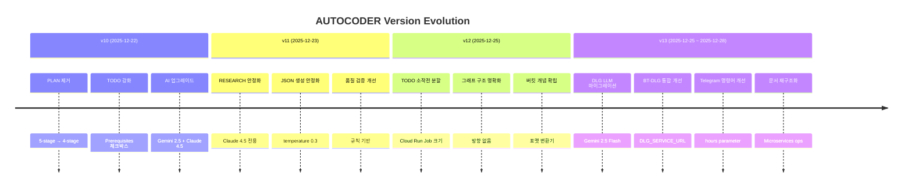
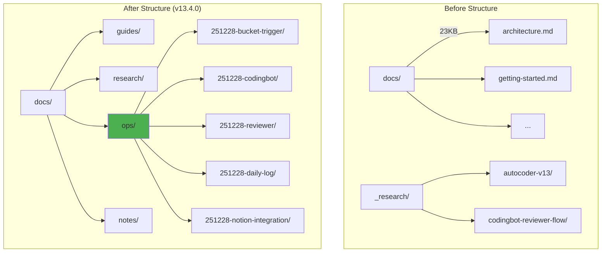
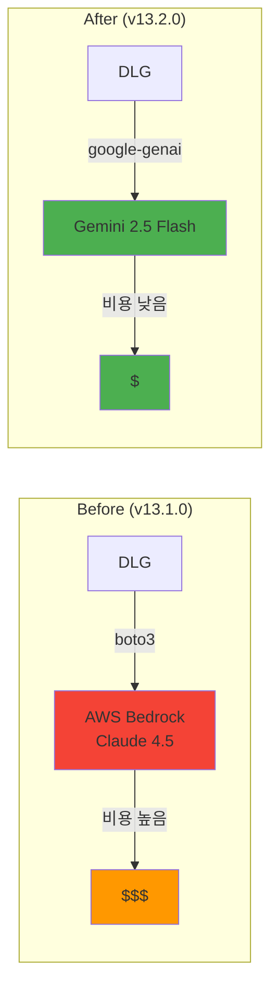

# 05-v13-changes: v13 주요 변경사항 상세

## Version History Timeline



## v13 Changelog Summary

| Version | Date | Key Changes |
|---------|------|-------------|
| **v13.4.0** | 2025-12-28 | 문서 재구조화 (Microservices ops), Telegram hours parameter |
| **v13.3.0** | 2025-12-25 | DLG 프롬프트 대폭 개선 (페이지 제목, 종합 보고서) |
| **v13.2.0** | 2025-12-25 | DLG LLM 마이그레이션 (AWS → Gemini) |
| **v13.1.0** | 2025-12-25 | DLG /telegram 엔드포인트 제거, BT-DLG 통합 |
| **v13.0.0** | 2025-12-25 | BT 버전 통일, 텔레그램 명령어 픽스 |

## v13.4.0: Documentation Restructuring

### Changes



**새로 추가된 폴더**:
- `docs/guides/`: Main documentation (was `docs/`)
- `docs/research/`: Research materials (was `_research/`)
- `docs/ops/`: 5 operation folders (NEW)
- `docs/notes/`: Personal notes (git tracked)

### Telegram Command Enhancement

**`/daily_log` hours parameter** (1-48h):

```python
# Before (v13.3.0)
/daily_log              # Fixed 24h only

# After (v13.4.0)
/daily_log              # 전체 24h
/daily_log 12           # 전체 12h
/daily_log AUTOCODER    # AUTOCODER 24h
/daily_log AUTOCODER 48 # AUTOCODER 48h
```

**Intelligent parsing**:
```python
# main.py:283-300
parts = command_text.split()

if len(parts) == 1:           # /daily_log
    project = "ALL"
    hours = 24
elif len(parts) == 2:
    if parts[1].isdigit():    # /daily_log 12
        project = "ALL"
        hours = int(parts[1])
    else:                     # /daily_log AUTOCODER
        project = parts[1]
        hours = 24
else:                         # /daily_log AUTOCODER 48
    project = parts[1]
    hours = int(parts[2])
```

### DLG SDK Migration

**Gemini SDK update**: `google-generativeai` → `google.genai`

```python
# Before (v13.3.0)
import google.generativeai as genai

genai.configure(api_key=GEMINI_API_KEY)
model = genai.GenerativeModel('gemini-2.5-flash')
response = model.generate_content(prompt)

# After (v13.4.0)
from google import genai

client = genai.Client(api_key=GEMINI_API_KEY)
response = client.models.generate_content(
    model='gemini-2.5-flash',
    contents=prompt
)
```

## v13.3.0: DLG Prompt Improvement

### 페이지 제목 개선

**Before** (너무 길고 구체적):
```
"AUTOCODER v13 DLG LLM 마이그레이션 완료"
```

**After** (기사 헤드라인 형식):
```
"DLG 대규모 리팩토링"
"코드 3만줄 변경의 날"
```

**`generate_page_title()` 프롬프트**:
```python
"""
10-18자 기사 헤드라인 형식
명사형 종결 (예: "완료", "변경", "개선")
핵심 키워드 1-2개만 포함
"""
```

### 종합 보고서 확장

**Before**: 3-5개 성과
**After**: 5-10개 성과

**추가된 섹션**:
- 핵심 기획 섹션 (Notion 활동)
- 프로젝트별 진행 상황 (IDEA/RESEARCH/TODO 카운트)
- 특이사항 (코드 1000줄 이상 변경, Breaking change)

**`generate_executive_summary()`**:
```python
max_tokens: 1500 → 2000
레포별 최소 1개씩 성과 추출
```

### 활동 없을 때 처리

**Early Return**: Notion + Git 둘 다 0건이면 스킵

```python
# main.py:916-925
if total_notion_count == 0 and total_git_count == 0:
    send_telegram_message("오늘 활동 없음")
    return {"success": True, "skipped": True}
```

## v13.2.0: DLG LLM Migration

### AWS Bedrock → Gemini 2.5 Flash



**변경사항**:
- `boto3` → `google-generativeai`
- `analyze_with_bedrock()` → `analyze_with_gemini()`
- 환경변수: `AWS_ACCESS_KEY_ID`, `AWS_SECRET_ACCESS_KEY` → `GEMINI_API_KEY`

**이유**:
- 비용 절감 (AWS Bedrock Claude 4.5 → Gemini 2.5 Flash)
- 응답 속도 개선

## v13.1.0: DLG Integration Cleanup

### /telegram 엔드포인트 제거

**Before**:
```
Telegram → BT /webhook (일부 명령)
Telegram → DLG /telegram (일부 명령)
```

**After**:
```
Telegram → BT /webhook (모든 명령)
          ↓
       DLG / (HTTP API only)
```

**변경사항**:
- DLG `/telegram` 엔드포인트 제거 (55줄 삭제)
- BT `/webhook`이 모든 텔레그램 명령 처리
- DLG는 `/` 엔드포인트만 사용 (BT나 Cloud Scheduler에서 HTTP 호출)

### BT-DLG Integration

**Environment variable added**: `DLG_SERVICE_URL`

```yaml
# cloudbuild.yaml
env:
  - name: DLG_SERVICE_URL
    value: https://dlg-xxx.run.app
```

**Usage**:
```python
# BT main.py:163
response = requests.post(
    DLG_SERVICE_URL,
    json={}  # Content-Type 자동 설정
)
```

## v13.0.0: BT Version Alignment

### Version Unification

**v11 → v13** (3곳):
```python
# bucket_trigger.py:3, 147, 203
__version__ = "13.0.0"
```

### Code Cleanup

**PLAN DB 잔재 제거**:
```python
# reviewer.py:27
DB_IDS = {
    "OPERATION": "...",
    "IDEA": "...",
    "RESEARCH": "...",
    "TODO": "...",
    # "PLAN": "...",  # REMOVED (v10에서 삭제됨)
    "REPORT": "...",
    "_ARCHIVE": "..."
}
```

### Telegram Command Fix

**명령어 일관성**: `/daily-log` (하이픈) vs `daily_log` (언더스코어)

```python
# main.py:283
if command in ('daily-log', 'daily_log'):  # 양쪽 모두 지원
```

**DLG 호출 개선**: 415 Unsupported Media Type 에러 해결

```python
# main.py:163
response = requests.post(
    DLG_SERVICE_URL,
    json={}  # Content-Type 자동 설정 (before: data={})
)
```

## Breaking Changes Summary

### v13.4.0
- **Documentation structure changed**: `docs/` → `docs/guides/`, `_research/` → `docs/research/`
- **NEW**: `docs/ops/` (5 operation folders)

### v13.2.0
- **Environment variables changed** (DLG):
  - `AWS_ACCESS_KEY_ID`, `AWS_SECRET_ACCESS_KEY` → `GEMINI_API_KEY`
- **GCP Secret Manager**: DLG는 `aws-*` secrets 불필요

### v13.1.0
- **DLG /telegram endpoint removed**: BT `/webhook` only

### v13.0.0
- **No breaking changes**: 하위 호환 유지

## Files Changed Summary

| Version | Component | Files Changed |
|---------|-----------|---------------|
| v13.4.0 | BT | `main.py` (hours/project parameter) |
| v13.4.0 | DLG | `main.py` (SDK migration), `requirements.txt` |
| v13.4.0 | Docs | 폴더 재구조화 (`git mv`) |
| v13.3.0 | DLG | `main.py` (프롬프트 개선) |
| v13.2.0 | DLG | `main.py` (LLM 마이그레이션), `requirements.txt` |
| v13.1.0 | DLG | `main.py` (/telegram 제거) |
| v13.1.0 | BT | `cloudbuild.yaml` (DLG_SERVICE_URL) |
| v13.0.0 | BT | `bucket_trigger.py`, `handlers/`, `utils/`, `reviewer.py` |

## Summary

**v13 핵심 변경**:
1. **DLG 개선**: LLM 마이그레이션, 프롬프트 개선, Telegram 명령어 확장
2. **BT-DLG 통합**: 단일 webhook 모델, DLG_SERVICE_URL 환경변수
3. **문서 재구조화**: Microservices-style operation management
4. **코드 정리**: PLAN DB 잔재 제거, 버전 통일

**다음 단계**: skim-stone v0.1 (물수제비 철학 명시)
