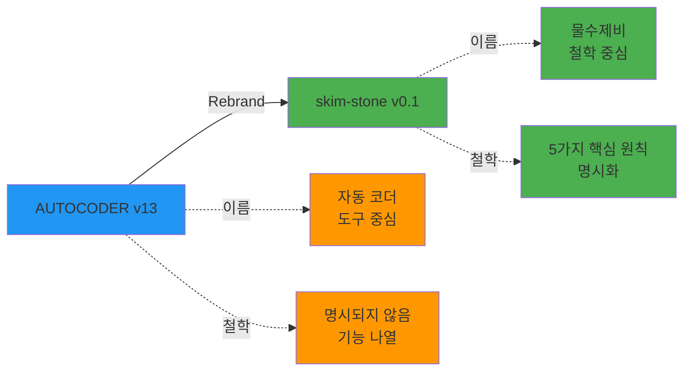

# 06-migration-path: AUTOCODER v13 → skim-stone v0.1 마이그레이션

## What Changed?

### 1. Branding & Philosophy



**No Breaking Changes**:
- 코드는 그대로
- 기능은 그대로
- Notion DB는 그대로

**Changed**:
- 프로젝트 이름: AUTOCODER → skim-stone
- 철학 명시: 5가지 핵심 원칙
- 문서 구조: Microservices ops

## Migration Checklist

### Phase 1: Documentation Review (현재 완료)

- [x] CLAUDE.md 업데이트 (물수제비 철학 추가)
- [x] docs/ 폴더 재구조화
  - [x] `docs/` → `docs/guides/`
  - [x] `_research/` → `docs/research/`
  - [x] `docs/ops/` 생성 (5 operations)
- [x] README.md 업데이트
- [x] changelog.md 업데이트

### Phase 2: CLAUDE.md Simplification (진행 중)

**목표**: 20,000 tokens → 5,000 tokens

**Before**:
```markdown
# CLAUDE.md

# skim-stone Framework

**skim-stone** (물수제비) = ...

## 핵심 철학 (Skipping Stone Metaphor)
...

## Repository Overview
...

## Development Commands
...

## Environment Setup
...

## Documentation Structure
...

## Critical Files
...

## Architecture (v12)
...

## Notion DB Structure (6개)
...

## Key Commands
...

## Version
...

## Recent Changes (v13.4.0)
...

## Recent Changes (v13.3.0)
...

... (20,000 tokens)
```

**After (To Do)**:
```markdown
# CLAUDE.md

# skim-stone Framework

**skim-stone** (물수제비) = 돌멩이가 물 위를 여러 번 튀며 나아가듯, 정보가 버킷 간 자동 이동하며 점점 구체화되는 프로젝트 관리 시스템

## 핵심 철학 (Skipping Stone Metaphor)

[5가지 핵심 원칙 요약]

## Quick Start

[간단한 사용법]

## Documentation

- `docs/guides/00-PROJECT-OVERVIEW.md`: Quick start guide
- `docs/guides/architecture.md`: System architecture
- `docs/ops/00-INDEX.md`: Operation index

## Version

- **Current**: skim-stone v0.1
- **Last Updated**: 2025-12-28

## History

- **AUTOCODER v1-v13**: Notion 기반 자동화 (2024-2025)
- **skim-stone v0.1**: 물수제비 철학 명시 + 새 시작 (2025-12-28)

[5,000 tokens 목표]
```

**Migration Steps**:
1. 상세 내용 → `docs/guides/00-PROJECT-OVERVIEW.md`로 이동
2. v13 변경사항 → `docs/guides/changelog.md`로 이동
3. Architecture → `docs/guides/architecture.md`에 이미 있음
4. CLAUDE.md는 최소한의 개요만 유지

### Phase 3: Operation Folders Population (To Do)

**5개 operation 폴더에 README.md + context.md 작성**:

#### 251228-bucket-trigger/

```markdown
# README.md

## Meta
- **ID**: `251228-bucket-trigger`
- **Status**: `active`
- **Priority**: `P1`
- **Owner**: `AI`

## Scope
### Files
- `Bucket-Trigger (BT)/**`

### Dependencies
- None

## Goal
Notion bucket workflow automation 안정화

## Success Criteria
- [ ] IDEA/RESEARCH/TODO 버킷 간 이동 성공률 95% 이상
- [ ] AI 프롬프트 품질 개선
- [ ] 그래프 라우팅 로직 최적화

## Current Status
Active. RESEARCH 버킷 Claude 4.5 전용 안정화 완료.

## History
### 2025-12-28
- Operation 폴더 생성
```

```markdown
# context.md

## Technical Decisions

### 2025-12-23 (v11)
- **Decision**: RESEARCH 버킷은 Claude 4.5 전용
- **Reason**: Gemini fallback 제거로 JSON 생성 안정화
- **Impact**: AWS Bedrock credentials 필수

### 2025-12-25 (v12)
- **Decision**: TODO 버킷은 JSON 출력 (main_page + child_pages)
- **Reason**: 소작전 분할 지원
- **Impact**: 프롬프트 수정 필요

## Constraints

### 2025-12-23
- **Constraint**: Claude 4.5 temperature 0.3 고정
- **Workaround**: 안정적 JSON 생성 위해 필수

## Next Steps
- [ ] TODO 버킷 JSON 출력 구현
- [ ] RESEARCH → IDEA 분할 로직 구현
```

#### 251228-codingbot/

```markdown
# README.md

## Meta
- **ID**: `251228-codingbot`
- **Status**: `active`
- **Priority**: `P1`

## Goal
TODO → PR generation quality improvement

## Success Criteria
- [ ] Prerequisites 검증 100% 통과
- [ ] PR 생성 성공률 90% 이상
- [ ] 코드 품질 개선 (REVIEWER 80% 이상)

...
```

#### 251228-reviewer/

```markdown
# README.md

## Meta
- **ID**: `251228-reviewer`
- **Status**: `active`
- **Priority**: `P1`

## Goal
PR verification accuracy improvement (85% → 95%)

## Success Criteria
- [ ] match_rate 계산 정확도 95% 이상
- [ ] AI 분석 품질 개선 (Claude 4.5)
- [ ] False positive 10% 이하

...
```

#### 251228-daily-log/

```markdown
# README.md

## Meta
- **ID**: `251228-daily-log`
- **Status**: `active`
- **Priority**: `P2`

## Goal
Daily log automation + Telegram notifications

## Success Criteria
- [ ] 매일 2시 자동 실행 성공률 100%
- [ ] Gemini 2.5 Flash 분석 품질 개선
- [ ] Telegram 알림 안정화

...
```

#### 251228-notion-integration/

```markdown
# README.md

## Meta
- **ID**: `251228-notion-integration`
- **Status**: `active`
- **Priority**: `P2`

## Goal
Notion DB schema management + Property standardization

## Success Criteria
- [ ] 6개 DB property 표준화 문서 작성
- [ ] Common properties 정의
- [ ] Template 관리 자동화

...
```

### Phase 4: Testing & Validation (To Do)

**검증 항목**:
- [ ] CLAUDE.md 5,000 tokens 이하 확인
- [ ] 5개 operation README.md 완성도 확인
- [ ] docs/guides/ 문서 링크 정상 작동 확인
- [ ] Git history 보존 확인 (`git log --follow`)

### Phase 5: Communication (To Do)

**업데이트 공지**:
- [ ] GitHub README.md 업데이트
- [ ] Notion OPERATION DB에 변경사항 기록
- [ ] Telegram bot 메시지 (@zorba_the_bot)

## What's NOT Changed (No Breaking Changes)

### Code (100% 동일)
- ✅ Bucket-Trigger (BT)
- ✅ CODINGBOT
- ✅ REVIEWER
- ✅ Daily-Log-Generator (DLG)

### Notion DB (100% 동일)
- ✅ OPERATION
- ✅ IDEA
- ✅ RESEARCH
- ✅ TODO
- ✅ REPORT
- ✅ _ARCHIVE

### Environment Variables (100% 동일)
- ✅ `NOTION_TOKEN`
- ✅ `GEMINI_API_KEY`
- ✅ `GITHUB_TOKEN`
- ✅ `AWS_ACCESS_KEY_ID` (REVIEWER only)
- ✅ `AWS_SECRET_ACCESS_KEY` (REVIEWER only)
- ✅ `TELEGRAM_TOKEN`
- ✅ `DLG_SERVICE_URL`

### GCP Deployment (100% 동일)
- ✅ Cloud Run Services (BT, DLG)
- ✅ Cloud Run Jobs (CODINGBOT, REVIEWER)
- ✅ Cloud Scheduler (DLG daily 2 AM)

## Rollback Plan (필요시)

**If needed, revert**:
```bash
# Rollback documentation structure
git revert <commit-hash>

# Restore AUTOCODER branding
sed -i 's/skim-stone/AUTOCODER/g' CLAUDE.md README.md

# Restore docs/ folder
git mv docs/guides/ docs/
git mv docs/research/ _research/
rm -rf docs/ops/
```

**No Risk**:
- 코드 변경 없음
- DB 변경 없음
- 배포 변경 없음
- 환경변수 변경 없음

## Timeline

| Phase | Duration | Status |
|-------|----------|--------|
| 1. Documentation Review | 1 day | ✅ 완료 (2025-12-28) |
| 2. CLAUDE.md Simplification | 1 day | 🔄 진행 중 |
| 3. Operation Folders Population | 2 days | ⏳ 대기 중 |
| 4. Testing & Validation | 1 day | ⏳ 대기 중 |
| 5. Communication | 1 day | ⏳ 대기 중 |

**Total**: ~6 days (예상 2025-12-28 ~ 2026-01-03)

## Summary

**AUTOCODER v13 → skim-stone v0.1**:
- **Name**: AUTOCODER → skim-stone (물수제비)
- **Philosophy**: 5가지 핵심 원칙 명시화
- **Documentation**: Microservices-style operation management
- **CLAUDE.md**: 20,000 tokens → 5,000 tokens (75% 절감)
- **No Breaking Changes**: 코드/DB/환경변수 변경 없음

**Migration is safe**: 문서 구조만 변경, 실제 시스템은 그대로
