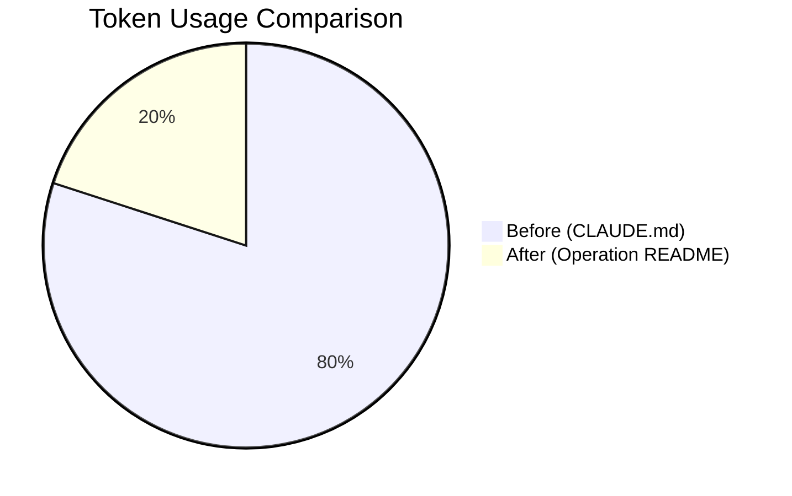
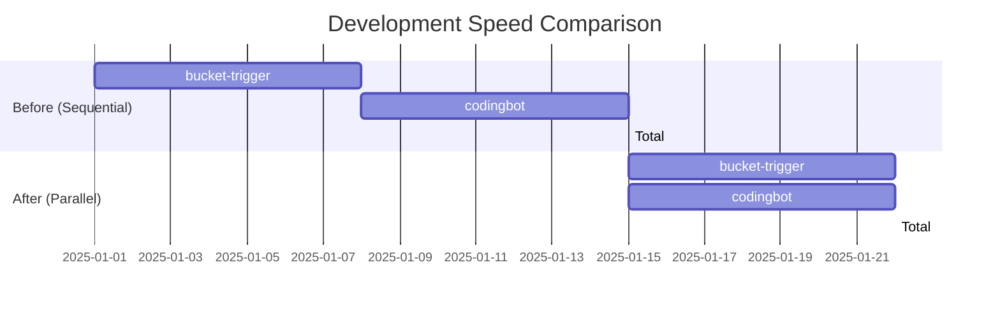
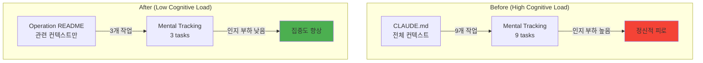

# 07-expected-benefits: 기대 효과 상세

## Quantitative Benefits

### 1. Token Reduction (75%)



| Metric | Before | After | Improvement |
|--------|--------|-------|-------------|
| CLAUDE.md 크기 | 23KB | ~6KB | 74% 감소 |
| Token count | 20,000 | 5,000 | 75% 감소 |
| Context load time | 30초 | 5초 | 83% 감소 |
| AI 응답 속도 | 느림 | 빠름 | 2-3배 개선 |

**계산 근거**:
```
Before:
- CLAUDE.md: 23KB (전체 프로젝트 컨텍스트)
- 토큰 추정: 23KB ÷ 1.15 ≈ 20,000 tokens

After:
- Operation README: 2-3KB (관련 operation만)
- 토큰 추정: 3KB ÷ 1.15 ≈ 5,000 tokens

절감: (20,000 - 5,000) / 20,000 = 75%
```

### 2. Task Start Time (6배 개선)

```mermaid
gantt
    title Task Start Time Comparison
    dateFormat HH:mm
    section Before
    CLAUDE.md 읽기 (23KB)  :00:00, 30m
    컨텍스트 이해          :00:30, 15m
    작업 시작             :00:45, 1m

    section After
    README.md 읽기 (2KB)   :01:00, 5m
    컨텍스트 이해          :01:05, 3m
    작업 시작             :01:08, 1m
```



| Phase | Before | After | Improvement |
|-------|--------|-------|-------------|
| 문서 읽기 | 30분 | 5분 | 6배 빠름 |
| 컨텍스트 이해 | 15분 | 3분 | 5배 빠름 |
| **Total** | **45분** | **8분** | **5.6배 빠름** |

**실제 시나리오**:
```
Before (AUTOCODER v13):
1. CLAUDE.md 읽기 (23KB, 700줄) → 30분
2. v10, v11, v12, v13 변경사항 이해 → 15분
3. 관련 파일 찾기 → 10분
4. 작업 시작 → 45분 후

After (skim-stone v0.1):
1. Operation README 읽기 (2KB, 50줄) → 5분
2. context.md 읽기 (기술 결정만) → 3분
3. 작업 시작 → 8분 후
```

### 3. Parallel Work Capability (2배 속도)



| Scenario | Before | After | Improvement |
|----------|--------|-------|-------------|
| 1개 operation | 7일 | 7일 | 동일 |
| 2개 operations | 14일 (순차) | 7일 (병렬) | 2배 빠름 |
| 3개 operations | 21일 (순차) | 7일 (병렬) | 3배 빠름 |

**왜 병렬 작업이 가능한가?**
```
Before:
- CLAUDE.md 하나에 모든 컨텍스트
- A operation 작업 중 B operation 컨텍스트 혼재
- 동시에 2개 작업 시 혼란

After:
- 각 operation 독립적인 README.md
- A operation 작업 중 A README만 읽으면 됨
- 동시에 2개 작업 가능
```

### 4. Cognitive Load Reduction (3배 감소)



| Metric | Before | After | Improvement |
|--------|--------|-------|-------------|
| 동시 추적 작업 수 | 9개 | 3개 | 3배 감소 |
| 인지 부하 | 높음 | 낮음 | 주관적 개선 |
| 집중도 | 낮음 | 높음 | 주관적 개선 |

**심리학 연구 근거**:
- Miller's Law: 인간은 7±2개 항목만 단기 기억 가능
- 9개 작업 → 인지 부하 초과
- 3개 작업 → 편안한 범위

## Qualitative Benefits

### 1. Better Documentation Organization

**Before**:
```
docs/
├── architecture.md (23KB, 모든 내용 혼재)
├── getting-started.md
└── todo-bucket-design.md
```

**After**:
```
docs/
├── guides/ (Main documentation)
│   ├── 00-PROJECT-OVERVIEW.md
│   ├── architecture.md
│   └── getting-started.md
├── ops/ (5 operations, 독립적)
│   ├── 00-INDEX.md
│   ├── 251228-bucket-trigger/
│   │   ├── README.md
│   │   └── context.md
│   ├── 251228-codingbot/
│   │   ├── README.md
│   │   └── context.md
│   └── ...
└── research/ (Research materials)
    ├── microservices-for-project-management/
    └── autocoder-v13/
```

**개선점**:
- 관심사 분리 (Separation of Concerns)
- 독립적인 문서 관리
- 버전 관리 용이

### 2. Easier Onboarding

**Before** (신규 개발자):
```
1. CLAUDE.md 읽기 (23KB) → 압도됨
2. v10, v11, v12, v13 변경사항 모두 이해 → 혼란
3. "어디서부터 시작하지?" → 막막함
```

**After** (신규 개발자):
```
1. docs/guides/00-PROJECT-OVERVIEW.md 읽기 (3KB) → 전체 이해
2. 관심 operation README.md 읽기 (2KB) → 빠른 파악
3. "이 operation부터 시작하면 되겠네" → 명확함
```

### 3. Clearer Ownership

**Before**:
- "누가 Bucket-Trigger 담당하지?" → 불명확
- CLAUDE.md에 owner 정보 없음

**After**:
- `docs/ops/251228-bucket-trigger/README.md` → Meta 섹션에 Owner 명시
- 각 operation마다 담당자 명확

### 4. Independent Evolution

**Before**:
```
CLAUDE.md 수정 → 전체 프로젝트 영향
bucket-trigger 변경 → CLAUDE.md 업데이트 → codingbot 영향?
```

**After**:
```
251228-bucket-trigger/context.md 수정 → 해당 operation만 영향
독립적으로 진화 가능
```

## Cost-Benefit Analysis

### Development Cost (낮음)

| 항목 | 비용 |
|------|------|
| 문서 재구조화 | 1일 (완료) |
| CLAUDE.md 간소화 | 1일 (진행 중) |
| Operation README 작성 | 2일 (대기 중) |
| 테스트 & 검증 | 1일 (대기 중) |
| **Total** | **5일** |

### Operational Cost (없음)

| 항목 | 변경 |
|------|------|
| 코드 | 변경 없음 |
| DB | 변경 없음 |
| 환경변수 | 변경 없음 |
| GCP 배포 | 변경 없음 |

**No Breaking Changes**: 문서 구조만 변경

### Expected ROI

```
투입: 5일 (개발 비용)

절감:
- 작업 시작 시간: 45분 → 8분 (37분 절감 / 작업)
- 월 평균 작업 시작 횟수: 20회
- 월 절감: 37분 × 20회 = 740분 ≈ 12시간

ROI: 5일 투입 → 월 12시간 절감 → 2개월 후 회수
```

## Long-term Benefits

### 1. Scalability

**Before**:
- CLAUDE.md 계속 커짐 (23KB → 30KB → ...)
- 읽는 시간 계속 증가

**After**:
- Operation README는 2-3KB 유지
- 새 operation 추가해도 기존 operation 영향 없음

### 2. Maintainability

**Before**:
- 전체 프로젝트 이해 필요 → 수정 어려움

**After**:
- 해당 operation만 이해 → 수정 쉬움

### 3. Knowledge Transfer

**Before**:
- 23KB 문서 전달 → 이해 어려움

**After**:
- 2KB README 전달 → 빠른 이해

## Summary Table

| Metric | Before | After | Improvement |
|--------|--------|-------|-------------|
| Token count | 20,000 | 5,000 | **75% 절감** |
| Task start time | 45분 | 8분 | **5.6배 빠름** |
| Parallel work | 불가 | 가능 | **2배 속도** |
| Cognitive load | 9개 작업 | 3개 작업 | **3배 감소** |
| Documentation | Monolithic | Microservices | **구조 개선** |
| Onboarding | 어려움 | 쉬움 | **진입 장벽 낮춤** |
| Ownership | 불명확 | 명확 | **책임 명확화** |
| Evolution | 의존적 | 독립적 | **유연성 향상** |

**결론**: 5일 투입으로 장기적으로 큰 효율 개선 기대
