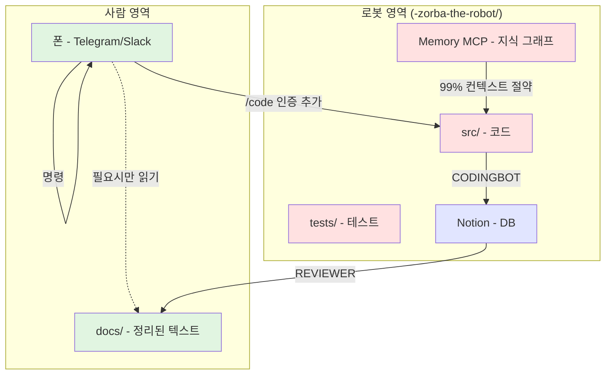

# stone-skim Philosophy: Computer-Free Workflow

## 학습 메타데이터
- **날짜**: 2025-12-31
- **카테고리**: Self-Development (프로젝트 철학)
- **Level**: Standard (깊이 있는 이해)
- **예상 시간**: 2시간
- **난이도**: ⭐️⭐️⭐️⭐️ (4/5 - 철학적 사고 필요)

## 학습 목표
이 문서를 완료하면:
- [ ] "컴퓨터 없애기"의 진짜 의미 이해
- [ ] 사람/로봇 영역 분리의 필요성 파악
- [ ] Memory MCP로 컨텍스트 99% 절약 원리 이해
- [ ] Telegram/Slack 역할 구분 설계 가능
- [ ] zorba-the-robot 폴더 구조 설계 가능

## 핵심 개념 (5가지)

### 1. 컴퓨터 없애기
**사람은 컴퓨터 화면을 안 켜도 프로젝트 진행 가능**
- 폰으로 Telegram/Slack만 봄
- docs 읽고 싶으면 그때만 컴퓨터 켬
- 코드는 AI가 알아서 작성/관리

### 2. docs vs zorba (영역 분리)
**사람이 보는 것**: `docs/` (정리된 텍스트)
**로봇이 보는 것**: `-zorba-the-robot/` (코드, 설정, 캐시)
- src/, tests/, .github/ → 전부 로봇 영역
- 사람은 결과만 봄 (문서 + 메시지)

### 3. Memory MCP (컨텍스트 절약)
**Claude가 코드 안 읽고도 프로젝트 이해**
- 지식 그래프: entities + relations + observations
- "BucketTrigger 뭐 하는 거임?" → 200 tokens (vs 5000 tokens)
- 코드 읽기: 99% → 5%

### 4. Slack/Telegram 역할
**Telegram**: 빠른 명령 + 알림
**Slack**: 프로젝트별 채널 + 대화형 작업
**Notion**: DB (영구 저장, 검색)

### 5. square-away 재정의
**기존**: 폴더 정리 (사람 중심)
**새로운**: 사람/로봇 영역 분리
- 사람용: docs/
- 로봇용: -zorba-the-robot/

## 개념 다이어그램

## 사전 지식
- **skim-stone 기본 철학**: IDEA → RESEARCH → TODO → PR (물수제비)
- **GAN 검증**: CODINGBOT (Generator) + REVIEWER (Discriminator)
- **Notion Database 구조**: OPERATION, IDEA, RESEARCH, TODO, REPORT, _ARCHIVE
- **MCP (Model Context Protocol)**: Memory, Filesystem, Notion 서버

## 학습 경로

### 1단계: 철학 이해 (30분)
**01-core-philosophy.md**: 컴퓨터 없애기
- 기존 방식의 문제점 (터미널 지켜보기, 마이크로 감시)
- 새로운 비전 (폰만으로 작업)
- 실현 가능한 이유 (AI + MCP)

### 2단계: 구조 설계 (30분)
**02-human-robot-separation.md**: docs vs zorba
- 사람이 보는 것: docs/ (유일)
- 로봇이 보는 것: -zorba-the-robot/ (전부)
- 극단적 프로젝트 구조

### 3단계: 기술 이해 (30분)
**03-context-optimization.md**: Memory MCP
- 지식 그래프 구조 (entities, relations, observations)
- 99% 컨텍스트 절약 원리
- zorba 폴더 구조 설계

### 4단계: 커뮤니케이션 (20분)
**04-communication-channels.md**: Telegram/Slack
- Telegram vs Slack 역할 구분
- 프로젝트별 채널 전략
- Notion과의 관계

### 5단계: 실행 계획 (10분)
**05-implementation-roadmap.md**
- Phase 1: zorba 폴더 초기화
- Phase 2: Memory MCP 구축
- Phase 3: Slack 통합
- Phase 4: square-away 재구현

### 참고 자료
**06-references.md**: 관련 문서, MCP 서버

## 예상 소요 시간
- **Level 1**: ~30분 (개념만 훑기)
- **Level 2**: ~2시간 (이해 + 설계) ← 현재
- **Level 3**: ~5시간 (구현까지)

## 학습 방법
1. 순서대로 읽기 (01 → 02 → 03 → 04 → 05)
2. 각 섹션마다 Mermaid 다이어그램 이해
3. 실제 프로젝트 적용 계획 세우기
4. 06-references.md로 심화 학습

## 완료 후 다음 단계
- [ ] zorba-the-robot 폴더 프로토타입 생성
- [ ] Memory MCP 테스트 (entities 3개만)
- [ ] Slack MCP 존재 여부 확인
- [ ] square-away 재구현 계획 수립
