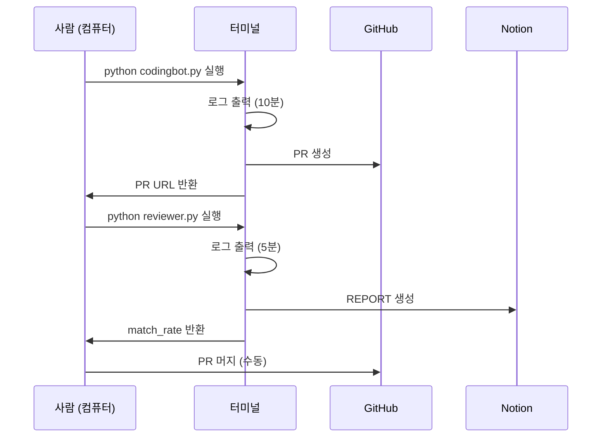
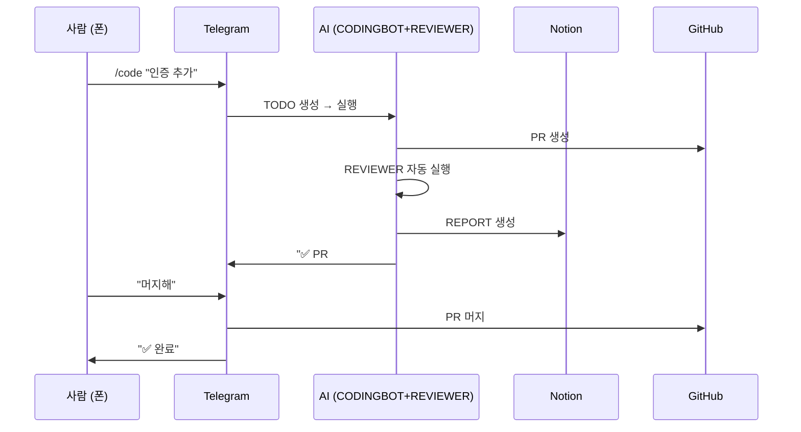

# 01. 핵심 철학: 컴퓨터 없애기

## 개요
stone-skim의 진짜 목표는 **"컴퓨터를 없애는 것"**임.

터미널 화면을 지켜보지 않고, 마이크로 감시를 하지 않고, 일을 시킬 수 있는가? **전화 통화**를 하고 **채팅**으로 일을 하는 것처럼 프로젝트를 관리할 수 있는가?

이게 가능하다면 우리는 정말로 **"컴퓨터 없이"** 프로젝트를 진행할 수 있음.

---

## 1. 기존 방식의 문제점

### 1.1 터미널 화면 지켜보기
```bash
# 개발자가 터미널에서 명령 실행
$ python codingbot.py <TODO_PAGE_ID>

# 10분 동안 로그 출력 지켜봄
[INFO] TODO 페이지 읽는 중...
[INFO] Prerequisites 검증 중...
[INFO] Gemini API 호출 중...
[INFO] GitHub PR 생성 중...
...
```

**문제점**:
- 사람이 터미널 앞에 앉아 있어야 함
- 에러 발생 시 즉시 대응 필요
- 다른 작업 못 함 (병렬 작업 불가)

### 1.2 마이크로 감시 (Micromanagement)
```
09:00 - codingbot.py 실행
09:10 - PR 생성 확인
09:11 - reviewer.py 실행
09:20 - REPORT 확인
09:21 - match_rate 체크
09:22 - PR 머지
```

**문제점**:
- 5분마다 상태 확인
- 사람이 워크플로우 관리
- 자동화의 의미 없음

### 1.3 로컬 파일 의존성
```
프로젝트/
├── src/           # 코드 수정 시 직접 열어봄
├── tests/         # 테스트 실패 시 직접 디버깅
└── docs/          # 문서 확인
```

**문제점**:
- 코드 파일 직접 읽어야 함
- 디버깅 시 로컬 환경 필요
- 컴퓨터 없으면 작업 불가

---

## 2. 새로운 비전: "컴퓨터 없애기"

### 2.1 폰으로만 작업
```
📱 사람 (폰)
   ↓
   Telegram: /code "사용자 인증 추가"
   ↓
   [AI가 알아서 처리]
   ↓
   Telegram: "✅ PR #123 생성 완료. match_rate: 85%"
   ↓
   사람: docs/ 읽기 (필요시만)
```

**특징**:
- 터미널 화면 안 봄
- 명령 → 결과만 확인
- 컴퓨터 안 켜도 됨

### 2.2 "전화 통화"처럼 작업
**Telegram**:
```
사람: /code "JWT 인증 구현"
AI: 네, TODO 페이지 생성했습니다. CODINGBOT 실행 중...
[5분 후]
AI: PR #124 생성 완료. REVIEWER 실행 중...
[3분 후]
AI: match_rate 90%. PASS. 머지 대기.
```

**Slack** (프로젝트별 채널):
```
#auth-system 채널
사람: "현재 진행 상황?"
AI: "JWT 구현 50% 완료. middleware 작업 중. ETA: 10분"
```

### 2.3 결과만 확인 (docs)
```
컴퓨터 켜는 시점:
1. docs/ 읽고 싶을 때만
2. 최종 확인 (PR 머지 전)
3. 그 외 99%: 폰만 사용
```

**사람이 보는 것**:
- `docs/guides/`: 가이드 문서
- `docs/research/`: 리서치 결과
- `docs/ops/`: Operation 정의
- `README.md`: 프로젝트 한 줄 설명

**사람이 안 보는 것**:
- `src/`, `tests/`, `.github/` (전부 로봇 영역)

---

## 3. 실현 가능한 이유

### 3.1 AI 에이전트 (CODINGBOT, REVIEWER)
```
TODO → CODINGBOT → PR
              ↓
         REVIEWER → REPORT
```

**자동화된 것**:
- 코드 작성 (Gemini 2.5 Flash)
- PR 생성 (GitHub API)
- 검증 (Claude 4.5)
- 보고서 생성 (REPORT DB)

**사람이 할 것**:
- 초기 아이디어 입력 (IDEA)
- 최종 승인 (PR 머지)

### 3.2 MCP (Model Context Protocol)

**Memory MCP**:
```python
# Claude 질문: "BucketTrigger 뭐 하는 거임?"
memory.search_nodes("BucketTrigger")

# 즉시 반환 (코드 안 읽음):
# - Service 타입
# - 6개 핸들러 지원
# - Notion DB 자동화
# - Flask HTTP 서버
```

**효과**:
- 코드 읽기: 99% → 5%
- 컨텍스트: 5000 tokens → 200 tokens
- 응답 속도: 30초 → 2초

**Notion MCP**:
- 모든 데이터 Notion에 저장
- 어디서든 접근 가능 (폰, 웹)
- 검색 가능한 지식 베이스

### 3.3 자동화 (Bucket Trigger)
```
Notion 페이지 생성 (IDEA)
   ↓
Reviewed = true
   ↓
Bucket Trigger 자동 실행
   ↓
RESEARCH DB로 이동 (AI가 변환)
   ↓
Telegram 알림: "✅ RESEARCH #456 생성 완료"
```

**사람이 할 것**:
- IDEA 작성 (폰에서 Notion 앱)
- Reviewed 체크박스 클릭
- 나머지는 자동

---

## 4. 워크플로우 비교

### 4.1 기존 방식 (사람 중심)



**특징**:
- 사람이 터미널 앞에 계속 있음
- 단계마다 명령 실행
- 15분 동안 다른 작업 못 함

---

### 4.2 새로운 방식 (AI 중심)



**특징**:
- 사람은 명령 1번 + 확인 1번
- 터미널 안 봄
- 15분 동안 다른 작업 가능 (폰으로 채팅, 영상 시청)

---

## 5. 핵심 원칙 (3가지)

### 원칙 1: 사람은 결과만 봄
```
사람 역할:
- 아이디어 입력 (IDEA)
- 피드백 (RESEARCH 코멘트)
- 최종 승인 (PR 머지)

AI 역할:
- 리서치 (RESEARCH)
- 코드 작성 (CODINGBOT)
- 검증 (REVIEWER)
- 배포 (CI/CD)
```

### 원칙 2: 컴퓨터 화면 최소화
```
컴퓨터 켜는 횟수:
- 기존: 하루 종일
- 목표: 하루 2-3회 (문서 읽기)

주요 작업:
- 99%: 폰 (Telegram/Slack)
- 1%: 컴퓨터 (docs 읽기)
```

### 원칙 3: 자동화 > 수동화
```
자동화 가능한 것:
- IDEA → RESEARCH 변환 (Bucket Trigger)
- RESEARCH → TODO 분할 (Bucket Trigger)
- TODO → PR 생성 (CODINGBOT)
- PR → 검증 (REVIEWER)

수동으로 남길 것:
- 아이디어 작성 (창의성)
- 최종 승인 (책임)
```

---

## 6. 실현 시나리오

### 시나리오 1: 새 기능 추가
```
[월요일 오전 9시 - 출근길 지하철]
📱 Telegram에서:
/idea "사용자 프로필 이미지 업로드 기능"

[AI가 IDEA DB에 생성]

---

[오전 9시 30분 - 회사 도착]
📱 Telegram 알림:
"✅ RESEARCH #789 생성 완료. 3개 child pages."

[필요시 Notion 앱으로 확인]

---

[오후 2시 - 점심 먹고]
📱 Telegram에서:
/skim research

[AI가 RESEARCH → TODO 변환]

📱 Telegram 알림:
"✅ TODO 3개 생성:
  - 00-image-upload-core
  - 01-image-storage
  - 02-image-validation"

---

[오후 3시 - 회의 중]
📱 Telegram에서:
/code "00-image-upload-core"

[AI가 CODINGBOT 실행 → PR 생성 → REVIEWER 검증]

📱 Telegram 알림 (15분 후):
"✅ PR #125 (match_rate: 88%, PASS)"

---

[오후 5시 - 퇴근 직전]
💻 컴퓨터 켜서:
- docs/ops/image-upload/ 읽기
- PR #125 diff 확인 (선택)
- GitHub에서 PR 머지

[컴퓨터 사용 시간: 10분]
```

**총 작업 시간**:
- 폰: 5분 (명령 입력)
- 컴퓨터: 10분 (문서 읽기)
- **터미널 사용: 0분**

---

### 시나리오 2: 버그 수정
```
[화요일 저녁 8시 - 집에서 TV 보는 중]
📱 Telegram 알림:
"🚨 에러 발생: image-upload API 500"

📱 Telegram에서:
/debug "image-upload 500 에러"

[AI가 로그 분석 → IDEA 생성]

📱 Telegram 알림 (2분 후):
"원인: file size validation 누락. IDEA #890 생성."

---

📱 Telegram에서:
/fast-track "890"

[IDEA → RESEARCH → TODO → PR 자동 진행]

📱 Telegram 알림 (20분 후):
"✅ PR #126 생성 (hotfix). match_rate: 92%"

📱 Telegram에서:
"머지해"

📱 Telegram 알림:
"✅ PR #126 머지 완료. 배포 중..."

[TV 계속 봄. 컴퓨터 안 켬]
```

**총 작업 시간**:
- 폰: 3분 (명령 입력)
- 컴퓨터: 0분
- TV 시청: 중단 안 함

---

## 결론

**"컴퓨터 없애기"의 진짜 의미**:
- 컴퓨터를 **물리적으로** 없애는 게 아님
- **의존성을 없애는 것**임

**실현 가능한 이유**:
- AI 에이전트 (코드 작성, 검증)
- MCP (컨텍스트 절약, 데이터 접근)
- 자동화 (Bucket Trigger, CI/CD)

**최종 목표**:
- 폰으로 **99%** 작업
- 컴퓨터는 **문서 읽기**용
- 터미널은 **0%**

**다음 단계**:
- 사람/로봇 영역 분리 (docs vs zorba)
- Memory MCP로 컨텍스트 최적화
- Slack 통합 (프로젝트별 채널)
