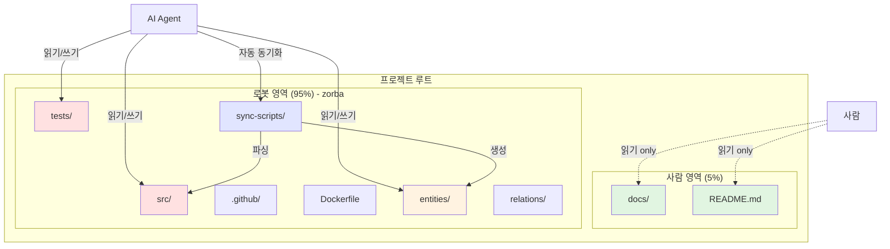

# 02. 사람/로봇 영역 분리: docs vs zorba

## 개요
"컴퓨터 없애기"를 실현하려면 **사람이 뭘 보는지** 명확히 해야 함.

핵심 인사이트: **사람은 src/도 안 봄. 코드 자체를 안 봄.**

사람이 보는 것 = `docs/` (정리된 텍스트)
로봇이 보는 것 = `-zorba-the-robot/` (코드, 설정, 캐시)

---

## 1. 핵심 인사이트: 사람은 코드 안 봄

### 1.1 기존 생각 (틀림)
```
사람이 보는 것:
- docs/ ✓
- README.md ✓
- src/ ✓ (코드 수정 시)
- tests/ ✓ (테스트 실패 시)

로봇이 보는 것:
- .github/ (CI/CD)
- Dockerfile
- cloudbuild.yaml
```

**문제점**: 사람이 여전히 코드 파일 열어봄

---

### 1.2 새로운 깨달음 (맞음)
```
사람이 보는 것:
- docs/ (유일)

로봇이 보는 것:
- src/ (코드)
- tests/ (테스트)
- .github/ (CI/CD)
- Dockerfile, cloudbuild.yaml (배포)
- package.json, requirements.txt (설정)
```

**왜 가능한가?**
- 디버깅 → AI가 로그 분석해서 Telegram으로 보고
- 새 기능 → `/code` 명령으로 끝
- 리뷰 → REVIEWER가 자동 검증 → REPORT

**사람은 결과만 봄** (docs + 메시지)

---

## 2. 사람 영역: docs/ (유일)

### 2.1 docs/ 폴더 구조
```
docs/
├── README.md           # 프로젝트 한 줄 설명
├── guides/             # 사용 가이드
│   ├── architecture.md
│   ├── getting-started.md
│   └── coding-standards.md
├── research/           # 리서치 결과
│   └── YYMMDD-HHMM-topic/
├── study/              # 학습 자료
│   └── YYMMDD-HHMM-topic/
└── ops/                # Operation 정의
    └── YYMMDD-project-name/
        ├── README.md
        └── context.md
```

**특징**:
- 전부 마크다운 (`.md`)
- 코드 없음 (예제 코드만 허용)
- 사람이 읽기 좋은 형식

---

### 2.2 사람이 docs/를 읽는 시점

**시나리오 1: 새 프로젝트 시작**
```
1. README.md 읽기 (1분)
   - 프로젝트 목적 파악
   - 핵심 기능 확인

2. docs/guides/architecture.md 읽기 (5분)
   - 시스템 구조 이해
   - 데이터 흐름 파악

3. docs/ops/ 읽기 (10분)
   - 진행 중인 Operation 확인
   - 우선순위 파악
```

**시나리오 2: 작업 완료 후 확인**
```
Telegram 알림: "✅ PR #123 머지 완료"
   ↓
docs/ops/auth-system/README.md 읽기 (3분)
   - 완료된 작업 내용 확인
   - 다음 단계 파악
```

**시나리오 3: 학습**
```
새 기술 도입 전:
docs/study/YYMMDD-topic/ 읽기 (2시간)
   - 기술 개념 학습
   - 예제 코드 확인
```

---

### 2.3 docs/에 없는 것

**코드 파일** ❌
```
docs/에 이런 거 넣지 말 것:
- src/auth.py (Python 파일)
- package.json (설정 파일)
- Dockerfile (배포 설정)
```

**이유**: 로봇 영역임

**대신 이렇게** ✓
```markdown
# docs/guides/auth-implementation.md

## 인증 시스템 구조

### 핵심 컴포넌트
- `auth.py`: JWT 토큰 생성/검증
- `middleware.py`: 요청 인증 체크
- `models.py`: User 모델

### 데이터 흐름
1. 클라이언트 → `/login` 엔드포인트
2. `auth.py`에서 JWT 생성
3. `middleware.py`에서 검증
4. 요청 처리

### 예제 코드 (10줄 이하)
```python
# JWT 생성 예제
token = jwt.encode({"user_id": 123}, SECRET_KEY)
```
```

**원칙**: 코드 설명 ✓, 코드 파일 자체 ✗

---

## 3. 로봇 영역: -zorba-the-robot/

### 3.1 zorba 폴더 구조
```
-zorba-the-robot/
├── README.md                      # 로봇 초기화 가이드
├── src/                           # 실제 코드
│   ├── CODINGBOT/
│   ├── REVIEWER/
│   ├── Bucket-Trigger/
│   └── Daily-Log-Generator/
├── tests/                         # 테스트 코드
├── .github/                       # CI/CD
├── entities/                      # Memory MCP 데이터
│   ├── services.json
│   ├── databases.json
│   └── handlers.json
├── relations/                     # Memory MCP 관계
│   ├── service-to-db.json
│   └── bucket-flow.json
├── filesystem/                    # 파일 인덱스
│   ├── py-files.json
│   └── docs-index.json
└── sync-scripts/                  # 동기화 스크립트
    ├── sync-from-notion.py
    ├── sync-from-code.py
    └── validate-graph.py
```

**특징**:
- 사람은 절대 안 봄
- AI만 읽기/쓰기
- Memory MCP로 컨텍스트 캐싱

---

### 3.2 zorba/ 하위 폴더 설명

**src/** (실제 코드)
```
기존 프로젝트 루트에 있던 것들:
- CODINGBOT/
- REVIEWER/
- Bucket-Trigger (BT)/
- Daily-Log-Generator (DLG)/

→ 전부 -zorba-the-robot/src/로 이동
```

**entities/** (Memory MCP 지식 그래프)
```json
// entities/services.json
{
  "entityName": "BucketTrigger",
  "entityType": "Service",
  "observations": [
    "Python Flask HTTP 서버",
    "Notion DB 자동화",
    "6개 핸들러 지원"
  ]
}
```

**relations/** (의존성, 데이터 흐름)
```json
// relations/service-to-db.json
{
  "from": "BucketTrigger",
  "relationType": "queries",
  "to": "IDEA_DB"
}
```

**filesystem/** (파일 인덱스)
```json
// filesystem/py-files.json
{
  "file": "src/CODINGBOT/codingbot.py",
  "lines": 543,
  "imports": ["notion_client", "google.genai"],
  "exports": ["execute_todo", "create_pr"]
}
```

**sync-scripts/** (자동 동기화)
```python
# sync-from-code.py
# Python 파일 분석 → entities/files.json 생성
# 일일 cron job 실행
```

---

## 4. 극단적 프로젝트 구조

### 4.1 전체 폴더 트리
```
프로젝트/
│
├── docs/                          # 사람 영역 (유일)
│   ├── README.md
│   ├── guides/
│   ├── research/
│   ├── study/
│   └── ops/
│
└── -zorba-the-robot/              # 로봇 영역 (전부)
    ├── src/
    │   ├── CODINGBOT/
    │   ├── REVIEWER/
    │   ├── Bucket-Trigger/
    │   └── Daily-Log-Generator/
    ├── tests/
    ├── .github/
    ├── Dockerfile
    ├── cloudbuild.yaml
    ├── requirements.txt
    ├── package.json
    ├── entities/
    ├── relations/
    ├── filesystem/
    └── sync-scripts/
```

**비율**:
- 사람 영역: 5% (docs/)
- 로봇 영역: 95% (zorba/)

---

### 4.2 기존 구조와 비교

**기존** (사람 중심):
```
프로젝트/
├── README.md
├── src/
├── tests/
├── .github/
├── docs/
└── Dockerfile
```

**새로운** (AI 중심):
```
프로젝트/
├── docs/                    # 사람용
└── -zorba-the-robot/        # AI용
    └── (전부 여기)
```

---

### 4.3 Mermaid 다이어그램



---

## 5. square-away 재정의

### 5.1 기존 square-away (틀림)
```
목적: 폴더 정리 (사람 중심)

Phase 1: 분석
- 임시 파일 찾기
- CLAUDE.md 최적화
- ops 후보 제안

Phase 2: 실행
- 파일 삭제/정리
- README 업데이트
```

**문제점**: 사람이 보기 편하게 하려는 것 (불필요)

---

### 5.2 새로운 square-away (맞음)
```
목적: 사람/로봇 영역 분리

Phase 1: 분석
- docs/ vs 나머지 구분
- 로봇 전용 파일 식별

Phase 2: 이동
- 코드 파일 → -zorba-the-robot/src/
- 테스트 → -zorba-the-robot/tests/
- 설정 → -zorba-the-robot/
- docs/ 유지

Phase 3: Memory MCP 동기화
- entities/ 생성
- relations/ 생성
- filesystem/ 인덱싱
```

**효과**: 사람은 docs/만 보면 됨

---

### 5.3 square-away 실행 결과

**Before**:
```
프로젝트/
├── README.md
├── CODINGBOT/
├── REVIEWER/
├── Bucket-Trigger (BT)/
├── Daily-Log-Generator (DLG)/
├── docs/
├── Dockerfile
└── cloudbuild.yaml
```

**After**:
```
프로젝트/
├── docs/
│   └── (사람이 읽을 것만)
└── -zorba-the-robot/
    ├── src/
    │   ├── CODINGBOT/
    │   ├── REVIEWER/
    │   ├── Bucket-Trigger/
    │   └── Daily-Log-Generator/
    ├── Dockerfile
    ├── cloudbuild.yaml
    ├── entities/
    └── sync-scripts/
```

---

## 6. 사용 시나리오

### 시나리오 1: 새 팀원 온보딩

**기존** (30분):
```
1. README.md 읽기 (5분)
2. src/ 폴더 구조 파악 (10분)
3. CODINGBOT/codingbot.py 읽기 (10분)
4. 환경 설정 (5분)
```

**새로운** (5분):
```
1. docs/README.md 읽기 (3분)
2. docs/guides/architecture.md 읽기 (2분)

끝.

코드는 안 봄.
필요하면 AI에게 물어봄:
"BucketTrigger 뭐 하는 거임?"
→ Memory MCP에서 즉시 답변
```

---

### 시나리오 2: 버그 디버깅

**기존** (1시간):
```
1. 에러 로그 확인 (5분)
2. src/ 파일 열어서 코드 읽기 (20분)
3. 테스트 실행 (10분)
4. 원인 파악 (15분)
5. 수정 (10분)
```

**새로운** (10분):
```
1. Telegram 알림: "🚨 에러 발생"
2. /debug 명령 (1분)
3. AI 분석 결과 확인 (2분)
   "원인: file size validation 누락"
4. /fix 명령 (1분)
5. PR 생성 → 머지 (5분)

코드 안 읽음.
```

---

### 시나리오 3: 코드 리뷰

**기존** (30분):
```
1. GitHub PR diff 확인 (10분)
2. 변경된 파일 읽기 (15분)
3. 코멘트 작성 (5분)
```

**새로운** (5분):
```
1. REVIEWER가 자동 검증
2. REPORT 읽기 (2분)
   - match_rate: 90%
   - 통과한 검증: 15개
   - 문제점: 없음
3. Telegram에서 "머지해" (1초)

PR diff 안 봄.
```

---

## 7. 예상 질문 & 답변

**Q1: 코드 안 보고 어떻게 개발함?**
A: AI가 코드 작성 + 검증. 사람은 결과만 확인.

**Q2: 디버깅은 어떻게?**
A: AI가 로그 분석 → 원인 보고 → 자동 수정.

**Q3: 코드 리뷰는?**
A: REVIEWER가 자동 검증 → REPORT 생성.

**Q4: 새 기능 추가는?**
A: Telegram `/code` 명령 → AI가 전부 처리.

**Q5: 사람이 할 일이 뭐임?**
A: 아이디어 입력 + 최종 승인.

**Q6: docs/만 보고 충분함?**
A: ㅇㅇ. docs/에 전부 있음 (가이드, 리서치, Operation).

**Q7: 급하게 코드 수정해야 하면?**
A: 그럴 일 없음. AI가 즉시 처리.

**Q8: zorba 폴더는 언제 씀?**
A: 안 씀. AI만 씀.

---

## 결론

**핵심 원칙**:
- 사람 영역: `docs/` (유일)
- 로봇 영역: `-zorba-the-robot/` (전부)

**사람이 하는 것**:
- docs/ 읽기 (필요시만)
- Telegram/Slack 메시지 확인
- 최종 승인 (PR 머지)

**AI가 하는 것**:
- 코드 작성 (CODINGBOT)
- 검증 (REVIEWER)
- 디버깅 (로그 분석)
- 문서 생성 (docs/ 업데이트)

**square-away 재정의**:
- 폴더 정리 ✗
- 사람/로봇 영역 분리 ✓

**다음 단계**:
- Memory MCP로 zorba 폴더 최적화
- Telegram/Slack 통합 설계
- square-away 재구현
