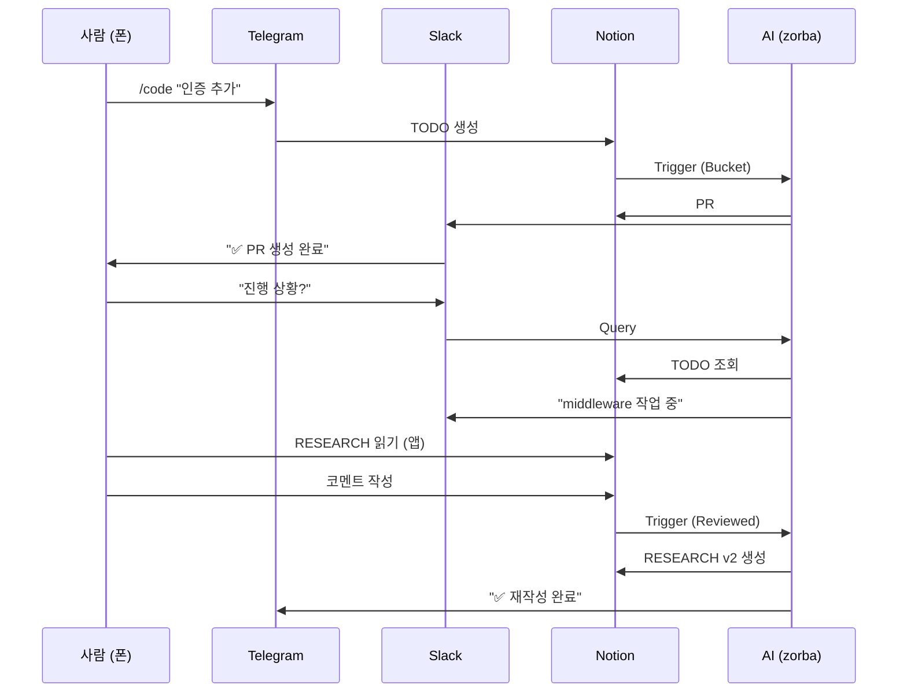

# 04. 커뮤니케이션 채널: Telegram vs Slack vs Notion

## 개요
"컴퓨터 없애기"를 실현하려면 **커뮤니케이션 채널**이 명확해야 함.

**3가지 채널**:
- **Telegram**: 빠른 명령 + 알림
- **Slack**: 프로젝트별 채널 + 대화형 작업
- **Notion**: DB (영구 저장, 검색)

**핵심**: 이 3개는 **대체 관계 ✗**, **보완 관계 ✓**

---

## 1. Telegram: 빠른 명령 + 알림

### 1.1 역할
```
사람 → Telegram 봇에게 명령
AI → 처리 후 결과 알림
```

**특징**:
- **빠름**: 폰에서 즉시 명령
- **간단함**: `/code`, `/skim`, `/debug`
- **알림**: 작업 완료 시 푸시 알림

---

### 1.2 Telegram 명령어 (현재)

| 명령어 | 기능 |
|--------|------|
| `/skim idea` | IDEA 버킷 트리거 |
| `/skim research` | RESEARCH 버킷 트리거 |
| `/skim todo` | TODO 버킷 트리거 |
| `/daily_log [hours]` | Daily Log 생성 (1-48h) |

---

### 1.3 Telegram 명령어 (추가 예정)

| 명령어 | 기능 |
|--------|------|
| `/code <TODO_ID>` | TODO → PR 생성 |
| `/debug <에러 메시지>` | 에러 분석 → IDEA 생성 |
| `/status <프로젝트명>` | 프로젝트 진행 상황 |
| `/fast-track <IDEA_ID>` | IDEA → PR 자동 진행 |

---

### 1.4 사용 시나리오 (Telegram)

**시나리오 1: 새 기능 추가**
```
[출근길 지하철]
📱: /code "사용자 프로필 이미지 업로드"

[AI 처리 중...]

📱 알림 (15분 후):
"✅ PR #125 생성 완료. match_rate: 88%"
```

**시나리오 2: 버그 수정**
```
[저녁 TV 보는 중]
📱 알림:
"🚨 에러 발생: image-upload API 500"

📱: /debug "image-upload 500"

📱 알림 (2분 후):
"원인: file size validation 누락. IDEA #890 생성"

📱: /fast-track "890"

📱 알림 (20분 후):
"✅ PR #126 머지 완료. 배포 중..."
```

---

## 2. Slack: 프로젝트별 채널 + 대화형 작업

### 2.1 역할
```
프로젝트별 채널 (#auth-system, #image-upload)
AI + 팀원 대화형 협업
```

**특징**:
- **맥락 유지**: 채널별 독립적 히스토리
- **대화형**: 질문 → 답변 → 후속 질문
- **협업**: 팀원과 AI가 같은 채널

---

### 2.2 Slack 채널 구조 (제안)

```
워크스페이스: skim-stone
├── #general (전체 공지)
├── #operations (모든 Operation 알림)
├── #auth-system (프로젝트별)
├── #image-upload (프로젝트별)
├── #bucket-trigger (서비스별)
└── #codingbot (서비스별)
```

**프로젝트별 채널**:
- Notion OPERATION DB 페이지 1개 = Slack 채널 1개
- 예: "사용자 인증 시스템" → `#auth-system`

**서비스별 채널**:
- BucketTrigger, CODINGBOT, REVIEWER, DLG
- 에러 알림, 로그 출력

---

### 2.3 사용 시나리오 (Slack)

**시나리오 1: 프로젝트 진행 상황 확인**
```
#auth-system 채널
사람: "현재 진행 상황?"
AI: "JWT 구현 50% 완료. middleware 작업 중. ETA: 10분"
```

**시나리오 2: 대화형 디버깅**
```
#image-upload 채널
사람: "500 에러 왜 남?"
AI: "file size validation 누락. logs/error.log:125 참고"
사람: "얼마나 걸림?"
AI: "PR 생성 중. 5분 소요 예상"
[5분 후]
AI: "✅ PR #126 생성 완료"
```

**시나리오 3: 팀 협업**
```
#auth-system 채널
팀원 A: "JWT expire time 얼마로?"
팀원 B: "24시간"
AI: "알겠습니다. TODO #123 업데이트했습니다"
```

---

### 2.4 Slack vs Telegram

| 기준 | Telegram | Slack |
|------|----------|-------|
| 속도 | **빠름** | 중간 |
| 용도 | 간단한 명령 | **대화형 작업** |
| 맥락 | 없음 | **채널별 유지** |
| 협업 | 1:1 (봇) | **팀 공유** |
| 알림 | **푸시** | 푸시 |
| 히스토리 | 짧음 | **긴 보관** |

**사용 전략**:
- **Telegram**: 폰에서 빠른 명령 (`/code`, `/debug`)
- **Slack**: 프로젝트 논의, 대화형 작업

---

## 3. Notion: DB (영구 저장, 검색)

### 3.1 역할
```
모든 데이터 영구 저장
검색 가능한 지식 베이스
```

**특징**:
- **영구**: 절대 삭제 안 됨 (_ARCHIVE)
- **구조화**: Database (OPERATION, IDEA, RESEARCH, TODO, REPORT)
- **검색**: 키워드, 필터, 정렬

---

### 3.2 Notion DB (6개)

| DB | 역할 | 접근 채널 |
|----|------|-----------|
| OPERATION | 프로젝트 컨텍스트 | Slack 채널별 |
| IDEA | 간단한 아이디어 | Telegram `/skim idea` |
| RESEARCH | 구조화된 리서치 | Slack (읽기) |
| TODO | 소작전 분할 | Telegram `/code` |
| REPORT | 검증 결과 | Slack (알림) |
| _ARCHIVE | 히스토리 보관 | 검색용 |

---

### 3.3 Notion 사용 시점

**시나리오 1: 깊은 리서치 읽기**
```
Slack 알림: "✅ RESEARCH #789 생성 완료"
   ↓
Notion 앱 열기 (폰 or 웹)
   ↓
RESEARCH 페이지 읽기 (3개 child pages)
   ↓
코멘트 작성 (피드백)
   ↓
Reviewed = true, next_bucket = _self
   ↓
AI가 재작성 (v2)
```

**시나리오 2: Operation 히스토리 검색**
```
Notion 웹에서:
- OPERATION DB 열기
- 필터: "사용자 인증"
- 정렬: Last Edited
   ↓
관련 IDEA, RESEARCH, TODO 모두 조회
```

---

## 4. 3채널 통합 흐름

### 4.1 Mermaid 다이어그램



---

### 4.2 채널별 사용 비율

| 채널 | 사용 빈도 | 주요 용도 |
|------|-----------|-----------|
| Telegram | 80% | 명령 입력, 알림 확인 |
| Slack | 15% | 대화형 작업, 팀 협업 |
| Notion | 5% | 깊은 리서치, 검색 |

**이유**: Telegram이 가장 빠르고 간편함

---

## 5. Slack MCP 확인 필요

### 5.1 Slack MCP 존재 여부
```
TODO: Slack MCP 서버 존재 확인
- MCP Registry 검색
- Slack API 호출 가능 여부
- 채널 메시지 전송/수신
```

**확인 사항**:
- `mcp__slack__send_message`
- `mcp__slack__create_channel`
- `mcp__slack__read_thread`

---

### 5.2 대안 (Slack MCP 없을 경우)
```
직접 Slack API 호출:
- slack_sdk Python 라이브러리
- Webhook URL
- Bot Token
```

**구현 위치**: Bucket-Trigger에 slack_handler.py 추가

---

## 6. 프로젝트별 채널 자동 생성

### 6.1 OPERATION 생성 시 Slack 채널 자동 생성
```python
# Notion OPERATION 페이지 생성
operation = {
  "title": "사용자 인증 시스템",
  "slack_channel": "#auth-system"  # 자동 생성
}

# Slack API 호출
slack.create_channel("auth-system")
slack.set_topic("사용자 인증 시스템 (OPERATION)")
slack.invite_bot()
```

---

### 6.2 채널명 규칙
```
OPERATION 제목 → Slack 채널명
- "사용자 인증 시스템" → #auth-system
- "이미지 업로드 기능" → #image-upload
- "결제 시스템" → #payment-system
```

**규칙**:
- 소문자
- 공백 → 하이픈
- 특수문자 제거

---

## 7. 구현 우선순위

### Phase 1: Telegram 확장 (1주)
- `/code` 명령어 추가
- `/debug` 명령어 추가
- `/fast-track` 명령어 추가

### Phase 2: Slack MCP 확인 (3일)
- MCP Registry 검색
- 존재 시: MCP 설치
- 없을 시: slack_sdk 사용

### Phase 3: Slack 통합 (1주)
- 프로젝트별 채널 자동 생성
- AI 봇 초대
- 알림 전송 테스트

### Phase 4: Notion 연계 (3일)
- OPERATION → Slack 채널 매핑
- RESEARCH 알림 → Slack
- REPORT 알림 → Slack

---

## 결론

**3채널 역할**:
- **Telegram**: 빠른 명령 + 알림 (80%)
- **Slack**: 대화형 작업 + 팀 협업 (15%)
- **Notion**: 영구 저장 + 검색 (5%)

**핵심 원칙**:
- 대체 관계 ✗
- 보완 관계 ✓

**다음 단계**:
- Slack MCP 존재 확인
- Telegram 명령어 확장
- 프로젝트별 채널 자동 생성
