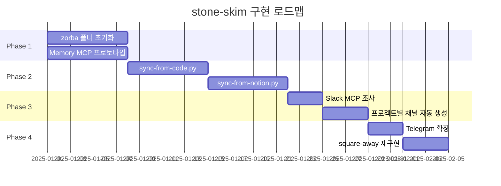

# 05. 구현 로드맵: 4 Phase

## 개요
stone-skim "컴퓨터 없애기" 철학을 실현하는 구현 로드맵.

**목표**: 사람은 폰만, 로봇은 zorba 폴더만

---

## Phase 1: zorba 폴더 초기화 (1주)

### 목표
- `-zorba-the-robot/` 폴더 생성
- Memory MCP 기본 구조 구축
- 프로토타입 검증

### 작업 항목
```
1. 폴더 구조 생성 (1일)
   - -zorba-the-robot/{entities,relations,filesystem,sync-scripts}
   - README.md 작성 (로봇 초기화 가이드)

2. entities/services.json 수동 작성 (1일)
   - 4개 서비스 (BucketTrigger, CODINGBOT, REVIEWER, DLG)
   - Observations 5개씩 작성

3. relations/service-to-db.json 수동 작성 (1일)
   - Service → DB 관계 (15개)
   - Service → Handler 관계 (8개)

4. Memory MCP import 스크립트 (1일)
   - import-to-memory.py 작성
   - entities + relations → Memory MCP 저장

5. 테스트 (1일)
   - memory.search_nodes("BucketTrigger") 실행
   - 응답 시간 < 3초 확인
   - 토큰 사용량 < 300 tokens 확인

6. 문서화 (1일)
   - docs/guides/zorba-setup.md 작성
```

### 완료 조건
- [ ] zorba 폴더 구조 완성
- [ ] Memory MCP 조회 성공 (4개 서비스)
- [ ] 응답 시간 < 3초
- [ ] 토큰 사용량 < 300 tokens

---

## Phase 2: Memory MCP 자동화 (2주)

### 목표
- Python 파일 자동 분석
- Notion DB 자동 동기화
- 일일 cron job 설정

### 작업 항목
```
Week 1: sync-from-code.py
1. AST 파싱 (2일)
   - Python 파일 imports/exports 추출
   - 주석에서 역할 추출
   - 의존성 분석 (internal, external)

2. entities/files.json 생성 (1일)
   - 20+ 파일 분석
   - File Entity 자동 생성

3. 테스트 (1일)
   - codingbot.py 분석 결과 확인
   - Memory MCP 업데이트 성공

Week 2: sync-from-notion.py + cron
4. Notion API 호출 (2일)
   - Database 리스트 조회
   - Properties 스키마 추출
   - entities/databases.json 생성

5. validate-graph.py (1일)
   - Relation 일관성 검증
   - Entity 중복 제거
   - 에러 리포트 생성

6. cron job 설정 (1일)
   - 일일 08:00 KST 실행
   - Telegram 알림 추가
```

### 완료 조건
- [ ] sync-from-code.py 동작 (20+ 파일)
- [ ] sync-from-notion.py 동작 (6개 DB)
- [ ] validate-graph.py 에러 없음
- [ ] cron job 정상 실행

---

## Phase 3: Slack 통합 (1주)

### 목표
- Slack MCP 확인 + 설치
- 프로젝트별 채널 자동 생성
- AI 봇 알림 전송

### 작업 항목
```
1. Slack MCP 조사 (1일)
   - MCP Registry 검색
   - 존재 여부 확인
   - 대안: slack_sdk 사용

2. 프로젝트별 채널 자동 생성 (2일)
   - OPERATION 생성 시 Slack 채널 자동 생성
   - 채널명 규칙 적용 (소문자, 하이픈)
   - AI 봇 초대

3. 알림 전송 (2일)
   - RESEARCH 생성 → #project-name 알림
   - REPORT 생성 → #project-name 알림
   - 에러 발생 → #operations 알림

4. 테스트 (1일)
   - 새 OPERATION 생성 → Slack 채널 확인
   - 알림 정상 전송 확인

5. 문서화 (1일)
   - docs/guides/slack-integration.md 작성
```

### 완료 조건
- [ ] Slack MCP 설치 완료 (또는 slack_sdk)
- [ ] 프로젝트별 채널 자동 생성
- [ ] 알림 전송 성공 (3가지)

---

## Phase 4: Telegram 확장 + square-away 재구현 (1주)

### 목표
- Telegram 명령어 확장
- square-away 재정의 (사람/로봇 영역 분리)
- 전체 시스템 통합 테스트

### 작업 항목
```
1. Telegram 명령어 확장 (2일)
   - /code <TODO_ID> 추가
   - /debug <에러 메시지> 추가
   - /fast-track <IDEA_ID> 추가

2. square-away 재구현 (2일)
   - 기존: 폴더 정리 → 새로운: 영역 분리
   - Phase 1: docs/ vs 나머지 분석
   - Phase 2: 코드/설정 → zorba/ 이동
   - Phase 3: Memory MCP 동기화

3. 통합 테스트 (2일)
   - 시나리오 1: 새 기능 추가 (Telegram → PR)
   - 시나리오 2: 버그 수정 (/debug → /fast-track)
   - 시나리오 3: 프로젝트 진행 상황 (Slack)

4. 문서화 (1일)
   - docs/guides/computer-free-workflow.md 작성
   - 사용 시나리오 10개 추가
```

### 완료 조건
- [ ] Telegram 명령어 3개 추가
- [ ] square-away 재구현 완료
- [ ] 통합 테스트 3가지 통과
- [ ] 문서화 완료

---

## 타임라인



**총 기간**: 5주 (2025-01-01 ~ 2025-02-05)

---

## 위험 요소 & 대응

### 위험 1: Slack MCP 없음
**대응**: slack_sdk 라이브러리 사용 (대안)

### 위험 2: Memory MCP 성능
**대응**: Entity 개수 제한 (초기 70개 → 50개로 축소)

### 위험 3: zorba 폴더 이동 시 Git 충돌
**대응**: `git mv` 사용, 별도 브랜치에서 작업

### 위험 4: Notion API Rate Limit
**대응**: sync-from-notion.py 실행 주기 조정 (일일 → 주간)

---

## 성공 지표

### 정량적 지표
- [ ] 컨텍스트 절약률 ≥ 95% (5000 → 200 tokens)
- [ ] 응답 시간 ≤ 3초 (Memory MCP 조회)
- [ ] Telegram 명령어 사용률 ≥ 80%
- [ ] 파일 읽기 필요 ≤ 5% (코드 파일)

### 정성적 지표
- [ ] 사람이 컴퓨터 화면 보는 시간 ≤ 10분/일
- [ ] 폰만으로 작업 가능 (99%)
- [ ] 새 팀원 온보딩 ≤ 5분 (기존 30분)

---

## 우선순위

**High** (즉시 시작):
- Phase 1: zorba 폴더 초기화
- Phase 2: sync-from-code.py

**Medium** (Phase 1 완료 후):
- Phase 3: Slack 통합
- Phase 4: Telegram 확장

**Low** (선택적):
- square-away 재구현 (필요시만)

---

## 다음 단계

**즉시 실행**:
1. zorba 폴더 생성
2. entities/services.json 수동 작성 (4개)
3. Memory MCP import 테스트

**1주 내**:
- sync-from-code.py 프로토타입
- Python 파일 3개 분석 테스트

**1달 내**:
- 전체 Phase 1-4 완료
- 통합 테스트 통과
