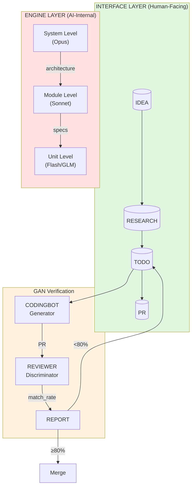

# YOMAN: UnitService Architecture 완벽 가이드

## 학습 메타데이터
- **날짜**: 2025-12-31
- **카테고리**: Development (Architecture)
- **Level**: Deep (Level 3)
- **예상 시간**: ~5시간
- **난이도**: ⭐️⭐️⭐️⭐️ (4/5)

---

## 학습 목표

이 문서를 완료하면:
- [ ] YOMAN의 Two-Layer Architecture (Interface Layer + Engine Layer) 이해
- [ ] SampleRNN에서 영감받은 UnitService 계층 구조 설명 가능
- [ ] Bucket System (IDEA → RESEARCH → TODO → PR) 흐름 이해
- [ ] Generator-Discriminator 검증 메커니즘 (Quasi-Non-Causal) 이해
- [ ] "컴퓨터 없이 개발하기" 패러다임의 실현 방법 파악

---

## 핵심 개념 (5가지)

1. **Two-Layer Architecture**: Interface Layer (Bucket)와 Engine Layer (UnitService)의 분리
2. **UnitService**: SampleRNN 영감의 3계층 구조 (Unit → Module → System)
3. **Bucket System**: 정보 정제 파이프라인 (IDEA → RESEARCH → TODO → PR)
4. **Quasi-Non-Causal Verification**: Generator-Discriminator를 통한 사후 검증
5. **Computer-Free Paradigm**: 사람-로봇 영역 분리로 폰만으로 개발

---

## 개념 다이어그램

---

## 사전 지식

- LLM (Large Language Model) 기본 개념
- 마이크로서비스 아키텍처 기초
- Git/GitHub PR 워크플로우
- (선택) SampleRNN 논문 개요

---

## 학습 경로

| 순서 | 파일 | 내용 | 예상 시간 |
|------|------|------|----------|
| 1 | 01-problem-statement.md | 핵심 문제 정의 (Causal System, Context 한계) | 30분 |
| 2 | 02-two-layer-architecture.md | Interface Layer vs Engine Layer 분리 | 45분 |
| 3 | 03-unitservice-hierarchy.md | SampleRNN 영감의 3계층 구조 | 45분 |
| 4 | 04-bucket-system.md | 물수제비 메타포와 정보 정제 | 40분 |
| 5 | 05-gan-verification.md | Generator-Discriminator 검증 | 40분 |
| 6 | 06-computer-free.md | "컴퓨터 없이 개발" 패러다임 | 30분 |
| 7 | 07-external-resources.md | 논문, GitHub, 참고 자료 | 20분 |
| 8 | 08-references.md | 내부 문서 및 용어 정리 | 20분 |

---

## YOMAN이란?

**YOMAN** = **Y**our **O**mniscient **M**anager for **A**utonomous **N**avigation

LLM이 안전하게 모든 기능을 파악할 수 있는 **UnitService Architecture**를 기반으로,
"컴퓨터 없이" 자연어만으로 소프트웨어 개발이 가능한 시스템.

### 핵심 인사이트

> "마이크로서비스 아키텍처조차도 사람한테 특별한 거지, LLM에게는 너무 큰 context임."

| 규모 | Context 크기 | LLM 이해도 |
|------|-------------|-----------|
| 전체 프로젝트 | 20,000+ tokens | ❌ 혼란 |
| 마이크로서비스 | 5,000 tokens | △ 부담 |
| **유닛** | **200-500 tokens** | ✅ 완벽 |

---

## 영감의 원천

| 출처 | 핵심 개념 | YOMAN 적용 |
|------|----------|-----------|
| **SampleRNN** (ICLR 2017) | 계층적 시간 스케일 | Unit → Module → System |
| **마이크로서비스** | 단일 책임, 독립 배포 | Operation 개념 |
| **인지 심리학** (Miller's Law) | 7±2 항목 한계 | 작은 단위로 분할 |
| **GAN** | Generator-Discriminator | CODINGBOT-REVIEWER |

---

## 기대 효과

### 정량적 지표

| 메트릭 | 기존 | YOMAN 적용 후 | 개선율 |
|--------|------|--------------|--------|
| 토큰 사용 | 20,000 | 500 | **96% 절감** |
| 작업 시작 시간 | 30분 | 5분 | **6배 단축** |
| 파일 읽기 필요 | 99% | 5% | **94% 감소** |
| First-pass 성공률 | 45% | 77% | **32pp 증가** |

### 비용 절감 (월간)

| 항목 | Before | After | 절감 |
|------|--------|-------|------|
| Claude API | $150 | $40 | $110 |
| 개발 시간 | 80시간 | 50시간 | 30시간 |
| 컴퓨터 사용 | 4.2시간/작업 | 12분/작업 | **97%** |

---

*다음: [01-problem-statement.md](01-problem-statement.md) - 핵심 문제 정의*
