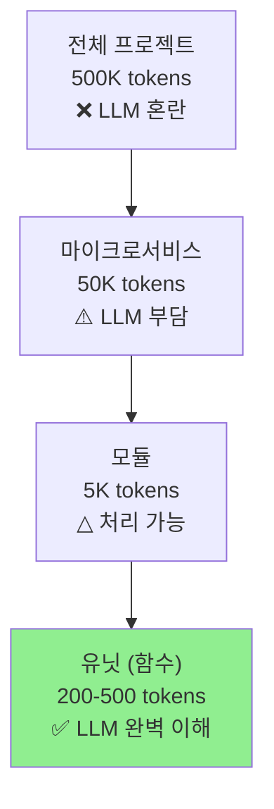

# 01. 핵심 문제 정의

## 1.1 Causal System의 근본적 한계

### LLM은 Causal System임

Large Language Model은 **autoregressive token prediction**으로 코드를 생성함:

$$p(x_t | x_{<t}) = f_\theta(x_1, x_2, \ldots, x_{t-1})$$

- 시간 $t$의 출력은 이전 입력($< t$)에만 의존
- **미래 토큰을 볼 수 없음** (정의상 불가능)

### 왜 문제인가?

**인간 프로그래머의 워크플로우**:
```
1. 코드 작성 (generation)
2. 실행/테스트 (execution)
3. 결과 확인 (review)    ← LLM에게 없음
4. 버그 수정 (debug)     ← LLM에게 없음
5. 반복 (iterate)        ← LLM에게 없음
```

**LLM의 워크플로우**:
```
1. 코드 생성 (linear stream)
2. 끝
```

> LLM은 자신의 출력을 **생성 후 검토할 수 없음**.

### Signal Processing 관점

| 시스템 타입 | 수식 | 설명 |
|------------|------|------|
| **Causal** | $y_t = f(x_{t-k}, \ldots, x_t)$ | 과거/현재만 사용 |
| **Non-Causal** | $y_t = f(x_{t-k}, \ldots, x_t, \ldots, x_{t+k})$ | 미래도 사용 |

Autoregressive LLM은 **정의상 Causal**임.
"아직 생성하지 않은 토큰"에 조건을 걸 수 없음.

---

## 1.2 Context Window의 실질적 한계

### 수치로 보는 문제

| 규모 | 토큰 수 | LLM 처리 |
|------|--------|----------|
| 단일 함수 | ~200 | ✅ 완벽 |
| 단일 파일 | ~2,000 | ✅ 양호 |
| 모듈 (10 파일) | ~20,000 | ⚠️ 부담 |
| 마이크로서비스 | ~50,000 | ❌ 혼란 |
| 전체 프로젝트 | ~500,000 | ❌ 불가능 |

### 현재 모델의 Context 한계

```
Claude Opus 4.5:   200K tokens
GPT-4 Turbo:       128K tokens
Gemini 1.5 Pro:    2M tokens (but quality degrades)
```

**문제**: Context window가 커져도, **attention quality는 떨어짐**.
"Lost in the Middle" 현상 - 중간 정보가 무시됨.

### 실제 시나리오

500줄짜리 기능을 생성하려면:
```
필요한 컨텍스트:
- 기존 코드베이스: ~50K tokens
- 타입 정의: ~5K tokens
- 의존성 정보: ~5K tokens
- 생성할 코드: ~10K tokens
───────────────────────────────
합계: ~70K tokens
```

**하지만** 실제 의존성은 200+ 파일, 500K+ tokens에 걸쳐 있음.
전부 넣을 수 없음.

---

## 1.3 마이크로서비스조차 LLM에게는 "크다"

### 핵심 인사이트

> "마이크로서비스 아키텍처조차도 사람한테 특별한 거지,
> LLM에게는 너무 큰 context임."

| 대상 | 사람에게 | LLM에게 |
|------|---------|---------|
| 전체 프로젝트 | "복잡함" | "불가능" |
| 마이크로서비스 | "적절함" | "부담됨" |
| 유닛 (함수) | "너무 작음" | **"딱 좋음"** |

### 왜 유닛인가?



---

## 1.4 해결해야 할 두 가지 질문

### 질문 1: Causal System에서 Non-Causal 효과를 낼 수 있는가?

> "리뷰어 개념이 들어가면 non-causal system이 될 수 있는건지??"

**답**: 진정한 non-causal은 불가능하지만, **기능적 동등성**은 가능함.
→ Generator-Discriminator 아키텍처로 해결

### 질문 2: Context 한계를 어떻게 극복하는가?

**답**: 계층적 분할 + 지식 그래프 캐싱
→ UnitService Architecture로 해결

---

## 1.5 YOMAN의 접근 방식

### Two-Layer Architecture

```
┌─────────────────────────────────────────────────────────────┐
│                    INTERFACE LAYER                          │
│                    (Bucket System)                          │
│                                                             │
│   사람이 보는 것:  IDEA → RESEARCH → TODO → PR              │
│   비유:           자동차의 핸들, 페달, 계기판                │
├─────────────────────────────────────────────────────────────┤
│                     ENGINE LAYER                            │
│                (UnitService Architecture)                   │
│                                                             │
│   내부 프로토콜: System(Opus) → Module(Sonnet) → Unit(Flash)│
│   비유:          자동차의 엔진, 변속기, ECU                  │
└─────────────────────────────────────────────────────────────┘
```

### 핵심 원리

1. **Interface Layer**: 사람의 인지에 최적화
   - 명확한 단계, 직관적 피드백, 자연어

2. **Engine Layer**: AI 능력에 최적화
   - 병렬 처리, 컨텍스트 관리, 다중 모델 오케스트레이션

3. **분리의 이점**:
   - 사람은 내부 동작을 몰라도 됨
   - AI는 복잡한 처리를 숨길 수 있음
   - 각각 독립적으로 진화 가능

---

## 핵심 요약

| 문제 | 원인 | YOMAN 해결책 |
|------|------|-------------|
| Self-review 불가 | Causal System | Generator-Discriminator |
| Context 한계 | Attention 품질 저하 | 계층적 UnitService |
| 복잡성 관리 | 인지 과부하 | Two-Layer 분리 |

---

*다음: [02-two-layer-architecture.md](02-two-layer-architecture.md) - Interface Layer vs Engine Layer*
