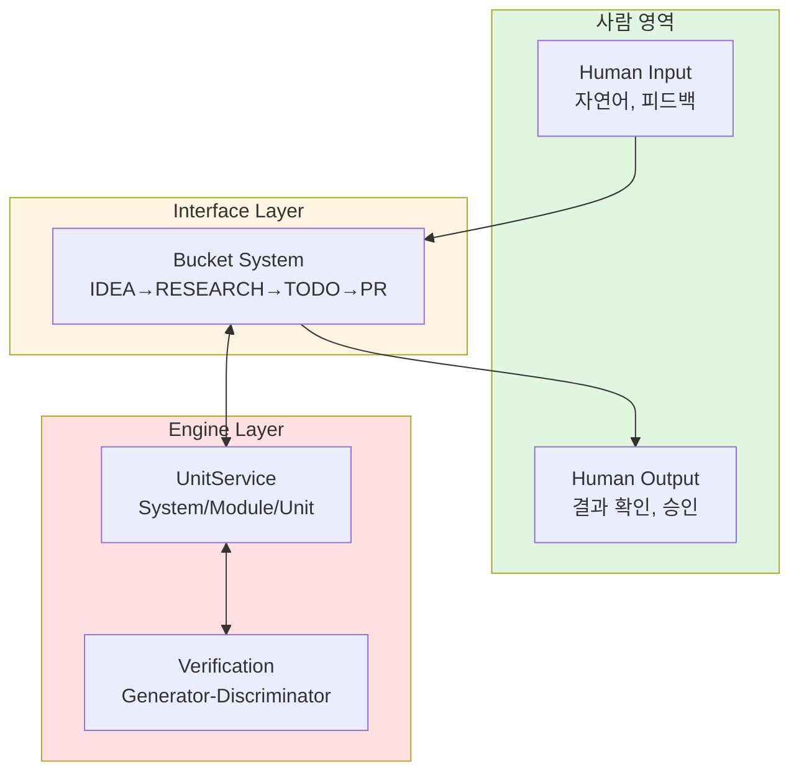
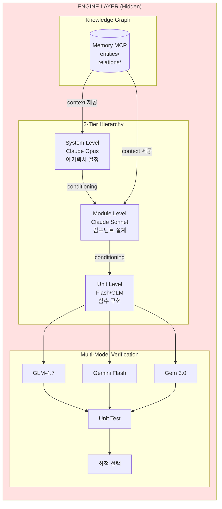
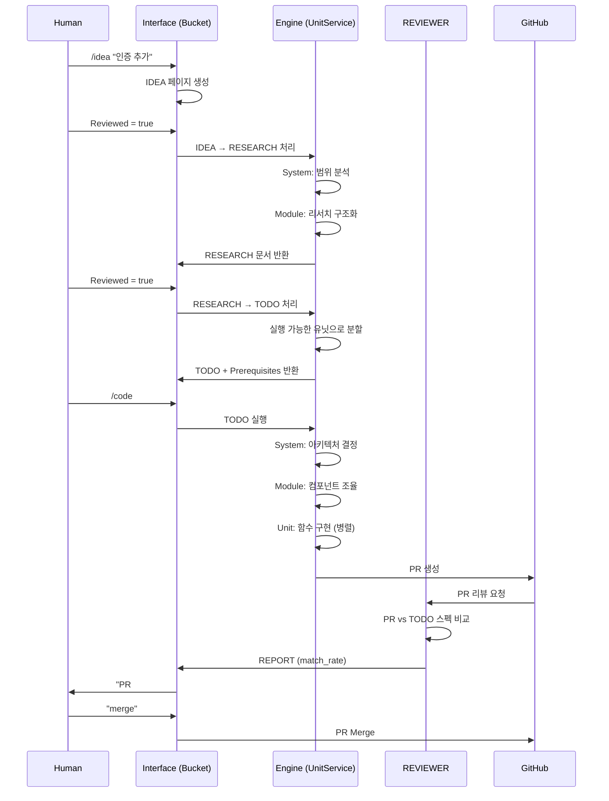
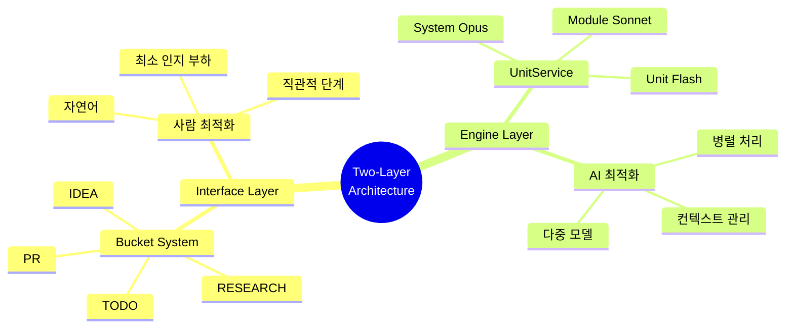

# 02. Two-Layer Architecture

## 2.1 설계 철학

### 자동차 비유

> "운전자가 엔진을 이해할 필요 없이 효과적으로 운전할 수 있어야 한다."

| Layer | 사용자 가시성 | 목적 | 비유 |
|-------|-------------|------|------|
| Interface (Bucket) | **Visible** | 사람과 소통 | 대시보드, 컨트롤 |
| Engine (UnitService) | **Hidden** | AI 처리 | 엔진, 변속기 |

### 분리의 핵심 원리



---

## 2.2 Interface Layer (Bucket System)

### 설계 원칙

1. **Progressive Refinement**: 정보가 단계를 거치며 정제됨
2. **Intuitive Stages**: 각 버킷이 명확하고 이해하기 쉬움
3. **Minimal Cognitive Load**: 4개 개념만 알면 됨 (IDEA, RESEARCH, TODO, PR)

### 버킷 정의

| Bucket | 입력 | 출력 | 사람의 행동 |
|--------|------|------|-----------|
| **IDEA** | 자연어 아이디어 | 간단한 마크다운 | 아이디어 작성, Reviewed=true |
| **RESEARCH** | IDEA 페이지 | 구조화된 분석 + 다이어그램 | 리뷰, 코멘트 추가, Reviewed=true |
| **TODO** | RESEARCH 페이지 | 실행 가능한 스펙 + Prerequisites | 범위 확인, 코딩 승인 |
| **PR** | TODO 페이지 | Git Pull Request | match_rate 확인, merge |

### 사람이 하는 일

```
9:00  📱 /idea "사용자 인증 추가"
      ↓ [AI가 알아서 처리 - 30분]
9:30  📱 "RESEARCH 준비됨" → 폰에서 확인, "approve"
      ↓ [AI가 알아서 처리 - 10분]
10:00 📱 "TODO 준비됨" → "approve"
      ↓ [AI가 코드 생성 - 15분]
10:15 📱 "PR #123 준비 (92% match)" → "merge"
10:16 완료!
```

**컴퓨터 사용 시간**: 0분. 전부 폰으로 처리.

---

## 2.3 Engine Layer (UnitService Architecture)

### 숨겨진 복잡성

Engine Layer는 사람에게 보이지 않음. 하지만 내부에서는:



### 왜 숨기는가?

| 관점 | Interface 노출 시 | 숨길 때 |
|------|------------------|--------|
| **복잡성** | 사람이 이해해야 함 | AI가 알아서 처리 |
| **유연성** | 변경 시 재교육 필요 | 내부만 수정 |
| **신뢰** | 세부사항에 집착 | 결과에 집중 |

---

## 2.4 정보 흐름 상세

### End-to-End 시퀀스



### 각 Layer의 책임

| Layer | 책임 | NOT 책임 |
|-------|------|---------|
| **Interface** | 상태 추적, 형식 변환, 사용자 소통 | 코드 생성, 품질 검증 |
| **Engine** | 코드 생성, 컨텍스트 관리, 품질 검증 | 사용자 직접 소통 |

---

## 2.5 분리의 이점

### 1. 독립적 진화

```
Interface 개선:                    Engine 개선:
- Telegram → Slack 전환           - Opus 4.5 → Opus 5.0
- 새로운 버킷 추가                 - 새로운 검증 로직
- UI/UX 개선                       - 성능 최적화

→ 서로 영향 없이 각각 개선 가능
```

### 2. 관심사 분리

```python
# Interface Layer - 사람의 인지에 최적화
def create_idea(user_input: str) -> IdeaPage:
    """사람이 이해하기 쉬운 형태로 변환"""
    return IdeaPage(
        title=extract_title(user_input),
        goals=extract_goals(user_input),
        non_goals=[]  # 사람이 채움
    )

# Engine Layer - AI 능력에 최적화
def generate_code(todo: TodoSpec) -> PullRequest:
    """복잡한 다중 모델 오케스트레이션"""
    system_ctx = opus.analyze(knowledge_graph, todo)
    modules = [sonnet.design(m, system_ctx) for m in system_ctx.modules]
    units = [flash.implement(f, m) for m in modules for f in m.functions]
    return create_pr(units)
```

### 3. 테스트 용이성

| Layer | 테스트 방법 |
|-------|-----------|
| Interface | UI/UX 테스트, 사용자 피드백 |
| Engine | 자동화된 품질 메트릭, match_rate |

---

## 2.6 실제 구현: zorba-the-robot

### 프로젝트 구조

```
project/
│
├── docs/                          # 사람 영역 (5%)
│   ├── guides/                    # 가이드 문서
│   ├── research/                  # 리서치 결과
│   ├── study/                     # 학습 자료
│   └── ops/                       # Operation 정의
│
└── -zorba-the-robot/              # 로봇 영역 (95%)
    ├── src/                       # 소스 코드
    │   ├── CODINGBOT/             # Generator
    │   ├── REVIEWER/              # Discriminator
    │   └── Bucket-Trigger/        # 버킷 전환
    ├── tests/                     # 테스트
    ├── entities/                  # Memory MCP
    ├── relations/                 # 지식 그래프
    └── .github/                   # CI/CD
```

### 명명 규칙

- **docs/**: 사람이 읽는 모든 것
- **-zorba-the-robot/**: 대시(-)로 시작 = AI 전용

> "사람은 src/도 안 봄. 코드 자체를 안 봄."

---

## 핵심 요약



---

*다음: [03-unitservice-hierarchy.md](03-unitservice-hierarchy.md) - SampleRNN 영감의 3계층 구조*
