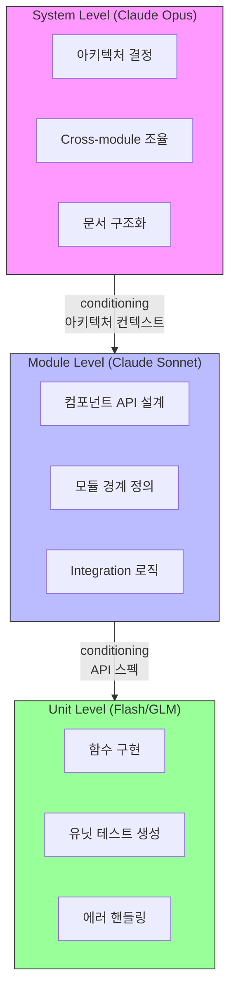
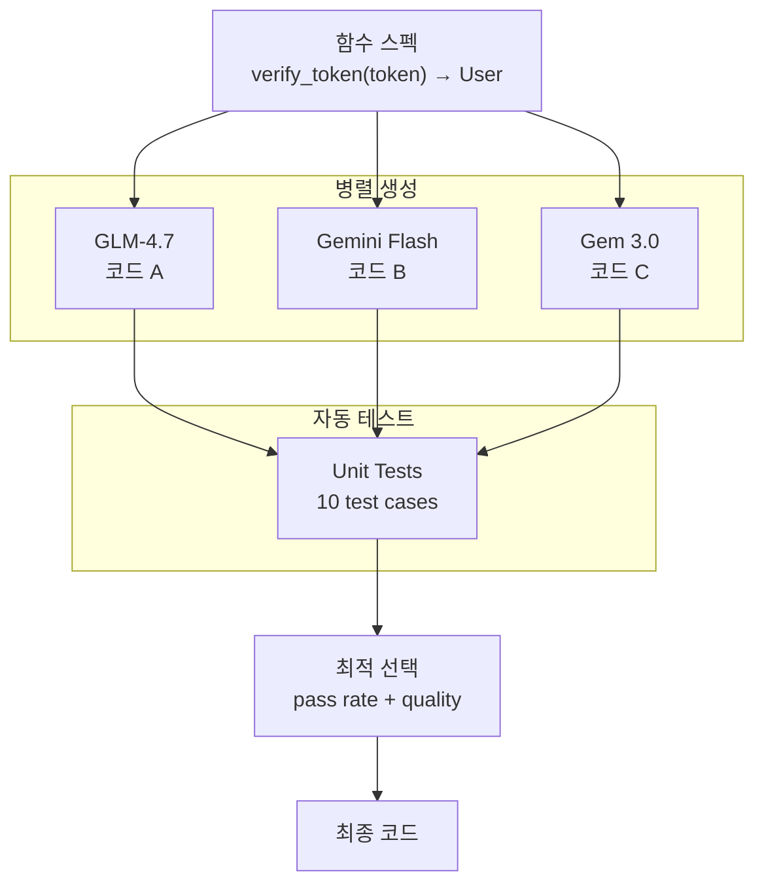
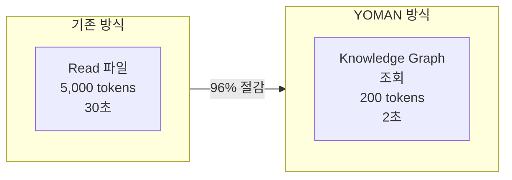
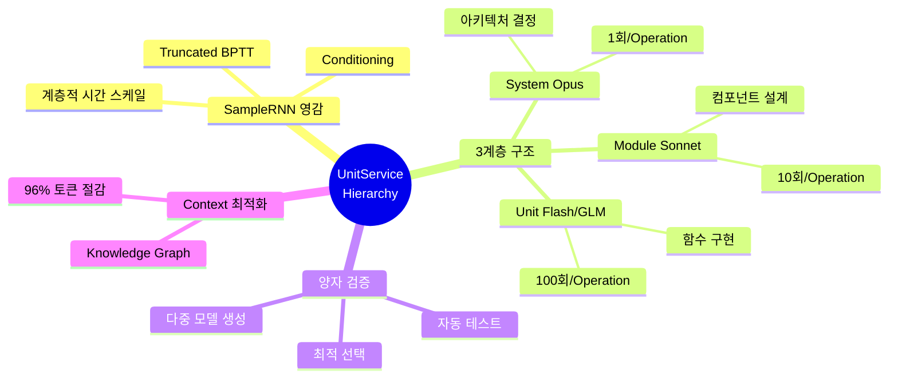

# 03. UnitService Hierarchy

## 3.1 SampleRNN에서 배운 것

### SampleRNN 논문 개요

**SampleRNN: An Unconditional End-to-End Neural Audio Generation Model**
(Mehri, Kumar, Gulrajani 등, ICLR 2017)

오디오 생성 모델로, 16kHz 샘플 레이트 = 초당 16,000개 샘플을 처리.
핵심 아이디어: **서로 다른 시간 스케일에서 작동하는 모듈 조합**

```
┌─────────────────────────────────────────────────────────────┐
│  Tier 3 (최상위)                                            │
│  - 가장 느린 clock rate                                     │
│  - 추상적 패턴 (음소, 단어 수준)                             │
│  - Stateful RNN                                             │
├─────────────────────────────────────────────────────────────┤
│  Tier 2 (중간)                                              │
│  - 중간 clock rate                                          │
│  - Frame 단위 처리                                          │
│  - Stateful RNN                                             │
├─────────────────────────────────────────────────────────────┤
│  Tier 1 (최하위)                                            │
│  - 가장 빠른 clock rate                                     │
│  - Sample 단위 (16kHz = 초당 16,000 샘플)                   │
│  - Memory-less MLP                                          │
└─────────────────────────────────────────────────────────────┘
```

### 핵심 통찰

1. **계층적 시간 스케일**: 다른 해상도에서 다른 패턴 학습
2. **Conditioning**: 상위 tier가 하위 tier에 컨텍스트 제공
3. **Truncated BPTT**: 짧은 시퀀스로도 긴 의존성 학습 가능

---

## 3.2 YOMAN으로의 매핑

### SampleRNN → UnitService

```
SampleRNN                         YOMAN (UnitService)
══════════════════════════════════════════════════════════════
Tier 3 (최상위)          →        System Level (Opus)
- 느린 clock rate                 - 프로젝트 전체 조망
- 추상적 패턴                     - 아키텍처 결정
- Stateful RNN                    - docs/Memory MCP 관리

Tier 2 (중간)            →        Module Level (Sonnet)
- 중간 clock rate                 - 컴포넌트 단위 작업
- Frame 단위                      - API 설계
- 상위↔하위 연결                  - Unit 그룹 통합

Tier 1 (최하위)          →        Unit Level (Flash/GLM)
- 빠른 clock rate                 - 단일 함수/클래스
- Sample 단위                     - 빠른 코드 생성
- Memory-less MLP                 - 여러 개 병렬 실행
══════════════════════════════════════════════════════════════
```

### 왜 이 매핑이 유효한가?

| 특성 | SampleRNN | YOMAN |
|------|-----------|-------|
| **계층화 이유** | 긴 시퀀스를 단계별 처리 | 큰 프로젝트를 단계별 처리 |
| **상위 역할** | 추상 패턴 (단어, 음소) | 추상 설계 (아키텍처) |
| **하위 역할** | 구체 생성 (개별 샘플) | 구체 구현 (개별 함수) |
| **Conditioning** | 상위가 하위 가이드 | System → Module → Unit |

---

## 3.3 3계층 구조 상세

### 아키텍처 다이어그램



### 각 Level의 책임

#### System Level (Claude Opus)

```python
# System level - 전체 프로젝트 관점
system_context = opus.analyze(
    knowledge_graph=project_kg,
    todo_spec=todo
)

# Output 예시:
{
    "architecture_decision": "JWT + refresh token, middleware pattern",
    "modules_needed": ["AuthModule", "TokenService", "UserDB"],
    "integration_points": {
        "AuthModule": ["calls TokenService", "queries UserDB"],
        "TokenService": ["uses Redis for storage"]
    },
    "docs_update": ["guides/auth.md", "README.md"]
}
```

**Clock Rate**: Operation당 1회
**Context**: 전체 프로젝트 Knowledge Graph

#### Module Level (Claude Sonnet)

```python
# Module level - 컴포넌트 관점
for module in system_context.modules:
    module_spec = sonnet.design(
        module=module,
        system_context=system_context
    )

# Output 예시:
{
    "module_name": "AuthModule",
    "exports": ["login()", "logout()", "verify()", "refresh()"],
    "dependencies": ["TokenService", "UserDB", "bcrypt"],
    "interfaces": {
        "login": {
            "input": {"email": "str", "password": "str"},
            "output": {"token": "str", "refresh_token": "str"}
        }
    }
}
```

**Clock Rate**: Operation당 ~10회
**Context**: 모듈 범위 + 인터페이스

#### Unit Level (Gemini Flash / GLM)

```python
# Unit level - 함수 관점
for function in module_spec.functions:
    code = flash.implement(
        function=function,
        module_spec=module_spec
    )

# Output 예시:
"""
async def verify_token(token: str) -> Optional[User]:
    '''JWT 토큰 검증 후 사용자 정보 반환'''
    try:
        payload = jwt.decode(token, SECRET_KEY, algorithms=['HS256'])
        user_id = payload.get('sub')
        return await UserDB.find_by_id(user_id)
    except jwt.ExpiredSignatureError:
        return None
    except jwt.InvalidTokenError:
        return None
"""
```

**Clock Rate**: Operation당 ~100회
**Context**: 함수 범위 + 타입 시그니처

---

## 3.4 Conditioning 메커니즘

### SampleRNN의 Conditioning

$$c^{(k)}_{(t-1) \cdot r + j} = W_j h_t, \quad 1 \leq j \leq r$$

상위 tier의 hidden state $h_t$가 하위 tier를 conditioning.

### YOMAN에서의 Conditioning

```python
# Conditioning 흐름
def generate_feature(todo_spec):
    # 1. System level: 전체 그림
    system_ctx = opus.analyze(knowledge_graph, todo_spec)
    # → "JWT 패턴, 3개 모듈 필요, Redis 사용"

    # 2. Module level: 각 모듈 설계 (system_ctx로 conditioning)
    for module in system_ctx.modules:
        module_spec = sonnet.design(
            module,
            context=system_ctx  # ← Conditioning!
        )
        # → "AuthModule: login(), logout(), verify(), refresh()"

        # 3. Unit level: 각 함수 구현 (module_spec로 conditioning)
        for function in module_spec.functions:
            code = flash.implement(
                function,
                context=module_spec  # ← Conditioning!
            )
            # → 실제 Python/JS 코드

    return aggregate_all(codes)
```

### Conditioning의 효과

| Without Conditioning | With Conditioning |
|---------------------|-------------------|
| 함수가 context 없이 생성 | 아키텍처 일관성 유지 |
| 인터페이스 불일치 | API 스펙 준수 |
| 통합 시 충돌 | 사전에 호환성 보장 |

---

## 3.5 다중 모델 검증 (양자 검증)

### 왜 여러 모델을 사용하는가?

> "하이어라키가 복잡해질 때 어떻게 하냐면
> 해당 유닛 서비스를 '여러 개' 만들어서 양자 검증하는 것처럼 테스트하는 것임."



### 구현 코드

```python
def generate_unit_with_verification(spec, module_context):
    # 여러 모델로 동시 생성
    candidates = [
        glm_4_7.generate(spec, module_context),
        gemini_flash.generate(spec, module_context),
        gem_3_0.generate(spec, module_context)
    ]

    # 자동 테스트 실행
    results = []
    for code in candidates:
        test_result = run_unit_tests(code, spec.test_cases)
        quality_score = evaluate_code_quality(code)
        results.append({
            'code': code,
            'pass_rate': test_result.pass_rate,
            'quality': quality_score
        })

    # 최적 선택
    best = max(results, key=lambda x: (x['pass_rate'], x['quality']))
    return best['code']
```

### 장점

1. **단일 모델 의존성 제거**: 하나가 실패해도 다른 게 성공
2. **품질 보장**: 테스트 통과한 것만 선택
3. **비용 효율**: 작은 모델들로 병렬 처리 (Unit level은 저렴)

---

## 3.6 Context 최적화

### Memory MCP 활용



### Knowledge Graph 예시

```json
{
  "entities": [
    {
      "name": "AuthMiddleware",
      "type": "Component",
      "observations": [
        "Express.js middleware",
        "Validates JWT from Authorization header",
        "Attaches user object to request",
        "Returns 401 on invalid token"
      ]
    }
  ],
  "relations": [
    {"from": "AuthMiddleware", "rel": "uses", "to": "JWTService"},
    {"from": "AuthMiddleware", "rel": "queries", "to": "UserDB"}
  ]
}
```

### 절감 효과

| 방법 | 토큰 수 | 시간 | 절감률 |
|------|--------|------|-------|
| Full code reading | 8,500 | 30s | baseline |
| Summary-based | 2,100 | 10s | 75% |
| **Knowledge Graph** | **350** | **2s** | **96%** |

---

## 핵심 요약



---

*다음: [04-bucket-system.md](04-bucket-system.md) - 물수제비 메타포와 정보 정제*
