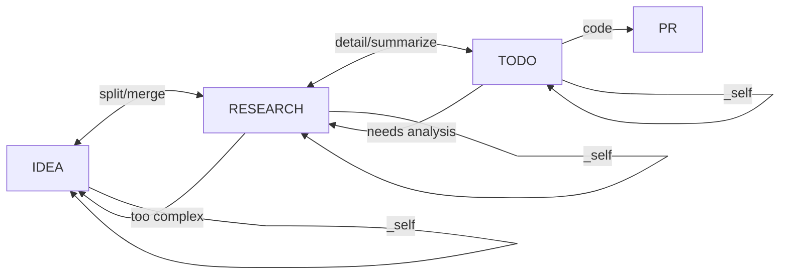
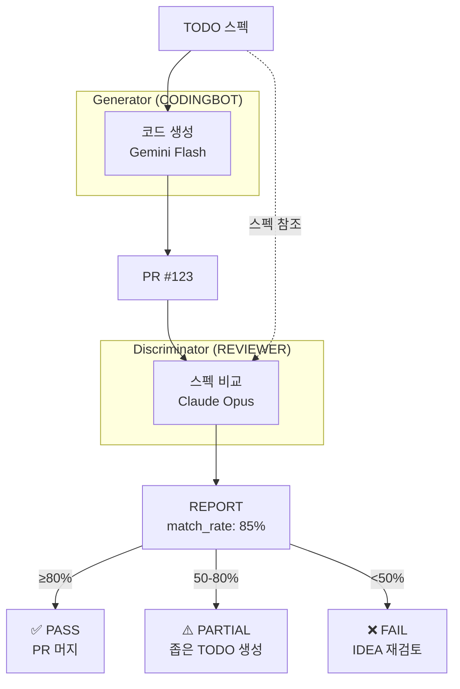
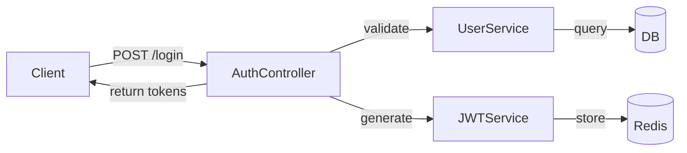
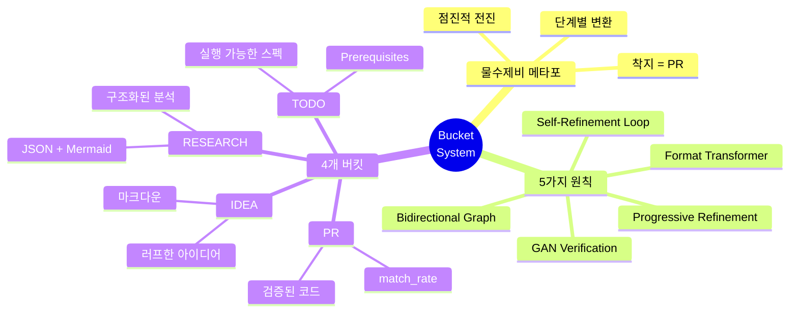

# 04. Bucket System (물수제비 메타포)

## 4.1 물수제비(Skipping Stone) 메타포

### 왜 물수제비인가?

```
첫 던짐        튀김1         튀김2         튀김3         착지
   │            │             │             │            │
   ▼            ▼             ▼             ▼            ▼
  💡  ───~───► 📊  ───~───►  ✅  ───~───►  🤖  ───~───► ✓
 IDEA       RESEARCH        TODO       CODINGBOT       PR
(러프)      (구조화)      (실행가능)    (검증완료)     (최종)
```

**물수제비의 특성**:
- 한 번에 목적지 도달 ✗
- 여러 번 튀면서 전진 ✓
- 각 튀김마다 에너지 전환

**YOMAN의 특성**:
- 한 번에 완성 ✗
- 여러 단계 거쳐 정제 ✓
- 각 단계마다 포맷 변환

---

## 4.2 5가지 핵심 원칙

### 원칙 1: Progressive Refinement (점진적 정제)

```
IDEA v1: "AI 에이전트 만들기"
         ↓ 불명확 → 구체화 필요
RESEARCH: Notion API 조사, 아키텍처 설계, 기술 스택 선정
         ↓ 구조화 → 실행 가능하게
TODO: Prerequisites + 소작전 분할
         ↓ 실행 가능 → 검증됨
PR: 코드 구현 + 테스트 통과 + 리뷰 완료
```

각 단계에서 정보가 **더 명확하고, 더 구체적으로** 변환됨.

### 원칙 2: Bucket = Format Transformer (포맷 변환기)

| 버킷 | AI 모델 | 출력 포맷 |
|------|---------|----------|
| IDEA | Gemini Flash | 간단한 마크다운 |
| RESEARCH | Claude Opus | JSON + Mermaid 다이어그램 |
| TODO | Gemini/Claude | JSON + Prerequisites |
| PR | CODINGBOT | Git diff + 코드 파일 |

### 원칙 3: Bidirectional Graph (양방향 그래프)



**가능한 흐름**:
- ✅ IDEA → RESEARCH (정상 진행)
- ✅ RESEARCH → IDEA 2개 (분할)
- ✅ TODO → RESEARCH (분석 필요)
- ✅ X → _self (재정제)

### 원칙 4: Self-Refinement Loop (_self)

```
IDEA v1: "AI 에이전트 만들기"
   ↓ 코멘트: "구체적으로 해줘"
   ↓ next_bucket = _self

IDEA v2: "Notion DB 자동 정리 AI 에이전트"
   ↓ 코멘트: "어떤 DB를?"
   ↓ next_bucket = _self

IDEA v3: "Notion IDEA/RESEARCH/TODO 버킷 자동 정리 에이전트"
   ↓ next_bucket = RESEARCH

RESEARCH v1: ...
```

**무한 정제 가능**: v1 → v2 → v3 → ... (만족할 때까지)

### 원칙 5: GAN Verification (Generator-Discriminator)



---

## 4.3 각 버킷 상세

### IDEA 버킷

**목적**: 러프한 아이디어를 명확한 목표로 정제

**입력 포맷**:
```markdown
# Feature: 사용자 인증

JWT 기반 인증 추가해서 API 보호하기

## Goals
- /api/* 경로 보호
- Refresh token 지원

## Non-Goals
- 소셜 로그인 (다음 페이즈)
```

**Notion 속성**:
```
Title: "Feature: 사용자 인증"
Status: Draft | Reviewed
next_bucket: _self | RESEARCH
comment: "더 구체적으로..."
```

### RESEARCH 버킷

**목적**: 아이디어를 구조화된 분석으로 변환

**입력**: IDEA 페이지
**출력 포맷**:
```json
{
  "summary": "JWT 인증 구현 분석",
  "architecture_diagram": "mermaid code",
  "children": [
    {
      "title": "보안 분석",
      "content": "JWT vs Session 비교..."
    },
    {
      "title": "구현 옵션",
      "content": "1. passport-jwt, 2. jose..."
    },
    {
      "title": "추천 접근법",
      "content": "jose 라이브러리 + Redis..."
    }
  ]
}
```

**Mermaid 예시**:


### TODO 버킷

**목적**: 실행 가능한 스펙으로 변환

**입력**: RESEARCH 페이지
**출력 포맷**:
```json
{
  "title": "JWT 인증 구현",
  "prerequisites": [
    {"type": "file_exists", "path": "src/middleware/"},
    {"type": "package_installed", "name": "jose"},
    {"type": "env_var", "name": "JWT_SECRET"}
  ],
  "sub_operations": [
    {
      "id": "00-jwt-core",
      "description": "JWT 생성/검증 서비스",
      "scope": "src/services/jwt.ts",
      "estimated_lines": 80
    },
    {
      "id": "01-auth-middleware",
      "description": "인증 미들웨어",
      "scope": "src/middleware/auth.ts",
      "estimated_lines": 50
    },
    {
      "id": "02-auth-routes",
      "description": "로그인/로그아웃 라우트",
      "scope": "src/routes/auth.ts",
      "estimated_lines": 100
    }
  ]
}
```

**Prerequisites의 중요성**:
- 실행 전 환경 검증
- 실패 원인 사전 차단
- CI/CD에서 자동 체크

### PR 버킷

**목적**: 실제 코드 + 리뷰 결과

**생성 주체**: CODINGBOT (Generator)
**검증 주체**: REVIEWER (Discriminator)

**REPORT 포맷**:
```json
{
  "pr_number": 123,
  "match_rate": 0.85,
  "breakdown": {
    "files_score": 1.0,
    "prereq_score": 1.0,
    "ai_score": 0.75
  },
  "issues": [
    "Refresh token rotation 미구현",
    "에러 핸들링 부족"
  ],
  "decision": "PASS",
  "recommendation": "Minor issues, safe to merge"
}
```

---

## 4.4 match_rate 계산

### 공식

$$\text{match\_rate} = 0.3 \cdot F_{\text{files}} + 0.2 \cdot F_{\text{prereq}} + 0.5 \cdot F_{\text{AI}}$$

### 각 컴포넌트

**$F_{\text{files}}$ (파일 점수)**:
$$F_{\text{files}} = \frac{|\text{예상 파일} \cap \text{수정된 파일}|}{|\text{예상 파일}|}$$

**$F_{\text{prereq}}$ (Prerequisites 점수)**:
$$F_{\text{prereq}} = \frac{\text{통과한 prerequisite 체크}}{\text{전체 prerequisite 체크}}$$

**$F_{\text{AI}}$ (AI 점수)**:
Claude Opus가 평가:
- 정확성 (40%): 스펙대로 동작하는가?
- 완전성 (30%): 모든 요구사항 충족?
- 품질 (20%): 코드 스타일, 에러 핸들링, 엣지 케이스
- 테스트 (10%): 적절한 테스트 포함?

### Decision Thresholds

| match_rate | Decision | Action |
|------------|----------|--------|
| **≥80%** | PASS | PR 머지 |
| **50-79%** | PARTIAL | 좁은 TODO 생성, 재시도 |
| **<50%** | FAIL | IDEA 단계로 복귀, 재검토 |

---

## 4.5 실제 사용 예시

### 시나리오: 사용자 인증 추가

```
📱 Day 1, 9:00
User: /idea "API에 사용자 인증 추가"

🤖 9:01
Bot: ✅ IDEA #101 생성됨.
     목표: API 보호
     비목표: (비어있음)

📱 9:02
User: [코멘트] "JWT 방식으로, refresh token도 필요"
User: [next_bucket = _self]

🤖 9:05
Bot: ✅ IDEA #101 v2 생성됨.
     목표:
     - JWT 기반 인증
     - Refresh token 지원
     - /api/* 경로 보호

📱 9:06
User: [Reviewed = true, next_bucket = RESEARCH]

🤖 9:35
Bot: 📊 RESEARCH #101 준비됨.
     - 3개 분석 섹션
     - 아키텍처 다이어그램 포함
     View: [link]

📱 9:40
User: [리뷰 후] [Reviewed = true, next_bucket = TODO]

🤖 9:50
Bot: ✅ TODO #101 준비됨.
     - Prerequisites: 3개
     - Sub-operations: 3개
     - 예상 라인: 230줄

📱 9:51
User: /code

🤖 10:05
Bot: 🔄 PR #123 생성 중...
     - 00-jwt-core ✅
     - 01-auth-middleware ✅
     - 02-auth-routes ✅

🤖 10:10
Bot: 📝 REVIEWER 검증 중...

🤖 10:12
Bot: 🎉 PR #123 준비됨!
     match_rate: 88% (PASS)
     Changes: +245 -12 across 4 files
     Issues: refresh token rotation 미구현 (minor)

📱 10:13
User: merge

🤖 10:14
Bot: ✅ PR #123 머지 완료.
     main 브랜치 업데이트됨.
```

---

## 핵심 요약



---

*다음: [05-gan-verification.md](05-gan-verification.md) - Generator-Discriminator 검증*
