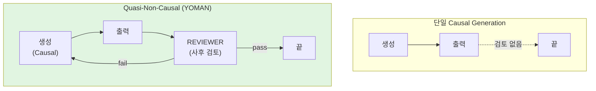
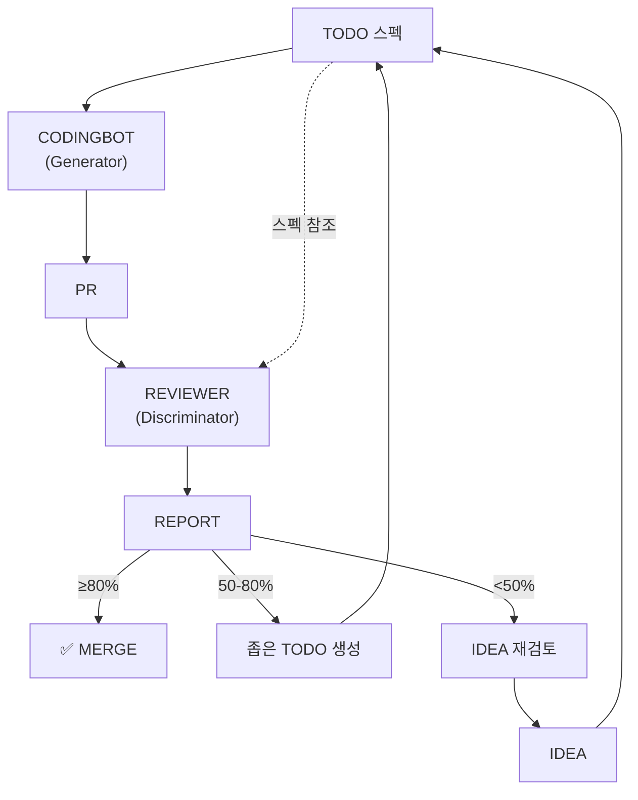
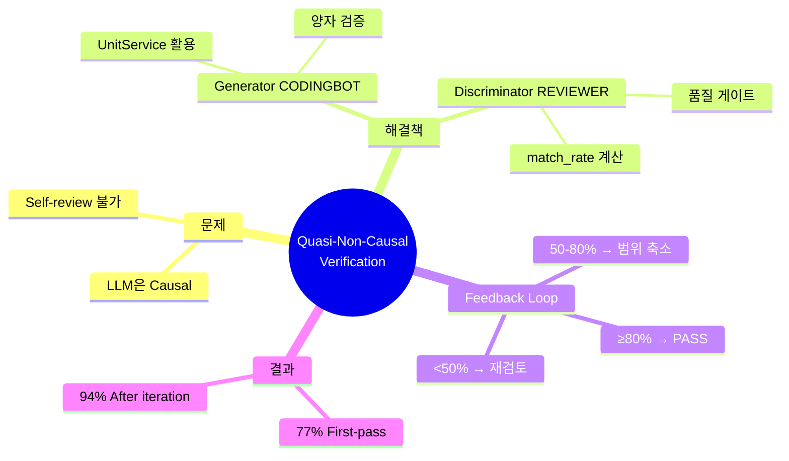

# 05. Generator-Discriminator 검증 (Quasi-Non-Causal)

## 5.1 Causal System의 한계 재검토

### 핵심 질문

> "Causal system vs non-causal system...
> 리뷰어의 개념이 들어가면 non-causal system이 될 수 있는건지??"

### Signal Processing 정의

| 시스템 | 수식 | 설명 |
|--------|------|------|
| **Causal** | $y_t = f(x_{t-k}, \ldots, x_t)$ | 과거/현재 입력만 사용 |
| **Non-Causal** | $y_t = f(x_{t-k}, \ldots, x_t, \ldots, x_{t+k})$ | 미래 입력도 사용 |

### LLM의 한계

Autoregressive LLM:
$$p(x_t | x_{<t}) = f_\theta(x_1, x_2, \ldots, x_{t-1})$$

- 토큰 $x_t$는 이전 토큰에만 조건화됨
- **정의상 Causal System**
- "아직 생성하지 않은 토큰"을 볼 수 없음

---

## 5.2 해결책: Quasi-Non-Causal

### 진정한 Non-Causal은 불가능

생성 시점에 미래 토큰에 조건을 거는 것은 **원리적으로 불가능**.

### 그러나: 기능적 동등성(Functional Equivalence)은 가능



**핵심 인사이트**:
- 생성 자체는 여전히 Causal
- **생성 후 검토**를 추가
- 검토 결과로 **반복** 가능
- → Non-Causal과 **기능적으로 동등한** 결과 달성

---

## 5.3 GAN에서 영감받은 아키텍처

### GAN 개요 (Goodfellow et al., 2014)

```
Generator (G):        노이즈 → 가짜 이미지
Discriminator (D):    이미지 → 진짜/가짜 판별

학습: G는 D를 속이려 하고, D는 G를 구별하려 함
      → 적대적 학습으로 품질 향상
```

### YOMAN의 적용

```
Generator (CODINGBOT):    TODO 스펙 → 코드 (PR)
Discriminator (REVIEWER): PR + 스펙 → match_rate 판별

차이점: 적대적 학습 ❌, 검증 피드백 ✅
       → REVIEWER는 "속이려는 대상"이 아닌 "품질 게이트"
```

---

## 5.4 CODINGBOT (Generator)

### 역할

- TODO 스펙을 받아 실제 코드 생성
- UnitService 계층 활용 (System → Module → Unit)
- PR 생성

### 구현 흐름

```python
class CODINGBOT:
    def generate(self, todo_spec: TodoSpec) -> PullRequest:
        # 1. System level: 아키텍처 결정
        arch_context = self.opus.analyze(
            knowledge_graph=self.kg,
            spec=todo_spec
        )

        # 2. Module level: 컴포넌트 설계
        modules = []
        for module_name in arch_context.modules:
            module_spec = self.sonnet.design(
                module_name,
                context=arch_context
            )
            modules.append(module_spec)

        # 3. Unit level: 함수 구현 (병렬)
        all_code = []
        for module in modules:
            for function in module.functions:
                # 다중 모델 생성 + 테스트 선택
                code = self.generate_with_verification(
                    function,
                    module_context=module
                )
                all_code.append(code)

        # 4. PR 생성
        return self.create_pull_request(
            files=all_code,
            todo_ref=todo_spec.id
        )

    def generate_with_verification(self, func, module_context):
        """양자 검증: 여러 모델로 생성 후 최적 선택"""
        candidates = [
            self.flash.generate(func, module_context),
            self.glm.generate(func, module_context),
            self.gem3.generate(func, module_context)
        ]

        results = [self.run_tests(c) for c in candidates]
        best_idx = argmax([r.score for r in results])
        return candidates[best_idx]
```

---

## 5.5 REVIEWER (Discriminator)

### 역할

- PR을 받아 TODO 스펙과 비교
- match_rate 계산
- REPORT 생성

### 구현 흐름

```python
class REVIEWER:
    def evaluate(self, pr: PullRequest, todo_spec: TodoSpec) -> Report:
        # 1. 파일 점수 계산
        expected_files = set(todo_spec.expected_files)
        modified_files = set(pr.modified_files)
        files_score = len(expected_files & modified_files) / len(expected_files)

        # 2. Prerequisites 점수 계산
        prereq_results = [
            self.check_prerequisite(p)
            for p in todo_spec.prerequisites
        ]
        prereq_score = sum(prereq_results) / len(prereq_results)

        # 3. AI 점수 계산 (Claude Opus)
        ai_assessment = self.opus.evaluate(
            pr_diff=pr.diff,
            todo_spec=todo_spec,
            criteria={
                'correctness': 0.4,
                'completeness': 0.3,
                'quality': 0.2,
                'tests': 0.1
            }
        )
        ai_score = ai_assessment.score

        # 4. match_rate 계산
        match_rate = (
            0.3 * files_score +
            0.2 * prereq_score +
            0.5 * ai_score
        )

        # 5. Decision
        if match_rate >= 0.8:
            decision = "PASS"
        elif match_rate >= 0.5:
            decision = "PARTIAL"
        else:
            decision = "FAIL"

        return Report(
            pr_number=pr.number,
            match_rate=match_rate,
            breakdown={
                'files': files_score,
                'prereq': prereq_score,
                'ai': ai_score
            },
            issues=ai_assessment.issues,
            decision=decision
        )
```

---

## 5.6 Feedback Loop

### 반복을 통한 품질 향상



### 의사 코드

```python
def develop_feature(idea):
    # 버킷 진행
    research = process_bucket(idea, target="RESEARCH")
    todo = process_bucket(research, target="TODO")

    # Generator-Discriminator 루프
    max_iterations = 3
    for i in range(max_iterations):
        pr = CODINGBOT.generate(todo)           # Causal 생성
        report = REVIEWER.evaluate(pr, todo)    # 사후 검토

        if report.match_rate >= 0.8:
            return merge(pr)                    # 성공!

        elif report.match_rate >= 0.5:
            # 범위 축소 후 재시도
            todo = create_narrower_todo(todo, report.issues)

        else:
            # 근본적 문제 - IDEA 재검토
            idea = create_new_idea(report.feedback)
            return develop_feature(idea)        # 재귀 호출

    # Max iterations 도달
    return escalate_to_human(todo, report)
```

---

## 5.7 왜 "Quasi-Non-Causal"인가?

### 비교 표

| 특성 | Pure Causal | True Non-Causal | YOMAN (Quasi) |
|------|-------------|-----------------|---------------|
| 생성 중 미래 참조 | ❌ | ✅ | ❌ |
| 완성된 출력 검토 | ❌ | N/A | ✅ |
| 스펙과 비교 | ❌ | N/A | ✅ |
| 오류 수정 | ❌ | N/A | ✅ (반복) |

### 이론적 프레이밍

가능한 모든 코드 출력 공간 $\mathcal{C}$에서:

**Causal Generation**:
$$c \sim P_\theta(C|S)$$ (한 번 샘플링, 결과 수용)

**YOMAN (Quasi-Non-Causal)**:
$$c^* = \arg\max_{c_i} D(c_i, S)$$

여기서:
- $c_i$: $i$번째 반복에서 생성된 코드
- $D$: Discriminator (REVIEWER)
- $S$: 스펙 (TODO)

→ **Rejection Sampling**과 유사:
  Discriminator가 품질 필터 역할

---

## 5.8 실험 결과

### match_rate 분포

| 점수 범위 | 비율 | 결과 |
|----------|------|------|
| ≥90% | 42% | 직접 머지 |
| 80-89% | 35% | 약간의 리뷰 후 머지 |
| 50-79% | 18% | 반복 필요 |
| <50% | 5% | 접근법 재검토 |

**First-pass 성공률**: 77% (match_rate ≥80%)
**반복 후 성공률**: 94%

### Ablation Study: REVIEWER 효과

| 구성 | 성공률 | 태스크당 버그 |
|------|--------|-------------|
| CODINGBOT only | 52% | 3.2 |
| + REVIEWER (반복 없음) | 65% | 2.1 |
| + REVIEWER + 반복 | **77%** | **0.8** |

REVIEWER 추가: +13pp
반복 추가: +12pp

---

## 핵심 요약



---

*다음: [06-computer-free.md](06-computer-free.md) - "컴퓨터 없이 개발" 패러다임*
