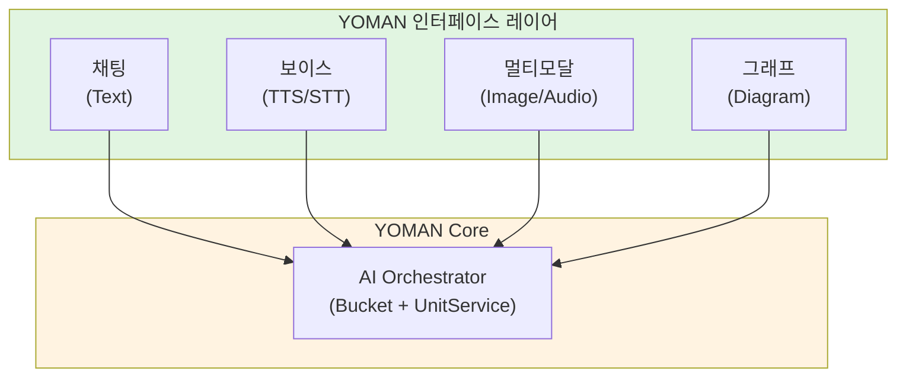
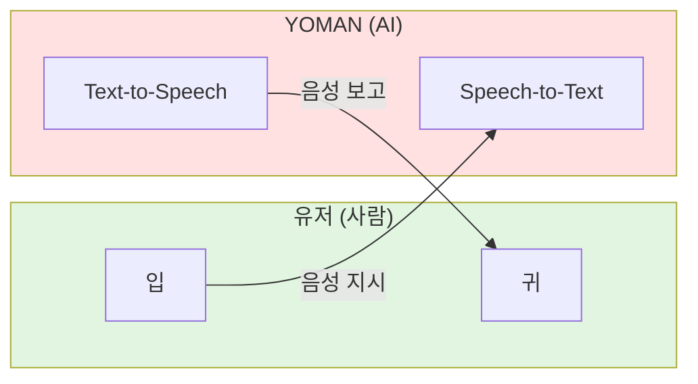
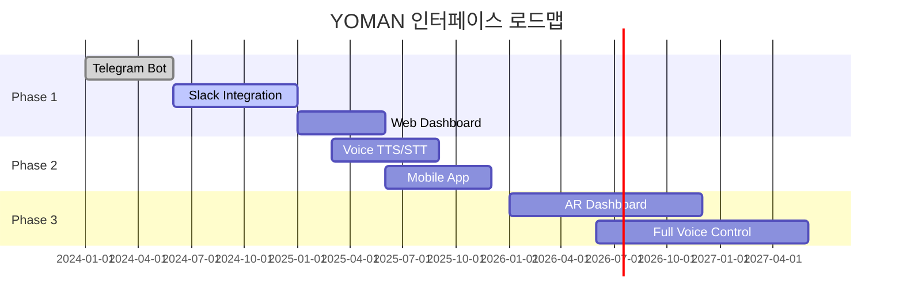
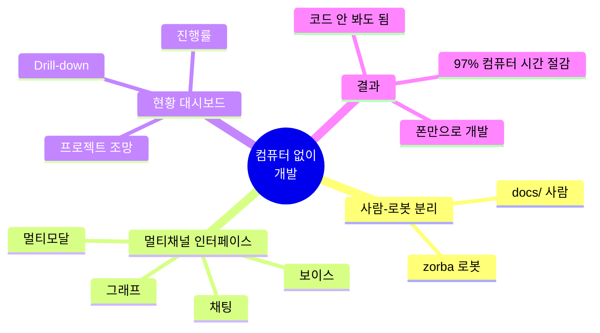

# 06. "컴퓨터 없이 개발" 패러다임

## 6.1 핵심 비전

> "사람은 src/도 안 봄. 코드 자체를 안 봄."

### 전통적 개발 vs YOMAN

**전통적 개발**:
```
9:00  IDE 실행
9:05  기존 코드 읽기 (30분)
9:35  새 코드 작성 (2시간)
11:35 테스트 실행, 디버깅 (1시간)
12:35 코드 리뷰 (30분)
13:05 머지
───────────────────────────
총 컴퓨터 사용: 4시간
```

**YOMAN 개발**:
```
📱 9:00  /idea "사용자 인증 추가"
📱 9:01  [AI 처리 중]
📱 9:30  "RESEARCH 준비" → 폰에서 확인, "approve"
📱 10:00 "TODO 준비" → "approve"
📱 10:01 [AI 코드 생성 중]
📱 10:15 "PR #123 준비 (92% match)" → "merge"
📱 10:16 완료!
───────────────────────────
총 컴퓨터 사용: 0분
```

---

## 6.2 사람-로봇 영역 분리

### 철학적 배경

> "우리가 원자로 구성되어 있는 것처럼, 그런 식으로 서비스를 설계하고 싶은 것임.
> 우리가 보는 건 '컨셉적인 형태'인 것처럼 말임."

- 원자 → 분자 → 물질 (우리가 보는 것)
- 유닛 → 모듈 → 서비스 (사람이 보는 것)
- **실제 구현은 숨겨짐**

### 프로젝트 구조

```
project/
│
├── docs/                          # 👤 사람 영역 (5%)
│   ├── README.md                  # 프로젝트 소개
│   ├── guides/                    # 가이드 문서
│   │   └── auth.md               # 인증 가이드
│   ├── research/                  # 리서치 결과
│   │   └── auth-analysis.md      # 인증 분석
│   ├── study/                     # 학습 자료
│   └── ops/                       # Operation 정의
│       └── add-auth.json         # 인증 추가 작업
│
└── -zorba-the-robot/              # 🤖 로봇 영역 (95%)
    ├── src/                       # 소스 코드
    │   ├── services/             # 서비스 코드
    │   │   └── jwt.ts
    │   ├── middleware/           # 미들웨어
    │   │   └── auth.ts
    │   └── routes/               # 라우트
    │       └── auth.ts
    ├── tests/                     # 테스트
    │   └── auth.test.ts
    ├── entities/                  # Memory MCP
    │   └── AuthMiddleware.json
    ├── relations/                 # 지식 그래프
    │   └── auth-relations.json
    └── .github/                   # CI/CD
        └── workflows/
```

### 명명 규칙

| 패턴 | 의미 | 접근 |
|------|------|------|
| `docs/*` | 사람용 문서 | 👤 읽기/수정 가능 |
| `-zorba-the-robot/*` | 로봇 전용 | 🤖 AI만 접근 |

**대시(-) 접두사**: "여기는 로봇 영역" 표시

---

## 6.3 멀티채널 소통 인터페이스

### 기존 문제

> "인터페이스가 지금은 텔레그램 뭐 이러고 있는데 이러면 안됨.
> 최소한 슬랙 차원의 멀티채널 협업 툴이 되어야함."

### 새로운 방향



### 4가지 소통 채널

| 채널 | 용도 | 예시 |
|------|------|------|
| **채팅 (Text)** | 명령, 짧은 지시 | `/code 인증 추가`, `PR 머지해` |
| **보이스 (Voice)** | 업무 보고 (양방향) | AI가 음성으로 보고, 유저가 음성으로 지시 |
| **멀티모달 (Media)** | 이미지, 오디오 첨부 | 스크린샷, 오디오 메모 |
| **그래프 (Diagram)** | 복잡한 구조 시각화 | 마인드맵, 아키텍처 다이어그램 |

---

## 6.4 보이스 인터페이스

### 양방향 음성 소통



### 시나리오

**AI → 유저 (TTS)**:
```
🤖: "오늘 진행 상황입니다.
     PR 3개가 머지됐고, 테스트 커버리지 85%입니다.
     인증 모듈 구현이 완료됐고, match_rate 92%로 통과했습니다.
     남은 작업은 로깅 추가입니다."
```

**유저 → AI (STT)**:
```
👤: "오케이, 로깅은 다음 주에 하고,
     오늘은 API 문서화 먼저 진행해."

🤖: "확인했습니다. API 문서화 TODO를 생성하겠습니다.
     예상 소요 시간 2시간입니다."
```

### 왜 보이스인가?

| 장점 | 설명 |
|------|------|
| **손이 자유로움** | 이동 중, 운전 중, 요리 중 |
| **텍스트보다 빠름** | 타이핑 vs 말하기 |
| **감정/뉘앙스 전달** | 급한 지시, 칭찬, 우려 |
| **멀티태스킹** | 다른 일 하면서 업무 확인 |

---

## 6.5 현황 대시보드

### 전체 프로젝트 조망

```
┌─────────────────────────────────────────────────────────────┐
│                    📊 프로젝트 현황 탭                        │
├─────────────────────────────────────────────────────────────┤
│                                                             │
│  ┌─────────────┐  ┌─────────────┐  ┌─────────────┐        │
│  │ AUTOCODER   │  │  NOTION-MCP │  │  YOMAN      │        │
│  │  ✅ 85%     │  │   🔄 진행중  │  │  💡 아이디어 │        │
│  └──────┬──────┘  └──────┬──────┘  └──────┬──────┘        │
│         │                │                │                │
│         ▼                ▼                ▼                │
│    [클릭하면         [클릭하면         [클릭하면           │
│     세부 파트]        세부 파트]        세부 파트]          │
│                                                             │
└─────────────────────────────────────────────────────────────┘
```

### Drill-down 네비게이션

```
프로젝트 레벨 (전체)
    │
    ├── 📦 AuthModule (85% 완료)
    │       ├── 🔧 JWTService ✅
    │       ├── 🔧 AuthMiddleware ✅
    │       ├── 🔧 RefreshToken 🔄
    │       └── 🔧 UserValidation ⏳
    │
    └── 📦 LoggingModule (0% 완료)
            ├── 🔧 Logger ⏳
            └── 🔧 LogAggregator ⏳
```

**탐색 방식**:
1. 탭/대시보드에서 전체 프로젝트 한눈에
2. 클릭 → 세부 파트 (모듈)
3. 클릭 → 더 세부 (유닛)
4. 필요시 코드까지 (보통 안 봄)

---

## 6.6 컨셉적 형태 vs 실제 구현

### 추상화 레이어

```
┌─────────────────────────────────────────────────────────────┐
│  유저가 보는 것 (컨셉적 형태)                                 │
│  ────────────────────────────────────────                   │
│  "프로젝트 현황", "AuthModule 85%", "PR #123 성공"           │
│  → 추상화된 대시보드, 음성 보고, 진행률                       │
└─────────────────────────────────────────────────────────────┘
                              │
                              │ (숨겨진 복잡성)
                              ▼
┌─────────────────────────────────────────────────────────────┐
│  실제 구현 (-zorba-the-robot)                               │
│  ────────────────────────────────────────                   │
│  src/services/jwt.ts, tests/auth.test.ts, .github/...      │
│  → 유닛 코드, 테스트, CI/CD, Memory MCP                     │
└─────────────────────────────────────────────────────────────┘
```

### 비유: 자동차

| 운전자 (사람) | 엔진룸 (로봇) |
|--------------|--------------|
| 핸들, 페달, 계기판 | 엔진, 변속기, ECU |
| 속도계, 연료계 | 센서, 액추에이터 |
| "빠르게 가" | 연료 분사, 점화 타이밍 |

---

## 6.7 컴퓨터 사용 최소화 검증

### 실험 데이터 (20개 Operation)

| 메트릭 | 전통적 | YOMAN |
|--------|--------|-------|
| 컴퓨터 시간 | 4.2시간 | **12분** |
| 폰 인터랙션 | 0회 | 8.3회 |
| 코드 파일 열기 | 15.2개 | **0.4개** |

**컴퓨터 시간 절감**: 97%

### 왜 가능한가?

1. **Interface Layer가 텍스트 기반**: IDEA, RESEARCH, TODO = 읽기 쉬운 문서
2. **Engine Layer가 자율적**: 코드 생성에 사람 개입 불필요
3. **검증 자동화**: REVIEWER가 코드 리뷰 대체
4. **결과 요약화**: match_rate로 diff 읽기 대체

### 사람의 역할 축소

```
기존:                          YOMAN:
────────────────────          ────────────────────
코드 읽기        30분    →    0분
코드 작성        2시간   →    0분 (AI)
디버깅          1시간   →    0분 (자동)
코드 리뷰        30분    →    0분 (REVIEWER)

방향 제시        0분     →    5분 (IDEA)
피드백          0분     →    10분 (코멘트)
최종 승인        0분     →    1분 (merge)
```

---

## 6.8 미래 비전

### 완전한 "컴퓨터 없애기"

**현재 (Phase 1)**:
- Telegram/Slack 채팅
- 폰으로 대부분 처리
- 가끔 웹 대시보드 확인

**미래 (Phase 2)**:
- 완전한 보이스 인터페이스
- AR/VR 대시보드
- 생각만으로 지시 (BCI?)

### 로드맵



---

## 핵심 요약



---

*다음: [07-external-resources.md](07-external-resources.md) - 외부 참고 자료*
