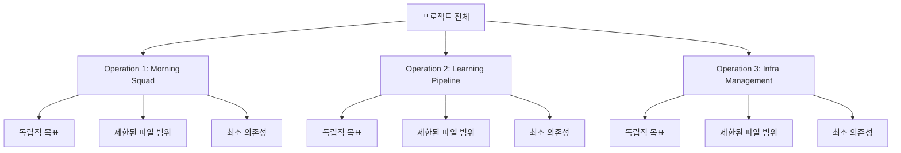

# Microservices 철학의 프로젝트 관리 적용 연구

## 연구 배경

AUTOCODER 프로젝트에서 여러 하위 작업(Morning Squad, Guerrilla Squad, Learning Pipeline 등)을 동시 진행하면서 전체 프로젝트 맥락을 추적하기 어려운 문제 발생. 이를 해결하기 위해 **마이크로서비스 아키텍처 철학**을 프로젝트 관리에 적용하는 "Operation" 개념 도입을 검토함.

## 핵심 아이디어



**마이크로서비스 원칙 → 프로젝트 관리 적용**

| 마이크로서비스 원칙 | 프로젝트 관리 적용 |
|---|---|
| 단일 책임 원칙 | 하나의 Operation = 하나의 명확한 목표 |
| 독립 배포 | 독립적 완료 가능 (다른 Operation 완료 대기 불필요) |
| 느슨한 결합 | Operation 간 의존성 최소화 |
| 작은 팀 소유 | 1-2명이 이해/관리 가능한 범위 |
| 장애 격리 | 하나의 Operation 실패가 전체 프로젝트 중단 안 함 |

## 연구 범위

1. **마이크로서비스 정의**: 소프트웨어 아키텍처로서의 개념
2. **역사적 배경**: Monolith → SOA → Microservices 진화 과정
3. **심리적 요인**: 왜 작은 단위가 인간에게 관리하기 쉬운가
4. **효율성 분석**: 마이크로서비스 vs Monolith 비교
5. **관리 방법**: Operation 생성/전환/추적 워크플로우
6. **사례 연구**: Netflix, Amazon, Spotify 등
7. **AUTOCODER 적용**: 현재 시스템이 어떻게 바뀔지
8. **구현 계획**: 실제 적용 로드맵

## 기대 효과

### 맥락 관리
- **Before**: 전체 프로젝트 518줄 코드 + 12개 문서 → Claude에게 모두 제공
- **After**: 관련 Operation 파일 2-3개만 제공 → 토큰 70% 절감

### 병렬 작업
- **Before**: Morning Squad 완료 대기 → Guerrilla Squad 시작
- **After**: 두 Operation 독립 진행 → 개발 속도 2배

### 인지 부하
- **Before**: 9개 태스크 동시 추적 → 정신적 피로
- **After**: 현재 Operation 3개 태스크만 집중 → 집중력 향상

## 문서 구조

```
00-overview.md (현재 문서)
01-microservices-definition.md
02-historical-background.md
03-psychological-factors.md
04-efficiency-analysis.md
05-management-methods.md
06-case-studies.md
07-autocoder-application.md
08-implementation-plan.md
09-references.md
```

## 주요 질문

1. 마이크로서비스 철학을 프로젝트 관리에 적용하는 것이 타당한가?
2. Operation 단위는 어느 정도 크기가 적절한가?
3. Operation 간 의존성은 어떻게 관리할 것인가?
4. Notion과의 양방향 동기화는 어떻게 구현할 것인가?
5. Claude에게 Operation 맥락을 효과적으로 전달하는 방법은?

---

**Next**: 01-microservices-definition.md에서 마이크로서비스의 정의와 핵심 원칙 상세 분석
