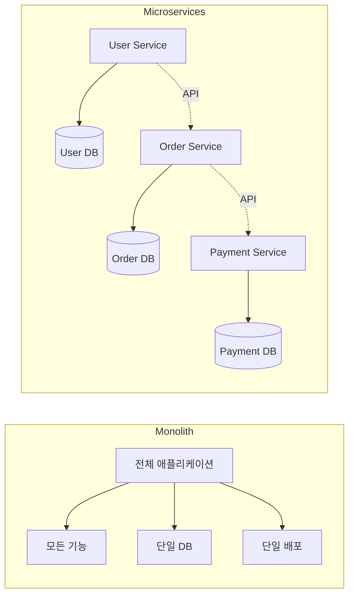
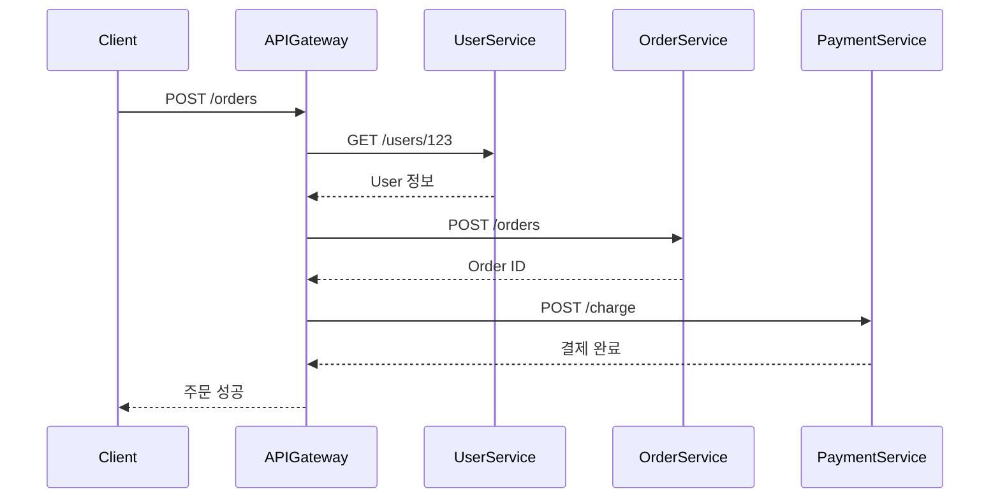
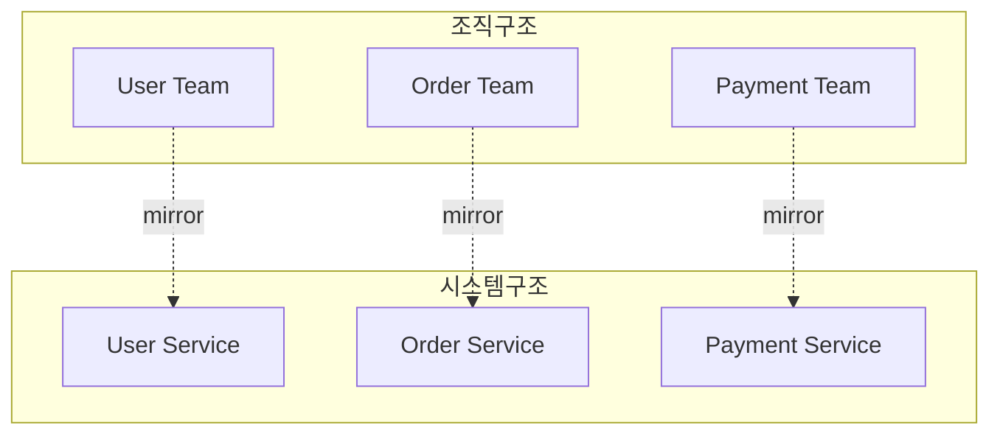

# 마이크로서비스 정의와 핵심 원칙

## 마이크로서비스란?

**마이크로서비스(Microservices)**는 애플리케이션을 작고 독립적인 서비스 집합으로 구성하는 소프트웨어 아키텍처 스타일임. 각 서비스는:
- 특정 비즈니스 기능 담당
- 독립적으로 배포 가능
- 자체 데이터베이스 소유
- API를 통해 통신



## 핵심 원칙 (Martin Fowler, 2014)

### 1. Single Responsibility (단일 책임)
- **정의**: 하나의 서비스는 하나의 비즈니스 역량만 담당
- **예시**: User Management 서비스는 인증/권한만 처리, 주문은 Order 서비스로

### 2. Independently Deployable (독립 배포)
- **정의**: 다른 서비스에 영향 없이 배포/업데이트 가능
- **예시**: Payment 서비스 업데이트 시 User/Order 서비스 재시작 불필요

### 3. Decentralized Data Management (분산 데이터)
- **정의**: 각 서비스가 자체 데이터베이스 소유
- **예시**: User DB, Order DB, Payment DB 분리

### 4. Design for Failure (장애 설계)
- **정의**: 다른 서비스 장애 시에도 동작 가능하도록 설계
- **예시**: Payment 서비스 다운 → Order 서비스는 "결제 대기" 상태로 주문 저장

### 5. Infrastructure Automation (인프라 자동화)
- **정의**: 배포/모니터링/스케일링 자동화
- **예시**: Docker + Kubernetes로 자동 배포

## 핵심 특성

| 특성 | 설명 | 예시 |
|---|---|---|
| **작은 크기** | 2-Pizza Team (팀원 2판 피자로 배불림) | 5-9명 |
| **느슨한 결합** | 서비스 간 직접 의존 최소화 | API Gateway 사용 |
| **높은 응집도** | 관련 기능끼리 모음 | 주문 생성/조회/취소 = Order Service |
| **자율성** | 각 팀이 기술 스택 선택 | User: Python, Order: Java |
| **분산 거버넌스** | 중앙 통제 대신 팀 자율 | 각 팀이 DB 선택 |

## 통신 패턴



### 동기 통신 (Synchronous)
- **방법**: REST API, gRPC
- **장점**: 간단함
- **단점**: Cascade Failure (연쇄 장애) 위험

### 비동기 통신 (Asynchronous)
- **방법**: Message Queue (RabbitMQ, Kafka)
- **장점**: 장애 격리
- **단점**: 복잡도 증가

## 프로젝트 관리 적용 비유

| 마이크로서비스 개념 | 프로젝트 관리 적용 |
|---|---|
| Service | Operation |
| Database | Operation 전용 문서/코드 |
| API | Operation 간 명시적 의존성 |
| Deployment | Operation 완료/전환 |
| Service Discovery | Operation 목록 조회 (rxk op list) |
| API Gateway | 프로젝트 전체 개요 문서 |

## 예시: E-Commerce 시스템

### Monolith 방식
```
ecommerce-app/
├── users/
├── products/
├── orders/
├── payments/
└── database/
```
- **문제**: 결제 로직 수정 시 전체 앱 재배포
- **문제**: 주문 조회 늘어나면 전체 시스템 느려짐

### Microservices 방식
```
user-service/        → 독립 배포
product-service/     → 독립 배포
order-service/       → 독립 배포
payment-service/     → 독립 배포
```
- **장점**: Payment만 업데이트 가능
- **장점**: Order만 스케일 아웃 가능

## Conway's Law (콘웨이 법칙)

> "시스템 구조는 조직 구조를 따른다"



**프로젝트 관리 적용**:
- 1명이 관리하기 어려운 프로젝트 → 여러 Operation으로 분할
- 각 Operation = 1-2명이 이해 가능한 범위
- Operation 구조 = 팀원 정신 모델 반영

## 마이크로서비스 != 은총알

### 적합한 경우
- ✅ 복잡한 도메인 (10개 이상 비즈니스 기능)
- ✅ 다양한 스케일링 요구 (주문 많음, 결제 적음)
- ✅ 팀 규모 20명 이상

### 부적합한 경우
- ❌ 단순한 CRUD 앱
- ❌ 팀 5명 미만
- ❌ 스타트업 MVP

**프로젝트 관리 적용**:
- ✅ 복잡한 프로젝트 (5개 이상 주요 기능)
- ✅ 여러 작업 병렬 진행 필요
- ❌ To-Do 앱처럼 단순한 프로젝트

---

**Next**: 02-historical-background.md에서 Monolith → SOA → Microservices 진화 과정 분석
