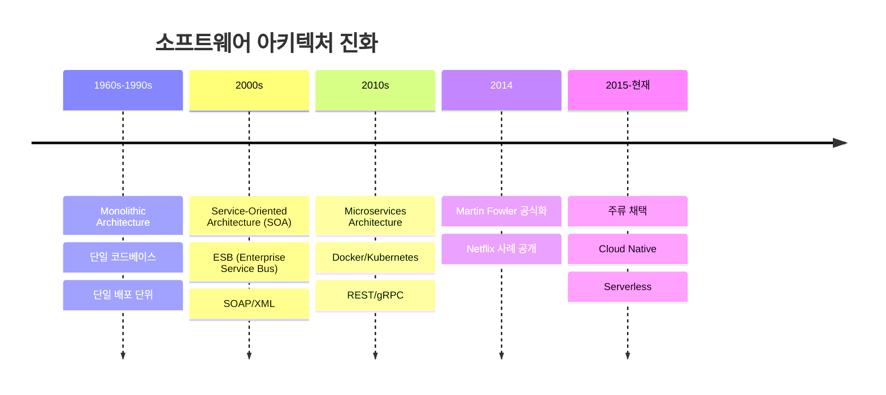
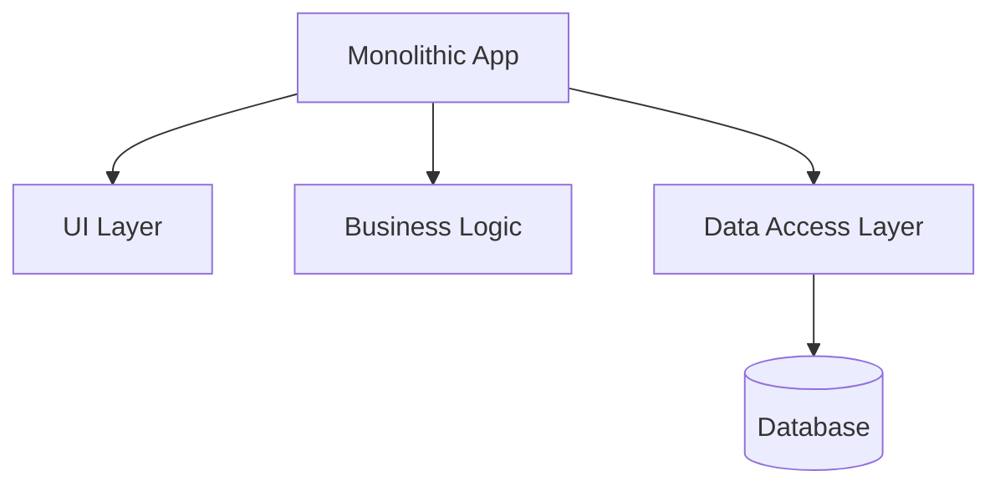
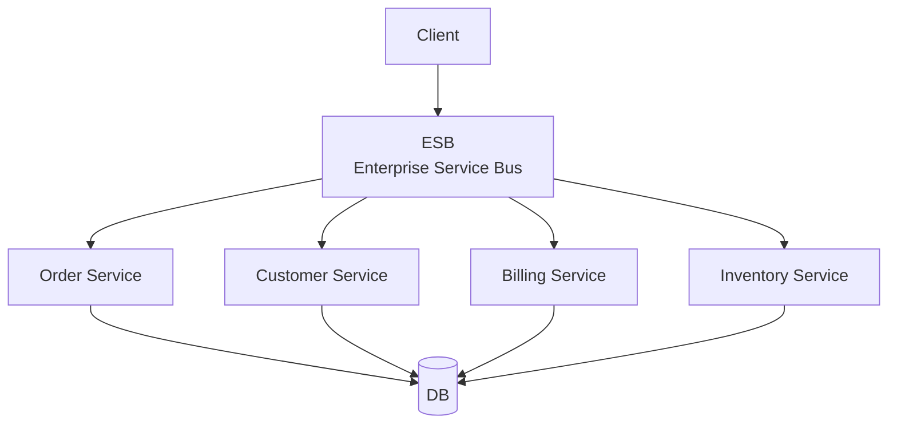
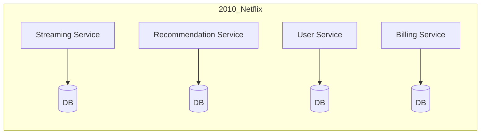

# 마이크로서비스의 역사적 배경

## 타임라인



## 1단계: Monolithic Architecture (1960-1990s)

### 특징
- 전체 애플리케이션 = 단일 코드베이스
- 단일 데이터베이스
- 단일 배포 단위



### 장점
- 단순함: 개발/테스트/배포 간단
- 일관성: 단일 기술 스택
- 트랜잭션: ACID 보장

### 한계
- **확장성**: 전체 앱 복제 필요 (특정 기능만 스케일 불가)
- **배포**: 작은 수정도 전체 재배포
- **기술 부채**: 10년 된 레거시 코드 수정 어려움
- **팀 확장**: 100명 개발자가 하나의 코드베이스 수정 → 충돌

### 역사적 사례
- **1980s IBM Mainframe**: 전체 시스템 하나의 거대한 프로그램
- **1990s Java EE**: WAR 파일 하나에 모든 기능

## 2단계: Service-Oriented Architecture (2000s)

### 등장 배경
- 기업 시스템 복잡도 증가
- 재사용 가능한 서비스 필요
- 표준화 요구 (SOAP, WSDL, XML)



### 특징
- **ESB (Enterprise Service Bus)**: 중앙 통신 허브
- **SOAP**: XML 기반 프로토콜
- **공유 데이터베이스**: 서비스가 같은 DB 사용

### 문제점
- **ESB 병목**: 모든 통신이 ESB 거침 → 단일 장애점
- **무거움**: XML 파싱 오버헤드, SOAP 복잡도
- **긴밀한 결합**: 공유 DB → 서비스 독립성 낮음

### 역사적 사례
- **2005 Oracle SOA Suite**: ESB 플랫폼
- **2007 IBM WebSphere**: SOAP 기반 통합

## 3단계: Microservices Architecture (2010s)

### 등장 배경
- **2010 Netflix**: 모놀리식 → 마이크로서비스 전환
- **2011 James Lewis**: "Microservices" 용어 최초 사용
- **2013 Docker**: 컨테이너 기술 대중화
- **2014 Martin Fowler**: 공식 정의 발표



### 핵심 변화
| SOA | Microservices |
|---|---|
| ESB 중앙 집중 | Peer-to-Peer 통신 |
| SOAP/XML | REST/JSON, gRPC |
| 공유 DB | 서비스별 독립 DB |
| 대형 서비스 (50-100 기능) | 소형 서비스 (5-10 기능) |

### 기술적 촉매제

#### 1. Docker (2013)
- 컨테이너 기술로 독립 배포 쉬워짐
- 개발 환경 = 프로덕션 환경

#### 2. Kubernetes (2014)
- 컨테이너 오케스트레이션
- 자동 스케일링, 롤링 업데이트

#### 3. Cloud (AWS, GCP, Azure)
- 인프라를 코드로 관리 (IaC)
- Auto-scaling, Load Balancing

#### 4. API Gateway
- 중앙 라우팅 (ESB 대신 경량화)
- 인증/로깅 집중 처리

### 문화적 변화

#### DevOps 운동

- **Before**: 개발 → 운영팀에 배포 요청 → 2주 대기
- **After**: 개발 → Git Push → CI/CD → 자동 배포

#### Two-Pizza Team
- Amazon Jeff Bezos: "팀원이 피자 2판으로 배불러야 함"
- 5-9명 = 의사소통 비용 최소화
- 각 팀 = 하나의 마이크로서비스 소유

## 주요 사건 연대기

### 2010: Netflix의 전환
- **문제**: 2008년 DB 장애로 3일간 서비스 중단
- **결정**: 모놀리식 → 마이크로서비스 전환
- **결과**: 2010-2016년 500개 이상 서비스 분할

### 2012: Amazon의 Two-Pizza Team
- **원칙**: 작은 팀 = 빠른 의사결정
- **실행**: 조직을 서비스 단위로 재편성
- **결과**: 하루 수천 번 배포 가능

### 2014: Martin Fowler 논문
- **제목**: "Microservices: a definition of this new architectural term"
- **내용**: 9가지 핵심 특성 정의
- **영향**: 산업 표준으로 자리잡음

### 2015: Kubernetes 1.0 릴리즈
- **배경**: Google의 Borg 시스템 오픈소스화
- **기능**: 컨테이너 자동 배포/스케일링
- **결과**: 마이크로서비스 배포 표준 플랫폼

## 프로젝트 관리로의 비유

### Monolith → Operation 없는 프로젝트
```
project.md (10,000 lines)
├── Feature A 설명
├── Feature B 설명
├── Feature C 설명
└── ...
```
- **문제**: 전체 문서 읽어야 맥락 파악
- **문제**: 작은 수정도 전체 문서 영향

### SOA → 폴더 분리 (but 의존성 높음)
```
features/
├── feature-a/
├── feature-b/
└── feature-c/
```
- **문제**: feature-a가 feature-b의 내부 파일 직접 참조
- **문제**: 순환 의존성 (A → B → C → A)

### Microservices → Operation 분리
```
operations/
├── active/
│   ├── op-morning.md (독립)
│   └── op-learning.md (독립)
└── completed/
    └── op-infra.md (독립)
```
- **장점**: 각 Operation 독립적 이해 가능
- **장점**: op-morning 수정해도 op-learning 영향 없음

---

**Next**: 03-psychological-factors.md에서 인간이 작은 단위를 선호하는 심리적 이유 분석
