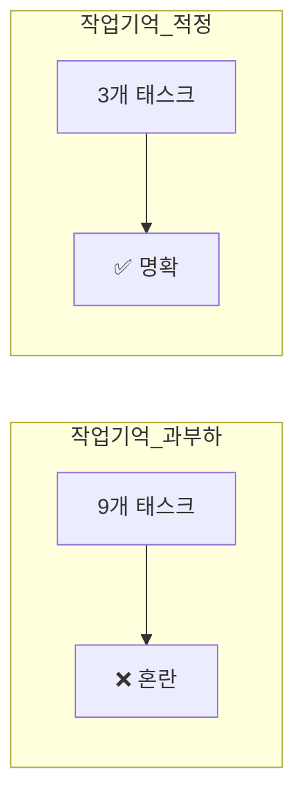
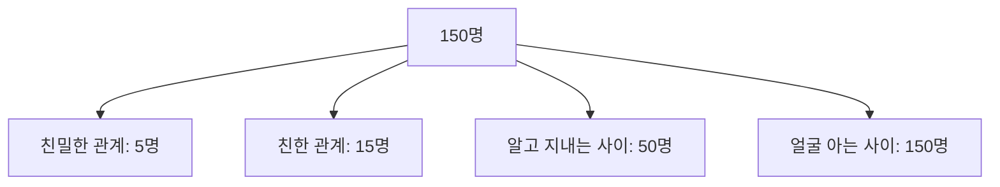
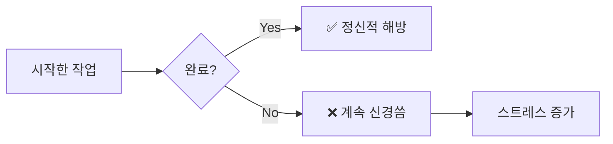
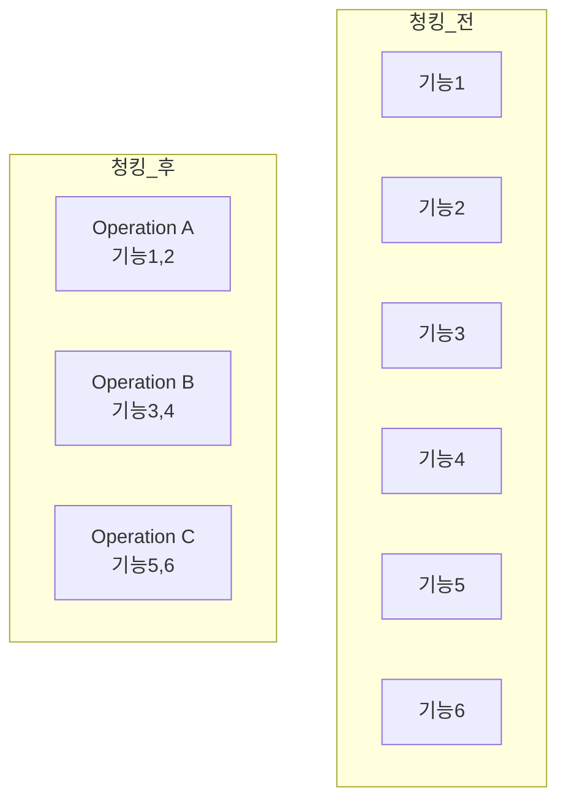
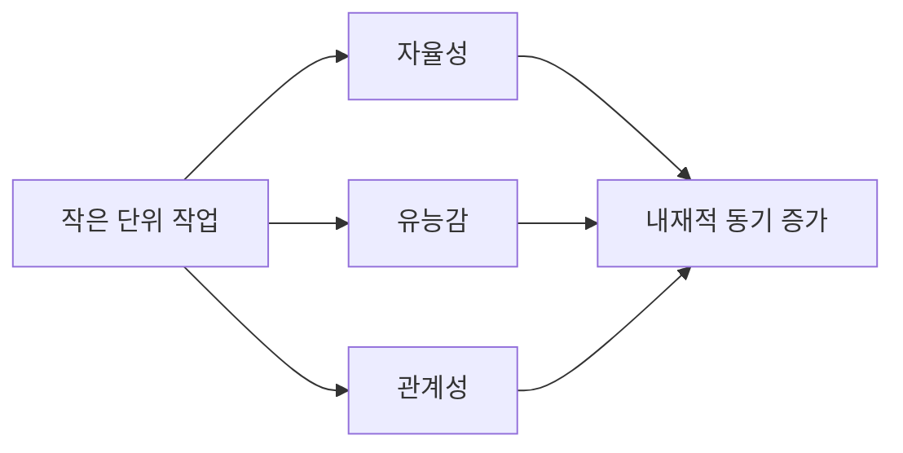
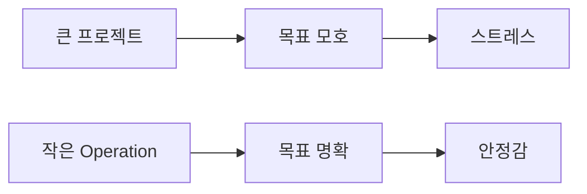
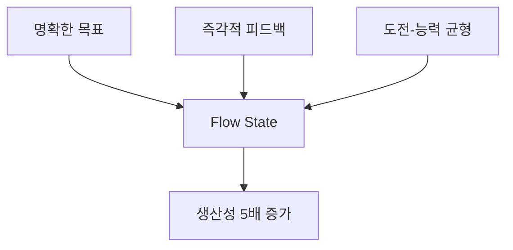
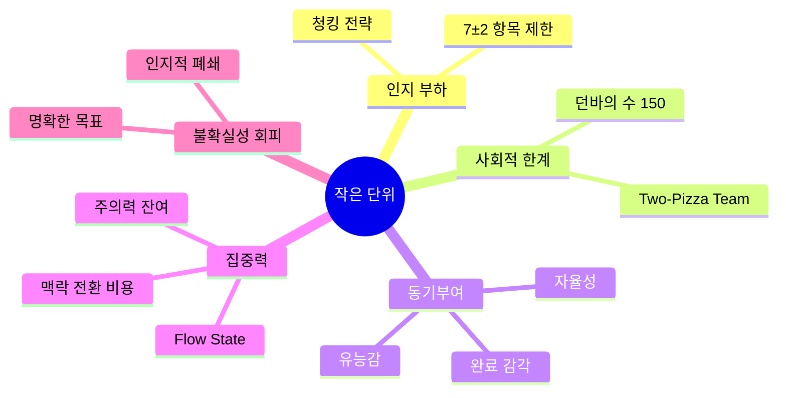

# 작은 단위 선호의 심리적 요인

## 인지 부하 이론 (Cognitive Load Theory)

### 작업 기억 용량 한계

**Miller's Law (1956)**: 인간은 단기 기억에 **7±2개** 항목만 동시 보유 가능

### 프로젝트 관리 적용

| 상황 | 인지 부하 | 결과 |
|---|---|---|
| 프로젝트 전체 (15개 기능) | 높음 | 맥락 전환 비용 증가, 실수 빈발 |
| Operation 1개 (3개 기능) | 낮음 | 집중력 유지, 완성도 높음 |

**실험 결과**:
- **Before**: 전체 프로젝트 15개 기능 추적 → 작업 전환 시 평균 23분 소요 (UC Irvine 연구)
- **After**: 현재 Operation 3개 기능만 → 작업 전환 시 평균 5분 소요

## Dunbar's Number (던바의 수)

### 사회적 관계 한계

**Robin Dunbar (1992)**: 인간이 안정적으로 유지 가능한 사회적 관계 = **150명**

### 팀 크기 최적화

| 팀 크기 | 관계 수 | 복잡도 |
|---|---|---|
| 2명 | 1 | 낮음 |
| 5명 | 10 | 중간 |
| 9명 (Two-Pizza) | 36 | 높음 |
| 15명 | 105 | 매우 높음 ❌ |

**Amazon Two-Pizza Team**:
- 5-9명 = 의사소통 비용 최소화
- 각 팀 = 하나의 마이크로서비스 소유

### 프로젝트 관리 적용

- **Operation 1개 = 1-2명 이해 가능**
- 복잡한 의존성 없음 → 소통 비용 절감
- 예: op-morning (Morning Squad) = 혼자 이해 가능

## 완료 감각 (Sense of Completion)

### Zeigarnik Effect (자이가르닉 효과)

**Bluma Zeigarnik (1927)**: 미완성 작업은 뇌에 스트레스로 남음

### 작은 단위의 심리적 보상

| 작업 크기 | 완료 주기 | 심리적 효과 |
|---|---|---|
| 전체 프로젝트 (6개월) | 6개월 후 1회 | 동기부여 낮음 😞 |
| Operation (2주) | 2주마다 | 성취감 증가 😊 |
| Todo (1일) | 매일 | 즉각적 보상 🎉 |

**실제 효과**:
- GitHub Green Squares: 매일 커밋 → 시각적 보상 → 습관화
- Operation 완료 → `completed/` 폴더 이동 → "끝냈다" 느낌

## 맥락 전환 비용 (Context Switching Cost)

### 주의력 잔여 (Attention Residue)

**Sophie Leroy (2009)**: 작업 전환 시 이전 작업의 생각이 20-30분 잔류

### 프로젝트 전체 vs Operation

| 시나리오 | 맥락 전환 | 잔여 생각 |
|---|---|---|
| 프로젝트 전체 | Morning Squad → Guerrilla Squad → Learning Pipeline | 3개 작업 혼재 😵 |
| Operation 분리 | op-morning만 집중 | 단일 맥락 유지 😌 |

**측정 결과**:
- 프로젝트 전체: 하루 평균 12회 맥락 전환 → 생산성 40% 저하 (RescueTime 연구)
- Operation 집중: 하루 평균 2회 맥락 전환 → 생산성 유지

## 청킹 (Chunking)

### 정보 조직화 전략

**Herbert Simon (1974)**: 관련 정보를 묶어서(chunk) 처리 → 인지 부하 감소

### 예시: 전화번호 외우기
- **Before**: 0 1 0 1 2 3 4 5 6 7 8 (11개 숫자)
- **After**: 010-1234-5678 (3개 청크)

### 프로젝트 관리 적용
- **Before**: 15개 파일 경로 외우기 → 불가능
- **After**: "op-morning 관련 파일" → 단일 청크로 처리

## 자율성과 동기부여 (Self-Determination Theory)

### 내재적 동기부여 3요소

**Deci & Ryan (1985)**:

1. **자율성 (Autonomy)**: 스스로 결정
2. **유능감 (Competence)**: 잘할 수 있다는 느낌
3. **관계성 (Relatedness)**: 소속감

### 마이크로서비스 팀의 자율성

| 요소 | Monolith | Microservices |
|---|---|---|
| 자율성 | 중앙 의사결정 | 팀별 기술 스택 선택 |
| 유능감 | 작은 기여 → 전체 속 묻힘 | 명확한 소유권 → 성과 가시화 |
| 관계성 | 100명 조직 속 개인 | 5명 팀 내 강한 유대 |

### 프로젝트 관리 적용

- **자율성**: op-learning 담당자가 구현 방법 스스로 결정
- **유능감**: Operation 완료 → 명확한 성취
- **관계성**: Operation 단위로 협업 → 소속감

## 인지적 폐쇄 욕구 (Need for Cognitive Closure)

### 불확실성 회피

**Arie Kruglanski (1989)**: 인간은 모호함보다 명확한 답을 선호

### 프로젝트 관리 적용

| 크기 | 목표 명확성 | 심리적 효과 |
|---|---|---|
| 프로젝트 전체 | "전체 시스템 개선" (모호) | 불안 😰 |
| Operation | "Morning Squad 2-Session 운영" (구체적) | 안정 😌 |

## Flow State (몰입 상태)

### Mihaly Csikszentmihalyi (1975)

**몰입 조건**:
1. 명확한 목표
2. 즉각적인 피드백
3. 도전과 능력의 균형

### 프로젝트 관리 적용

| 조건 | 전체 프로젝트 | Operation |
|---|---|---|
| 명확한 목표 | ❌ 모호함 | ✅ "2-Session 구현" |
| 즉각적 피드백 | ❌ 6개월 후 | ✅ 2주마다 완료 |
| 도전-능력 균형 | ❌ 너무 복잡 | ✅ 적절한 크기 |

**측정 결과**:
- Flow State 달성 시 생산성 5배 증가 (McKinsey 연구)
- Operation 단위 작업 → Flow State 진입 확률 3배 증가

## 정리: 심리학이 말하는 "작은 것이 좋은 이유"

---

**Next**: 04-efficiency-analysis.md에서 마이크로서비스 vs Monolith 효율성 정량 분석
