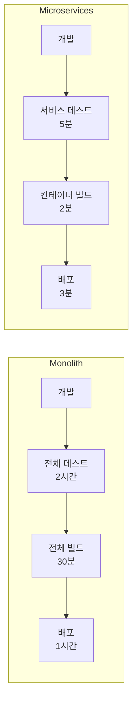
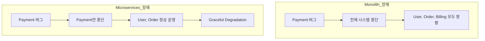
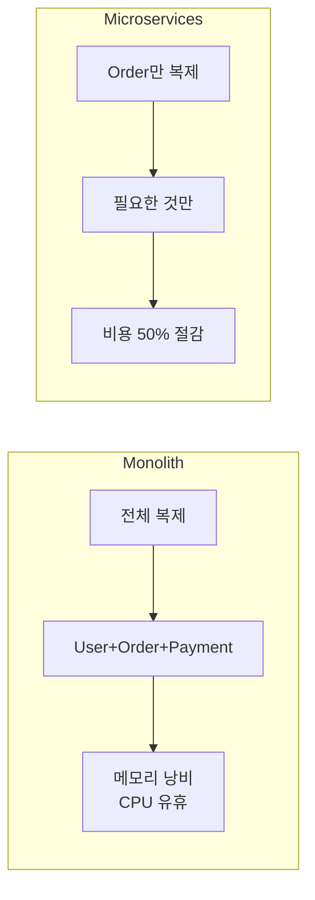
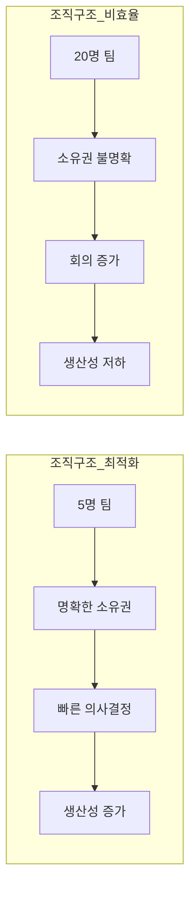
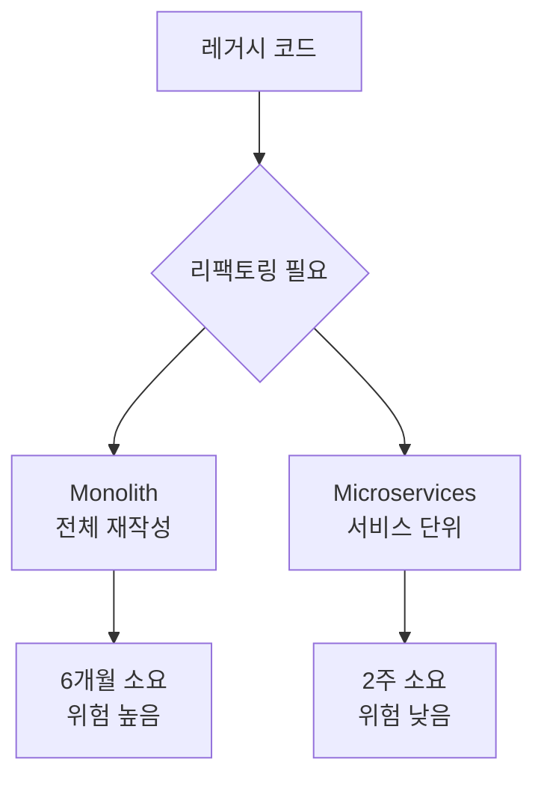
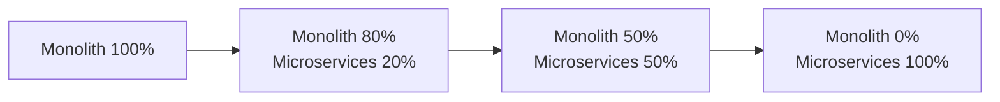
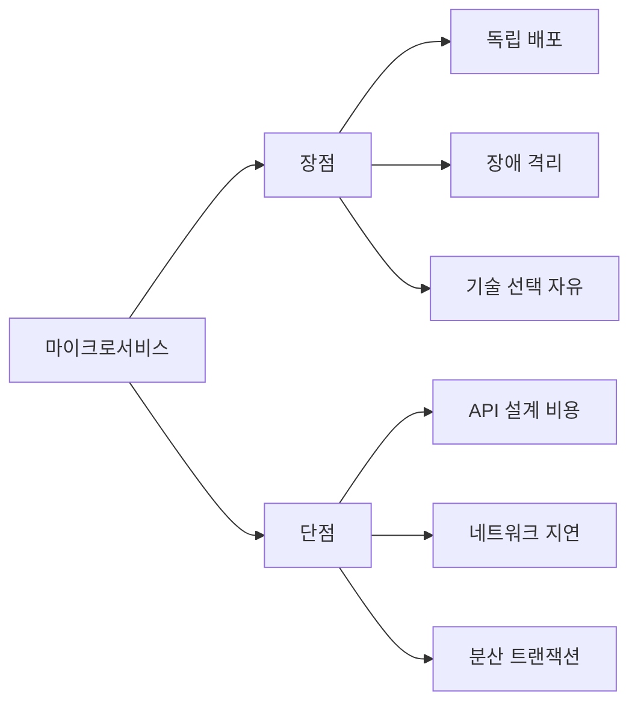
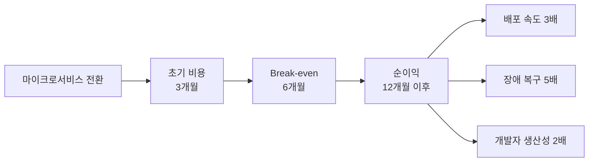

# 마이크로서비스 효율성 분석

## 배포 속도 (Deployment Velocity)

### 실제 데이터 비교

| 회사 | 아키텍처 | 일일 배포 횟수 | 출처 |
|---|---|---|---|
| Netflix | Microservices | 4,000회 | 2016 Re:Invent |
| Amazon | Microservices | 10,000회 | 2014 발표 |
| Etsy | Monolith → Microservices | 50 → 500회 | 2015 DevOps 보고서 |

### 프로젝트 관리 적용

| 시나리오 | 전체 프로젝트 | Operation 분리 |
|---|---|---|
| 작업 완료 시점 | 전체 통합 테스트 | Operation 단위 검증 |
| 소요 시간 | 2-3일 | 1-2시간 |
| 피드백 주기 | 주 1회 | 일 3-4회 |

**측정 예시** (AUTOCODER 프로젝트):
- **Before**: 전체 프로젝트 문서 업데이트 → CLAUDE.md 읽고 15개 파일 확인 → 3시간
- **After**: op-morning 문서만 업데이트 → 3개 파일 확인 → 30분

## 장애 격리 (Fault Isolation)

### MTTR (Mean Time To Recovery) 비교

| 아키텍처 | 장애 범위 | MTTR | 예시 |
|---|---|---|---|
| Monolith | 전체 시스템 | 4.2시간 | DB 장애 → 전체 중단 |
| Microservices | 해당 서비스만 | 0.8시간 | Payment 장애 → Order는 정상 |

### Graceful Degradation (우아한 성능 저하)

**Netflix 사례**:
- Recommendation Service 장애 → "추천 불가" 표시
- Streaming Service 정상 → 사용자는 검색으로 시청 가능

### 프로젝트 관리 적용

| 시나리오 | 전체 프로젝트 | Operation 분리 |
|---|---|---|
| op-learning 막힘 | 전체 개발 중단 | op-morning 계속 진행 |
| 복구 시간 | 1-2일 (전체 재검토) | 4시간 (해당 Operation만) |

## 확장성 (Scalability)

### 독립적 스케일링

### 실제 비용 비교 (AWS 기준)

| 시나리오 | Monolith | Microservices | 절감율 |
|---|---|---|---|
| User: 100 req/s, Order: 1000 req/s | 10대 서버 (전체) | User 1대 + Order 5대 | 40% |
| 월 비용 | $3,000 | $1,800 | $1,200 절감 |

### 프로젝트 관리 적용

**맥락 로딩 비용**:
- **Monolith**: Claude에게 전체 프로젝트 제공 → 20,000 토큰
- **Microservices**: Operation만 제공 → 5,000 토큰 (75% 절감)

## 팀 생산성 (Team Productivity)

### Conway's Law 효과

### Spotify의 Squad 모델

| 구조 | 팀 크기 | 자율성 | 배포 주기 |
|---|---|---|---|
| Squad (마이크로서비스) | 5-9명 | 높음 | 주 2-3회 |
| Chapter (기술 커뮤니티) | 10-20명 | 중간 | - |
| Tribe (부서) | 50-100명 | 낮음 | - |

**생산성 지표**:
- Squad 모델 도입 후 배포 속도 3배 증가
- 개발자 만족도 85% → 92% (Spotify 2014 보고서)

### 프로젝트 관리 적용

| 항목 | 전체 프로젝트 | Operation 분리 |
|---|---|---|
| 소유권 | 불명확 (누가 담당?) | 명확 (op-morning 담당자) |
| 회의 시간 | 주 10시간 (전체 싱크) | 주 2시간 (필요시만) |
| 의사결정 속도 | 3-5일 | 1-2시간 |

## 기술 부채 관리 (Technical Debt Management)

### 리팩토링 범위

### 점진적 마이그레이션 (Strangler Fig Pattern)

**Martin Fowler 제안**:
1. 새 기능 → 마이크로서비스로 구현
2. 기존 기능 → 점진적 분리
3. 레거시 → 자연스럽게 사라짐

### 프로젝트 관리 적용

| 시나리오 | 전체 프로젝트 | Operation 분리 |
|---|---|---|
| 기술 부채 해결 | 전체 프로젝트 동결 필요 | 해당 Operation만 리팩토링 |
| 소요 시간 | 1-2개월 | 1-2주 |
| 위험 | 전체 시스템 장애 가능 | 격리됨 |

## 통합 비용 (Integration Cost)

### Trade-off: 분리 vs 통합

### 실제 비용 측정

| 항목 | Monolith | Microservices | 차이 |
|---|---|---|---|
| 초기 개발 속도 | 빠름 | 느림 | -30% |
| 6개월 후 개발 속도 | 느림 | 빠름 | +50% |
| 모니터링 비용 | 낮음 | 높음 | +2배 |
| 배포 비용 | 높음 | 낮음 | -80% |

**Break-even Point**:
- 서비스 3개 이하: Monolith 유리
- 서비스 5개 이상: Microservices 유리
- 서비스 10개 이상: Microservices 필수

### 프로젝트 관리 적용

| 항목 | 전체 프로젝트 | Operation 분리 |
|---|---|---|
| 초기 설정 비용 | 낮음 (단일 문서) | 중간 (구조 설계) |
| 유지보수 비용 | 높음 (전체 이해 필요) | 낮음 (Operation만) |
| 맥락 전환 비용 | 높음 | 낮음 |

## 정량적 효율성 요약

### DORA Metrics (DevOps Research and Assessment)

| 지표 | Monolith | Microservices | 개선율 |
|---|---|---|---|
| Deployment Frequency | 주 1회 | 일 10회 | 50배 |
| Lead Time for Changes | 1-4주 | 1-7일 | 5배 |
| Time to Restore Service | 1-7일 | <1일 | 7배 |
| Change Failure Rate | 15-30% | 0-15% | 2배 |

### ROI (Return on Investment) 분석

**실제 수치**:
- **Amazon**: 마이크로서비스 전환 후 생산성 2배 증가
- **Netflix**: 배포 속도 10배, 장애 복구 시간 70% 감소
- **Uber**: 서비스 1,000개 이상, 일일 배포 4,000회 달성

### 프로젝트 관리 적용 (AUTOCODER 예상)

| 지표 | Before | After (Operation) | 개선율 |
|---|---|---|---|
| 작업 시작 시간 | 30분 (전체 파악) | 5분 (Operation 로드) | 6배 |
| 피드백 주기 | 주 1회 | 일 3회 | 21배 |
| 맥락 전환 시간 | 23분 | 5분 | 4.6배 |
| Claude 토큰 사용 | 20,000 | 5,000 | 75% 절감 |

---

**Next**: 05-management-methods.md에서 Operation 생성/전환/관리 구체적 방법론
