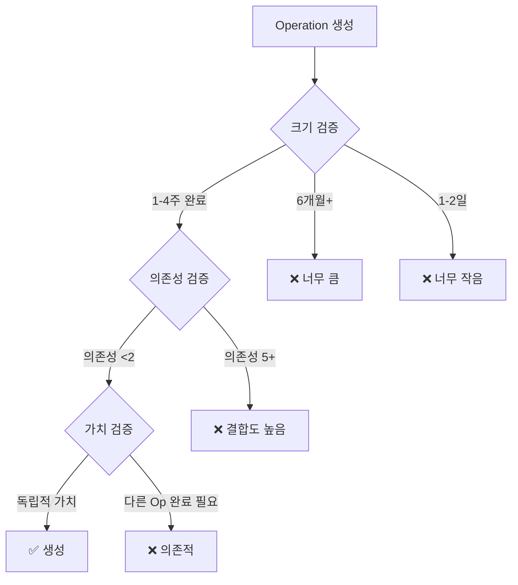
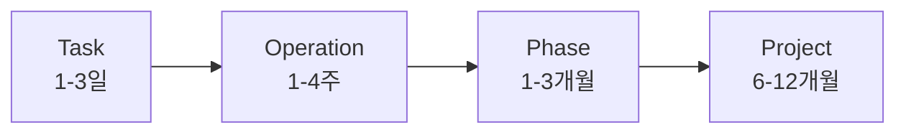
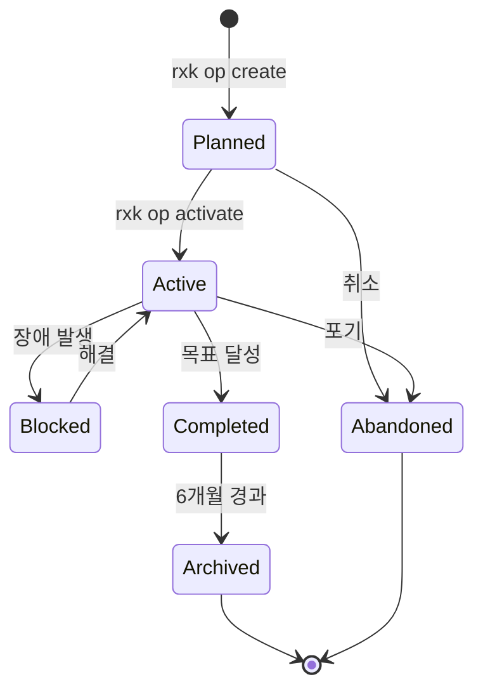
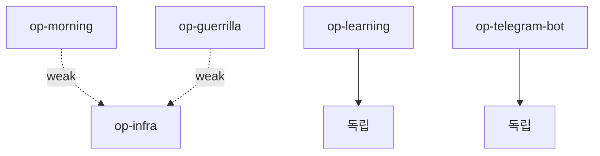
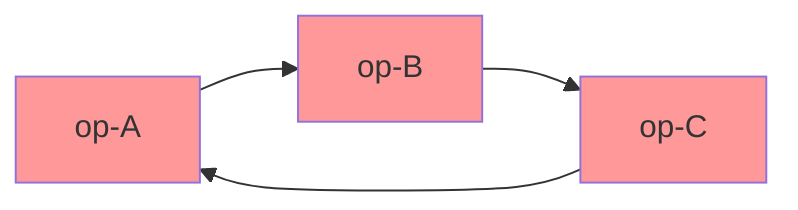
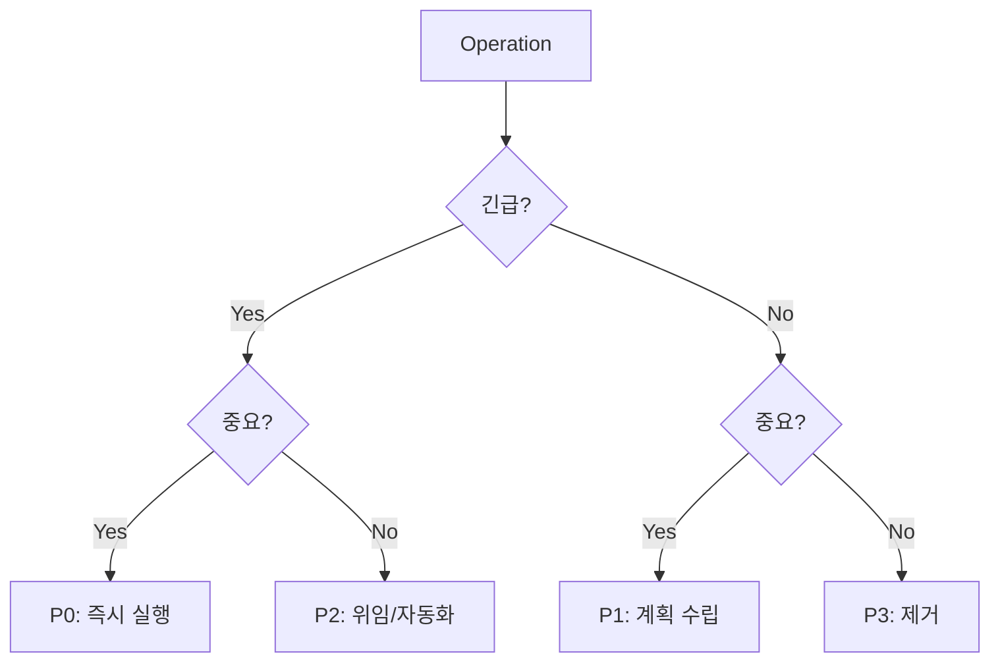
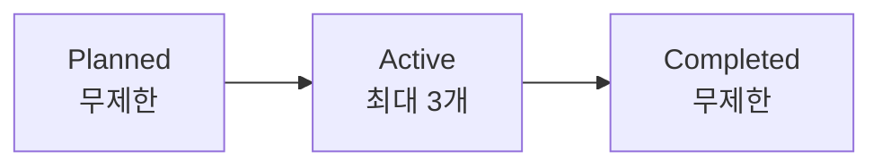
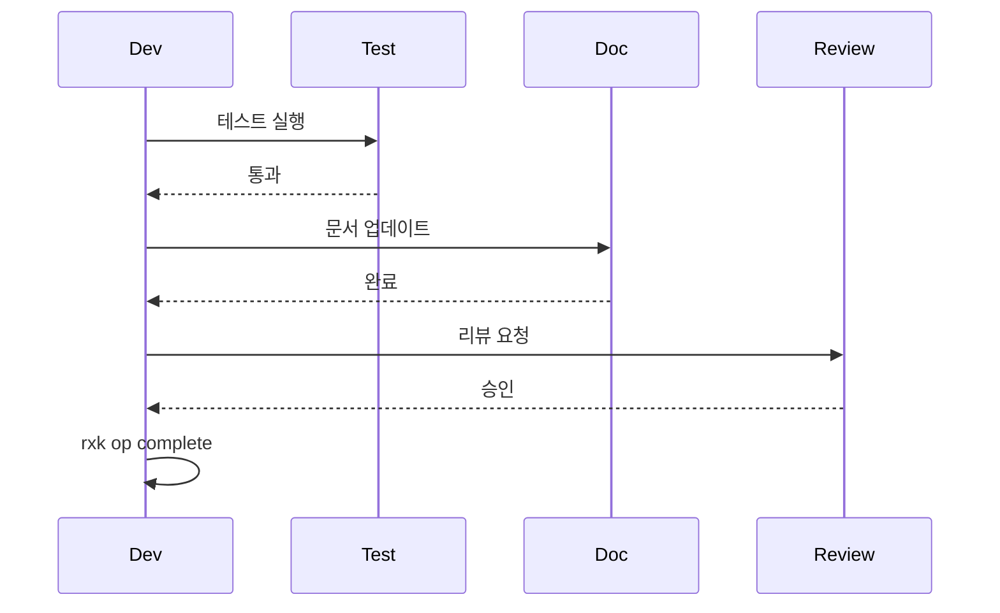
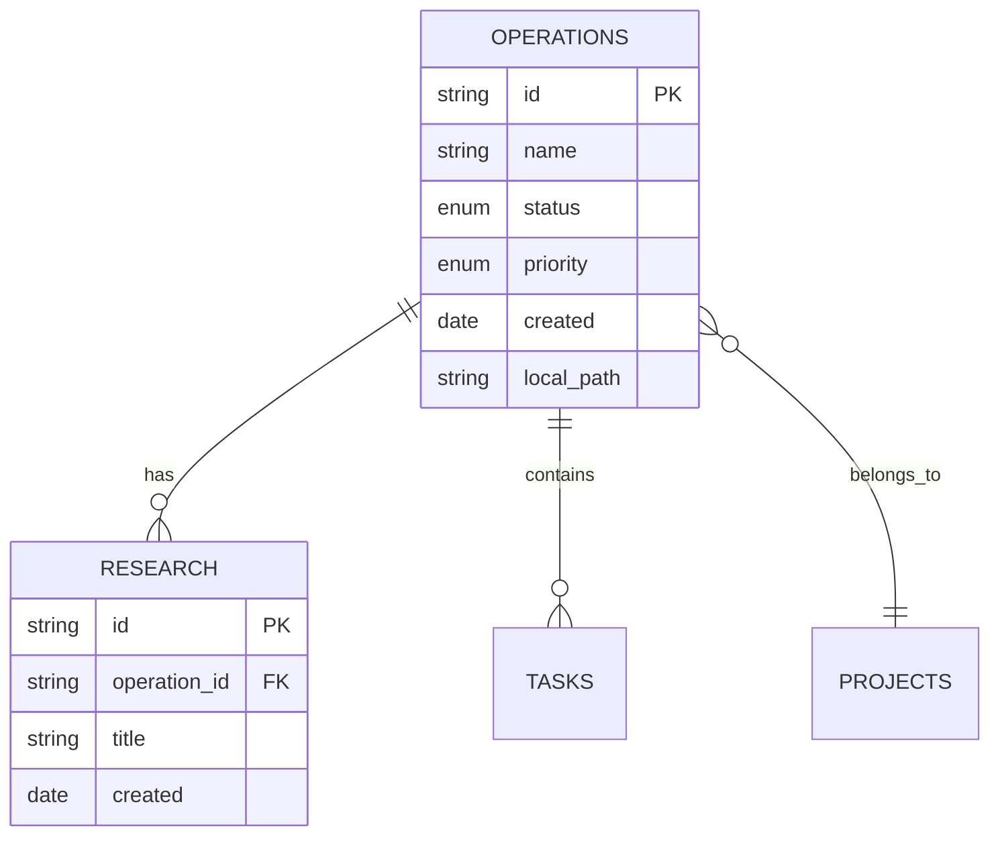
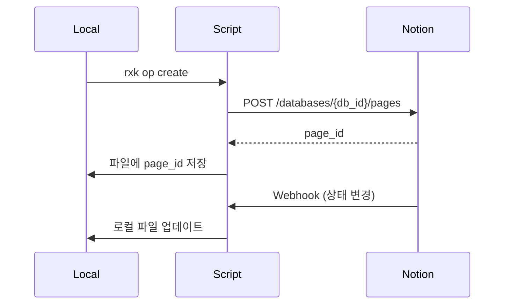

# Operation 관리 방법론

## Operation 생성 기준

### 좋은 Operation의 특성



### SMART 원칙 적용

| 원칙 | 설명 | Operation 예시 |
|---|---|---|
| **Specific** | 명확한 목표 | "Morning Squad 2-Session 운영" (O)<br/>"시스템 개선" (X) |
| **Measurable** | 측정 가능 | "YouTube 크롤러 50개 영상" (O)<br/>"학습 파이프라인" (X) |
| **Achievable** | 달성 가능 | "1-2주 완료" (O)<br/>"AGI 개발" (X) |
| **Relevant** | 프로젝트 관련성 | "Gemini API 비용 절감" (O)<br/>"React 학습" (X) |
| **Time-bound** | 기한 설정 | "2주 내 완료" (O)<br/>"언젠가" (X) |

### Operation 크기 가이드



| 단위 | 기간 | 파일 수 | 예시 |
|---|---|---|---|
| **Task** | 1-3일 | 1-3개 | "OrderService 테스트 추가" |
| **Operation** | 1-4주 | 5-15개 | "Morning Squad 2-Session" |
| **Phase** | 1-3개월 | 20-50개 | "트레이딩 시스템 v2" |
| **Project** | 6-12개월 | 100+ 개 | "AUTOCODER 전체" |

## Operation 템플릿

### 필수 섹션

```markdown
# Operation: [Name]

## Meta
- ID: op-[slug]
- Status: planned | active | completed | archived
- Created: YYYY-MM-DD
- Priority: P0 (긴급) | P1 (높음) | P2 (중간) | P3 (낮음)
- Owner: [담당자]

## Scope
- Files: `src/xxx/**`, `deploy/yyy`
- Dependencies: [op-zzz (minimal)] or None

## Goal
[1-2줄 명확한 목표]

## Success Criteria
- [ ] 기준 1
- [ ] 기준 2
- [ ] 기준 3

## Current Status
- [x] Completed task
- [ ] Pending task
- Blocker: [현재 막힌 부분]

## Context (Claude Reference)
[Claude가 이 Operation 이어서 할 때 필요한 핵심 맥락]

## History
- YYYY-MM-DD: 주요 변경사항

## Related
- Research: `docs/research/op-xxx/`
- Notion: [링크]
```

### Context 섹션 작성 팁

**좋은 예시**:
```markdown
## Context
- 현재 Morning Squad는 2-Session 구조 (09:00-11:00, 12:30-14:30)
- Multi-Strategy Router (518 lines) 구현 완료
- 다음: 전략 라이브러리 확장 (momentum, value 추가)
- 주의: session_config.py 수정 시 타임존 체크할 것
```

**나쁜 예시**:
```markdown
## Context
- Morning Squad 작업 중
- 파일 많음
- 다음에 뭐 할지 모름
```

## Operation 생명주기 (Lifecycle)



### 상태 정의

| 상태 | 의미 | 조건 |
|---|---|---|
| **Planned** | 계획됨 | 아직 시작 안 함 |
| **Active** | 진행 중 | 현재 작업 중 |
| **Blocked** | 막힘 | 외부 의존성 대기 |
| **Completed** | 완료 | Success Criteria 충족 |
| **Archived** | 보관 | 완료 후 6개월 경과 |
| **Abandoned** | 포기 | 더 이상 진행 안 함 |

## CLI 명령어 (rxk)

### 생성 명령어

```bash
# Operation 생성
rxk op create "Morning Squad 2-Session" --priority P1

# 출력:
# Created: docs/operations/planned/op-morning-squad-2-session.md
# Created: docs/research/op-morning-squad-2-session/
```

### 상태 전환 명령어

```bash
# Planned → Active
rxk op activate op-morning

# Active → Completed
rxk op complete op-morning

# Completed → Archived
rxk op archive op-morning

# Planned/Active → Abandoned
rxk op abandon op-learning
```

### 조회 명령어

```bash
# 전체 목록
rxk op list
# 출력:
# Active (2):
#   - op-morning (P1)
#   - op-guerrilla (P2)
# Planned (3):
#   - op-ambush (P1)
#   - op-trust-score (P2)

# 활성 Operation만
rxk op list --active

# 상세 정보
rxk op show op-morning
# 출력: cat docs/operations/active/op-morning.md

# Context 섹션만 (Claude용)
rxk op context op-morning
# 출력: Context 섹션 텍스트만
```

### 검색 명령어

```bash
# 키워드 검색
rxk op search "Squad"
# 출력: op-morning, op-guerrilla, op-ambush

# 우선순위 필터
rxk op list --priority P1

# 상태 필터
rxk op list --status active
```

## Operation 간 의존성 관리

### 최소화 원칙



**원칙**:
- ✅ 의존성 0-2개 = 이상적
- ⚠️ 의존성 3-4개 = 재검토 필요
- ❌ 의존성 5개 이상 = Operation 분할

### 의존성 표기법

```markdown
## Scope
- Dependencies:
  - op-infra (인프라 필요, weak)
  - op-data-pipeline (데이터 입력, strong)
```

**의존성 강도**:
- **Weak**: 없어도 동작 가능 (예: 모니터링)
- **Strong**: 반드시 필요 (예: DB 스키마)

### 순환 의존성 해결



**해결 방법**:
1. 공통 부분 추출 → op-common 생성
2. 의존 방향 역전 (Dependency Inversion)
3. Operation 재설계

## 우선순위 관리 (Priority Management)

### Eisenhower Matrix 적용



| 우선순위 | 의미 | 예시 |
|---|---|---|
| **P0** | 긴급+중요 | 프로덕션 장애 수정 |
| **P1** | 중요+비긴급 | 핵심 기능 개발 |
| **P2** | 긴급+비중요 | 문서 업데이트 |
| **P3** | 비긴급+비중요 | 실험적 기능 |

### WIP (Work In Progress) 제한

**Kanban 원칙**: 동시 작업 제한 → 집중력 증가



**규칙**:
- P0: 동시 1개
- P1: 동시 2개
- P2: 동시 3개

## 완료 기준 (Definition of Done)

### Checklist

```markdown
## Success Criteria
- [ ] 기능 구현 완료
- [ ] 유닛 테스트 통과
- [ ] 통합 테스트 통과
- [ ] 문서 업데이트
- [ ] 코드 리뷰 승인
- [ ] 배포 완료 (프로덕션)
```

### 검증 절차



## Research 연동

### Operation별 Research 폴더

```
docs/research/
├── op-morning/
│   ├── exploration.md
│   └── experiments/
├── op-guerrilla/
│   └── event-detection-research.md
└── general/
    └── llm-cost-optimization.md
```

### 명령어

```bash
# Operation 전용 Research 생성
rxk research create "2-Session 전략" --op op-morning
# → docs/research/op-morning/2-session-strategy/

# 일반 Research 생성
rxk research create "Gemini API 분석"
# → docs/research/general/gemini-api-analysis/
```

## Notion 연동 (미래)

### Database 구조



### 양방향 동기화



---

**Next**: 06-case-studies.md에서 Netflix, Amazon, Spotify 실제 사례 분석
