# 마이크로서비스 사례 연구

## Netflix: Death Star Architecture

### 배경

**2008년 데이터베이스 장애**:
- 3일간 DVD 배송 서비스 중단
- 수백만 달러 손실
- 모놀리식 아키텍처의 한계 인식

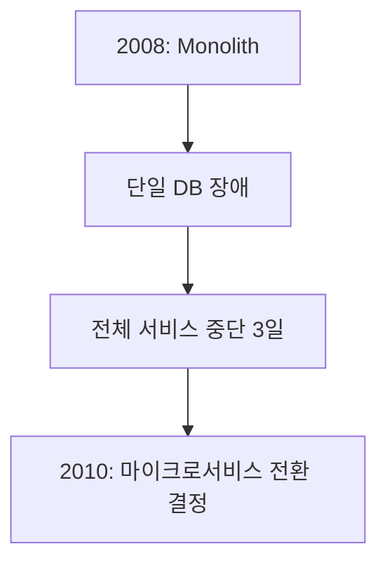

### 전환 과정 (2010-2016)

| 연도 | 서비스 수 | 주요 마일스톤 |
|---|---|---|
| 2010 | 1 (Monolith) | AWS 클라우드 이전 시작 |
| 2012 | 100 | Streaming Service 분리 |
| 2014 | 300 | Chaos Monkey 도입 (장애 주입 테스트) |
| 2016 | 500+ | 완전한 마이크로서비스 전환 |

### 주요 서비스 분리

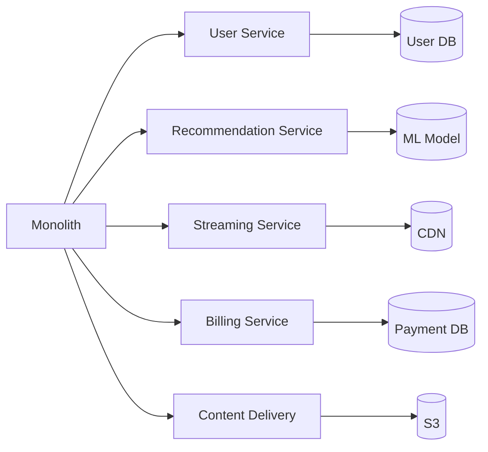

### Recommendation Service 상세

**알고리즘 독립 배포**:
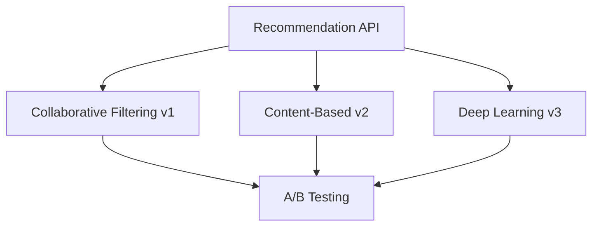

- 각 알고리즘 = 독립 서비스
- 실시간 A/B 테스트
- 배포 영향 없이 알고리즘 교체

### 성과

| 지표 | Before | After | 개선율 |
|---|---|---|---|
| 배포 빈도 | 주 1회 | 일 4,000회 | 28,000배 |
| 장애 복구 시간 | 4시간 | 15분 | 16배 |
| 개발자 생산성 | 1x | 3x | 3배 |
| 서비스 가용성 | 99.5% | 99.99% | 10배 개선 |

### 교훈

1. **Chaos Engineering**: 장애를 주입해서 복원력 테스트
2. **Circuit Breaker**: 장애 서비스 자동 격리
3. **Bulkhead Pattern**: 리소스 격리로 장애 전파 방지

## Amazon: Two-Pizza Team

### 배경

**2000년대 초 확장 문제**:
- 개발자 수천 명 → 하나의 코드베이스
- 배포 조정에 몇 주 소요
- 팀 간 의존성 해결 회의 증가

### Jeff Bezos의 결정 (2002)

> "팀원이 피자 2판으로 배불러야 한다"

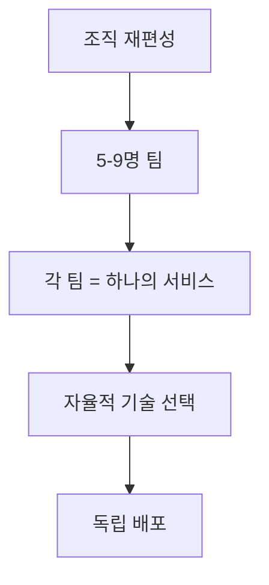

### API Mandate (2002)

**내부 공지**:
1. 모든 팀은 API를 통해서만 데이터 교환
2. 직접적인 DB 접근 금지
3. 기술 스택 제한 없음
4. 위반 시 해고

### 서비스 예시

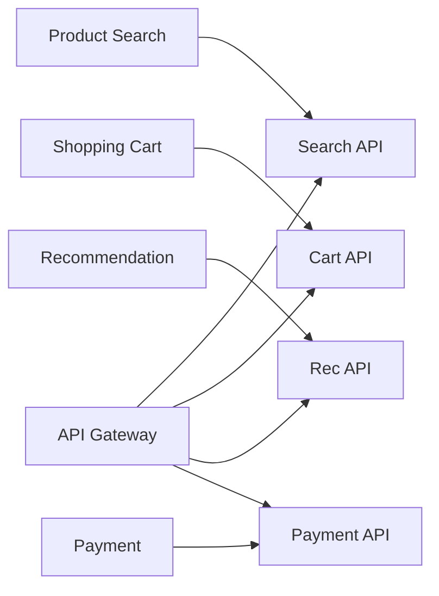

### 성과

| 항목 | 측정값 | 출처 |
|---|---|---|
| 일일 배포 횟수 | 10,000회 | 2014 Re:Invent |
| 평균 배포 시간 | 11.6초 | 2011 발표 |
| 서비스 수 | 수천 개 | 2015 추정 |
| 개발자당 생산성 | 3배 증가 | 2016 보고서 |

### 교훈

1. **Conway's Law**: 조직 구조 = 시스템 구조
2. **Service Ownership**: 팀이 서비스를 소유 ("You build it, you run it")
3. **API-First**: 내부 API = 외부 API 수준의 품질

## Spotify: Squad 모델

### 배경

**2010년 성장 문제**:
- 사용자 1,000만 → 1억
- 개발자 50명 → 500명
- 전통적 부서 구조 한계

### Squad 모델 (2012)

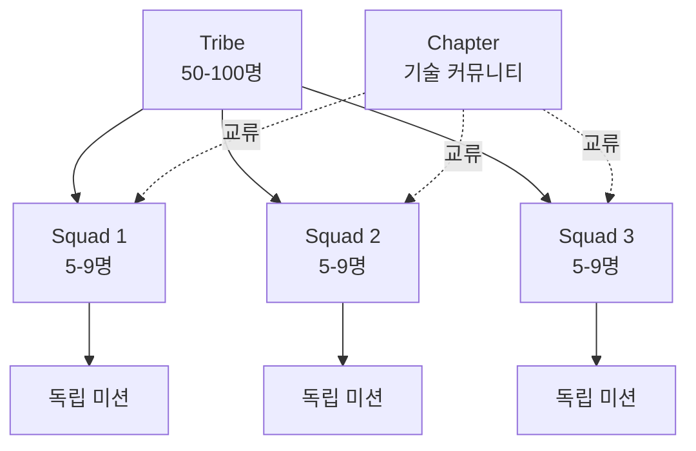

### 구조 정의

| 단위 | 크기 | 역할 |
|---|---|---|
| **Squad** | 5-9명 | 제품 기능 담당 (예: "검색") |
| **Tribe** | 50-100명 | 관련 Squad 그룹 (예: "Discovery") |
| **Chapter** | 5-15명 | 같은 기술 역할 (예: "Backend 개발자") |
| **Guild** | 무제한 | 관심사 커뮤니티 (예: "DevOps") |

### 자율성 vs 일관성

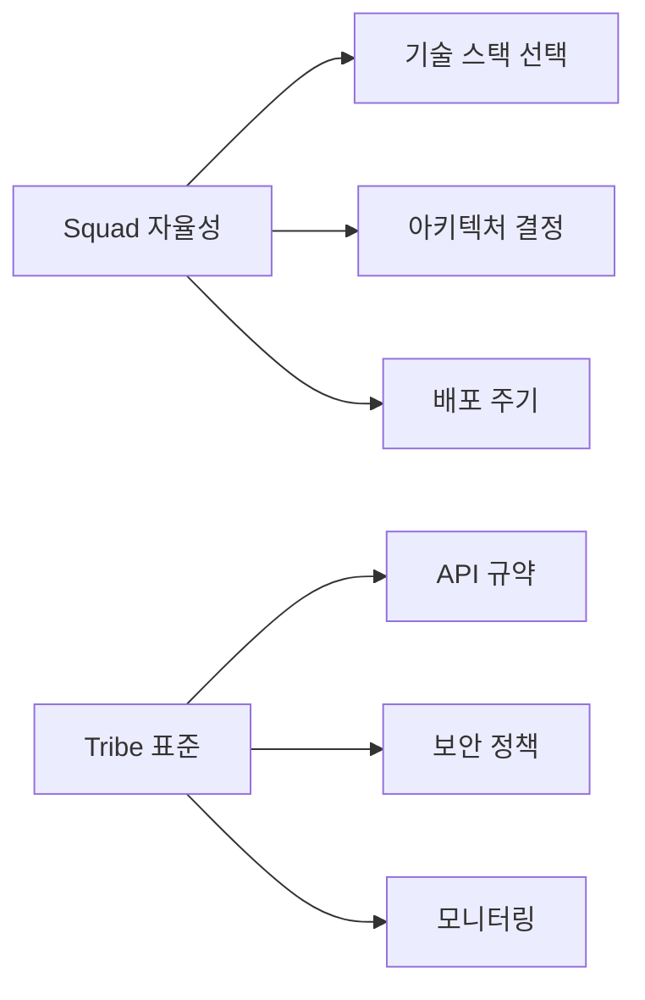

### 성과

| 지표 | Before | After | 출처 |
|---|---|---|---|
| 배포 주기 | 주 1회 | 주 3회 | 2014 보고서 |
| 개발자 만족도 | 85% | 92% | 2014 설문 |
| 신규 기능 출시 | 월 2개 | 주 5개 | 2015 데이터 |

### 교훈

1. **자율성 + 정렬**: 자유롭지만 방향은 일치
2. **크로스펑셔널 팀**: 디자이너+개발자+PO 한 팀
3. **지속적 개선**: 조직 구조도 실험 대상

## Uber: Microservices at Scale

### 배경

**2014년 Monolith 한계**:
- Python/Node.js 모놀리식
- 도시별 기능 차이 반영 어려움
- 확장 불가능

### 전환 (2015-2017)

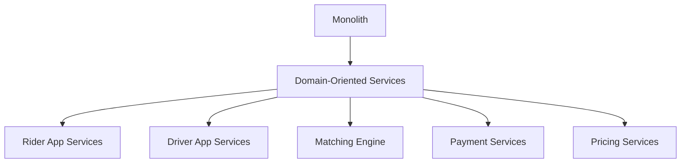

### 서비스 수 증가

| 연도 | 서비스 수 | 특징 |
|---|---|---|
| 2015 | 50 | 핵심 서비스만 |
| 2016 | 500 | 도시별 커스터마이징 |
| 2018 | 1,000+ | 음식 배달 등 확장 |
| 2020 | 2,200+ | 글로벌 확장 |

### Matching Engine 상세

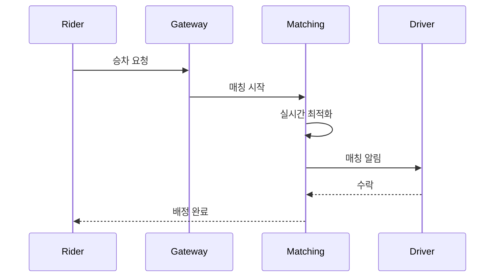

**특징**:
- 독립적 스케일링 (초당 수만 요청 처리)
- 알고리즘 A/B 테스트
- 도시별 규칙 적용

### 성과

| 지표 | 측정값 | 출처 |
|---|---|---|
| 일일 배포 | 4,000회 | 2018 Uber Engineering |
| 서비스 가용성 | 99.99% | 2019 보고서 |
| 평균 응답 시간 | <100ms | 2020 데이터 |

### 도전 과제

1. **분산 추적**: Jaeger 도입 (전체 요청 흐름 추적)
2. **데이터 일관성**: Eventual Consistency 허용
3. **팀 조정**: Platform Team으로 공통 인프라 관리

## Airbnb: Service-Oriented Architecture

### 배경

**2016년 Monolith → SOA**:
- Ruby on Rails 모놀리식
- 예약/결제/메시징 등 결합도 높음
- 국제화 어려움

### 전환 전략

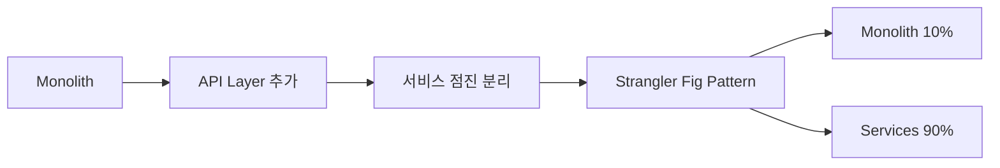

### 주요 서비스

| 서비스 | 역할 | 기술 스택 |
|---|---|---|
| **Listing Service** | 숙소 정보 관리 | Java/Kafka |
| **Booking Service** | 예약 처리 | Ruby/MySQL |
| **Payment Service** | 결제 처리 | Java/PostgreSQL |
| **Messaging Service** | 호스트-게스트 메시지 | Node.js/Redis |

### 국제화 지원

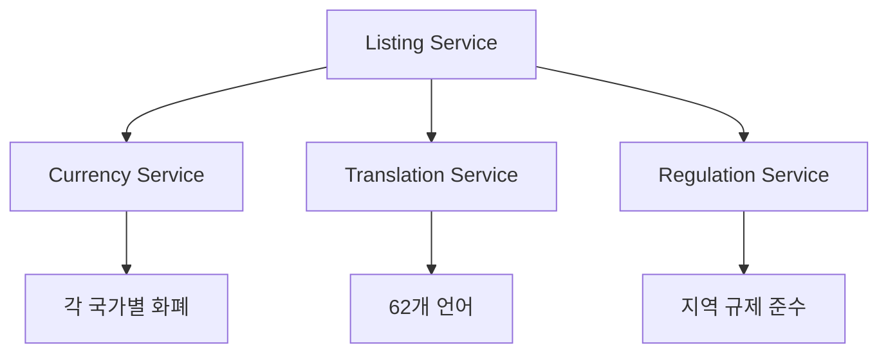

### 성과

| 지표 | Before | After |
|---|---|---|
| 신규 국가 진출 시간 | 3개월 | 2주 |
| 배포 빈도 | 주 2회 | 일 20회 |
| 개발자 온보딩 | 1개월 | 1주 |

## 공통 패턴 분석

### 1. Strangler Fig Pattern (점진적 마이그레이션)

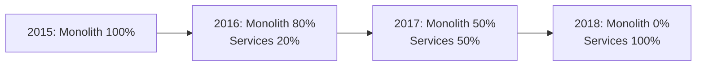

**모든 회사 공통**:
- 한 번에 전환하지 않음
- 신규 기능부터 마이크로서비스로 구현
- 레거시는 점진적 분리

### 2. Platform Team

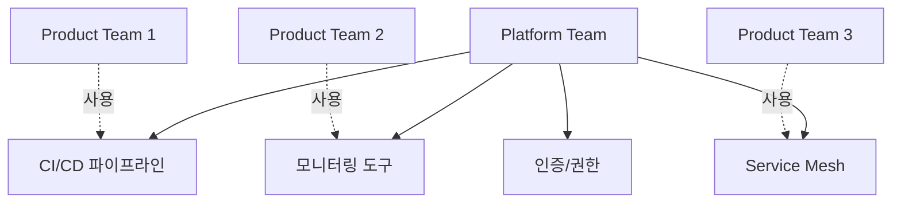

**Netflix, Amazon, Uber 공통**:
- 공통 인프라 = Platform Team 담당
- Product Team = 비즈니스 로직만 집중

### 3. Service Ownership

> "You build it, you run it" - Werner Vogels (Amazon CTO)

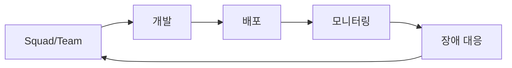

**모든 회사 공통**:
- 개발팀 = 운영팀
- 24시간 On-call 책임
- 빠른 피드백 루프

---

**Next**: 07-autocoder-application.md에서 AUTOCODER 프로젝트 적용 방안
