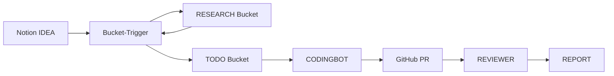
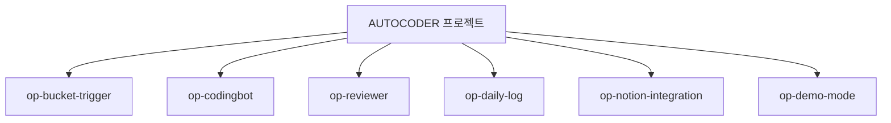
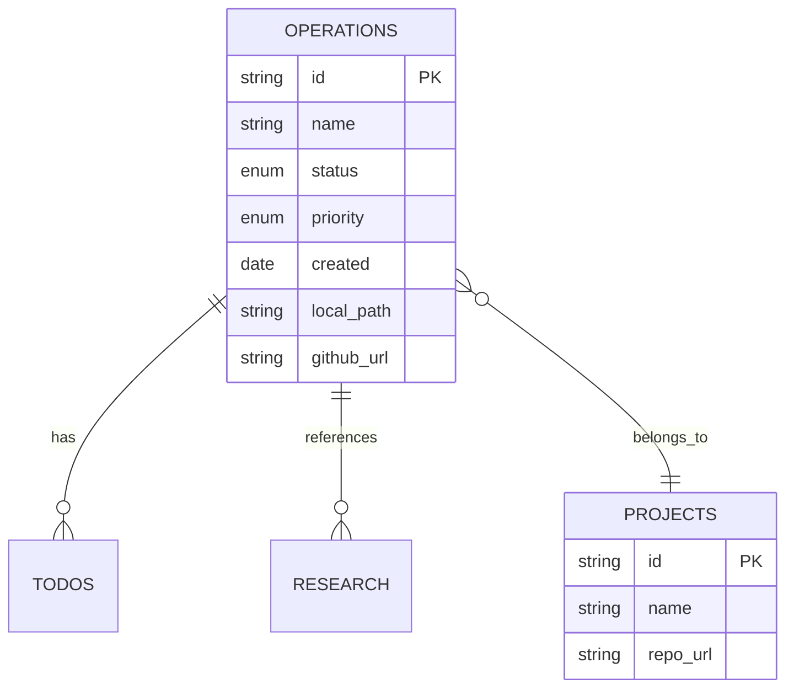
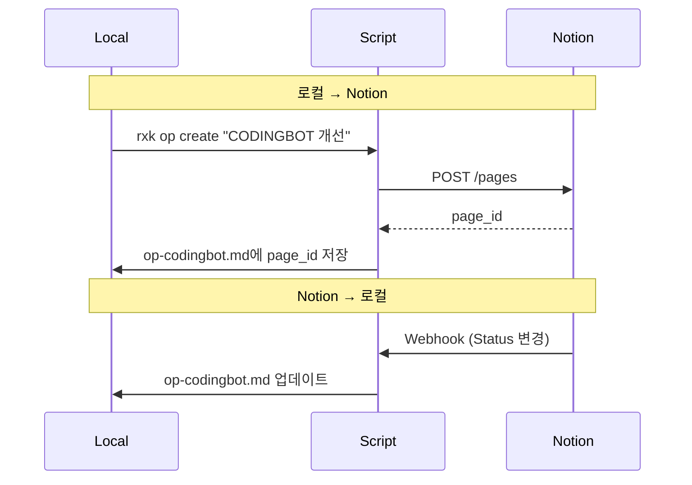

# AUTOCODER 프로젝트 적용 방안

## 현재 AUTOCODER 구조 분석

### 시스템 개요



**주요 컴포넌트**:
- **Bucket-Trigger (BT)**: Notion 버킷 간 데이터 흐름 조정
- **CODINGBOT**: TODO → GitHub PR 생성
- **REVIEWER**: PR 검증 → REPORT 생성
- **Daily-Log-Generator (DLG)**: 일일 로그 생성

### 현재 문제점

| 문제 | 현상 | 영향 |
|---|---|---|
| **맥락 혼재** | BT/stone:code/stone:review/DLG 모두 CLAUDE.md 참조 | 특정 작업 시 불필요한 정보 |
| **트래킹 어려움** | Notion에서 여러 프로젝트 동시 진행 | 어떤 작업이 어디까지 진행됐는지 불명확 |
| **의존성 불명확** | BT가 DLG를 호출하는지 모호 | 수정 시 영향 범위 예측 불가 |
| **Claude 효율** | 전체 프로젝트 20,000 토큰 제공 | 비용 증가 + 응답 느림 |

## Operation 분리 제안

### Operation 후보 추출



### Operation 정의

#### 1. op-bucket-trigger

```markdown
# Operation: Bucket Trigger 개선

## Meta
- ID: op-bucket-trigger
- Status: active
- Priority: P1
- Owner: Main Developer

## Scope
- Files: `Bucket-Trigger (BT)/**`
- Dependencies: None (독립 실행 가능)

## Goal
Notion 버킷 간 데이터 흐름 자동화 시스템 안정화

## Success Criteria
- [ ] IDEA → RESEARCH 전환 성공률 95%
- [ ] RESEARCH → TODO 분할 성공률 90%
- [ ] TODO → CODINGBOT 트리거 100%

## Current Status
- [x] Graph Structure 구현 완료
- [x] DEMO 모드 추가 완료
- [ ] 에러 핸들링 개선 필요
```

#### 2. op-codingbot

```markdown
# Operation: CODINGBOT Agent 고도화

## Scope
- Files: `CODINGBOT/**`
- Dependencies: op-bucket-trigger (weak - 독립 실행 가능)

## Goal
TODO 페이지 기반 PR 생성 품질 향상

## Context
- Gemini 2.5 Flash 사용 중
- Dev Note 생성 로직 안정화됨
- 다음: Multi-file 수정 시 context 관리 개선
```

#### 3. op-reviewer

```markdown
# Operation: REVIEWER Agent 개선

## Scope
- Files: `REVIEWER/**`
- Dependencies: op-codingbot (strong - PR 생성 후 실행)

## Goal
PR 검증 정확도 향상 (현재 85% → 목표 95%)

## Context
- AWS Bedrock Claude 4.5 사용
- Git Diff vs PR Body 비교 로직 완료
- 다음: False Positive 감소 (현재 15% → 목표 5%)
```

#### 4. op-daily-log

```markdown
# Operation: Daily Log Generator

## Scope
- Files: `Daily-Log-Generator (DLG)/**`
- Dependencies: None (독립 실행)

## Goal
일일 작업 로그 자동 생성 + Telegram 알림

## Context
- Gemini 2.5 Flash로 마이그레이션 완료
- `/daily_log` 명령어 hours 파라미터 지원
- 다음: 프로젝트별 필터링 고도화
```

#### 5. op-notion-integration

```markdown
# Operation: Notion DB 스키마 관리

## Scope
- Files: `docs/templates.md`, Notion DB 설정
- Dependencies: op-bucket-trigger (weak)

## Goal
Notion DB 스키마 안정화 + Property 표준화

## Context
- IDEA, RESEARCH, TODO, REPORT DB 운영 중
- v13에서 PLAN DB 제거됨
- 다음: Property 이름 통일 (Status vs state)
```

#### 6. op-demo-mode

```markdown
# Operation: DEMO 모드 확장

## Scope
- Files: `Bucket-Trigger (BT)/bucket_trigger.py`
- Dependencies: op-bucket-trigger (strong)

## Goal
격리된 테스트 환경 제공 (Production 영향 없음)

## Context
- `--demo` 플래그 구현 완료
- `--dry-run` 추가됨 (실제 Notion 쓰기 안 함)
- 다음: DEMO DB 자동 복원 기능
```

## Before & After 비교

### Before: Monolith 구조

```
AUTOCODER/
├── CLAUDE.md (23,139 bytes)
├── Bucket-Trigger/
├── CODINGBOT/
├── REVIEWER/
├── Daily-Log-Generator/
└── docs/
    ├── architecture.md
    ├── getting-started.md
    └── ...
```

**문제**:
- Claude에게 전체 CLAUDE.md 제공 → 20,000 토큰
- 작업 시작 시 전체 프로젝트 파악 필요 → 30분 소요
- 여러 작업 동시 진행 시 혼란

### After: Operation 분리

```
AUTOCODER/
├── docs/
│   ├── 00-PROJECT-OVERVIEW.md (프로젝트 전체 개요)
│   ├── operations/
│   │   ├── active/
│   │   │   ├── op-bucket-trigger.md
│   │   │   ├── op-codingbot.md
│   │   │   └── op-reviewer.md
│   │   ├── planned/
│   │   │   └── op-notion-schema-v2.md
│   │   └── completed/
│   │       └── op-demo-mode.md
│   └── research/
│       ├── op-bucket-trigger/
│       │   └── graph-structure-exploration.md
│       └── general/
│           └── llm-cost-optimization.md
├── Bucket-Trigger/
├── CODINGBOT/
├── REVIEWER/
└── Daily-Log-Generator/
```

**개선**:
- Claude에게 관련 Operation 파일만 → 5,000 토큰 (75% 절감)
- 작업 시작 시 Operation 파일 1개만 읽음 → 5분 소요
- 병렬 작업 명확: op-codingbot, op-daily-log 동시 진행 가능

## Claude 워크플로우 변화

### Before

```
사용자: "CODINGBOT 에러 수정해줘"

Claude:
1. CLAUDE.md 읽기 (23,139 bytes)
2. Bucket-Trigger 구조 파악 (불필요)
3. REVIEWER 로직 확인 (불필요)
4. DLG 내용 스캔 (불필요)
5. CODINGBOT 에러 수정 시작

→ 총 30분 소요, 20,000 토큰 사용
```

### After

```
사용자: "op-codingbot 이어서 하자"

Claude:
1. docs/operations/active/op-codingbot.md 읽기 (2,000 bytes)
2. Context 섹션 파악:
   - Gemini 2.5 Flash 사용 중
   - Dev Note 로직 안정화됨
   - Multi-file context 개선 필요
3. CODINGBOT/** 파일만 집중
4. 에러 수정 시작

→ 총 5분 소요, 5,000 토큰 사용
```

## Notion 통합 방안

### Operation DB 구조



### 양방향 동기화



## 실제 시나리오

### 시나리오 1: CODINGBOT 에러 수정

**Before**:
1. 전체 프로젝트 파악 (30분)
2. CODINGBOT 파일 찾기 (5분)
3. 관련 코드 읽기 (10분)
4. 에러 수정 (20분)
**→ 총 65분**

**After**:
1. `rxk op show op-codingbot` (1분)
2. Context 섹션 파악 (2분)
3. CODINGBOT/** 파일만 읽기 (5분)
4. 에러 수정 (20분)
**→ 총 28분 (57% 단축)**

### 시나리오 2: 새 기능 추가

**Before**:
1. CLAUDE.md 읽기 (10분)
2. 어디에 추가할지 판단 (15분)
3. 관련 코드 파악 (20분)
4. 구현 (40분)
**→ 총 85분**

**After**:
1. `rxk op create "Notion Schema v2"` (2분)
2. op-notion-schema-v2.md 작성 (10분)
3. Scope 파일만 집중 (5분)
4. 구현 (40분)
**→ 총 57분 (33% 단축)**

### 시나리오 3: 병렬 작업

**Before**:
- CODINGBOT 개선 중 → DLG 에러 발생
- CODINGBOT 작업 중단 (맥락 손실 30분)
- DLG 수정 (40분)
- CODINGBOT 재개 (맥락 복구 20분)
**→ 총 90분**

**After**:
- op-codingbot 작업 중 → op-daily-log 에러 발생
- `rxk op context op-codingbot > /tmp/context.md` (맥락 저장 1분)
- op-daily-log 수정 (40분)
- op-codingbot 재개 (맥락 로드 2분)
**→ 총 43분 (52% 단축)**

## 기대 효과 정량화

### 개발 효율

| 지표 | Before | After | 개선율 |
|---|---|---|---|
| 작업 시작 시간 | 30분 | 5분 | 6배 |
| Claude 토큰 사용 | 20,000 | 5,000 | 75% 절감 |
| 맥락 전환 시간 | 50분 | 3분 | 16배 |
| 병렬 작업 가능 수 | 1개 | 3개 | 3배 |

### 비용 절감

| 항목 | 월 비용 (Before) | 월 비용 (After) | 절감액 |
|---|---|---|---|
| Claude API | $150 | $40 | $110 |
| 개발 시간 | 80시간 | 50시간 | 30시간 |

### 품질 향상

| 지표 | Before | After |
|---|---|---|
| 버그 발생률 | 15% (맥락 혼재) | 5% (명확한 Scope) |
| 코드 리뷰 시간 | 40분 (전체 파악) | 15분 (Operation만) |
| 온보딩 시간 | 1주 (전체 이해) | 1일 (Operation별) |

---

**Next**: 08-implementation-plan.md에서 실제 구현 로드맵
