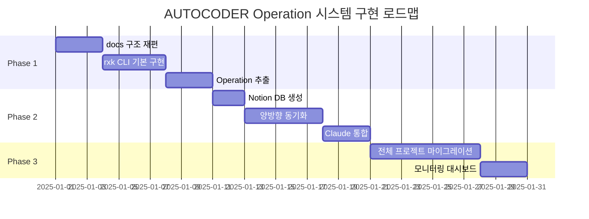
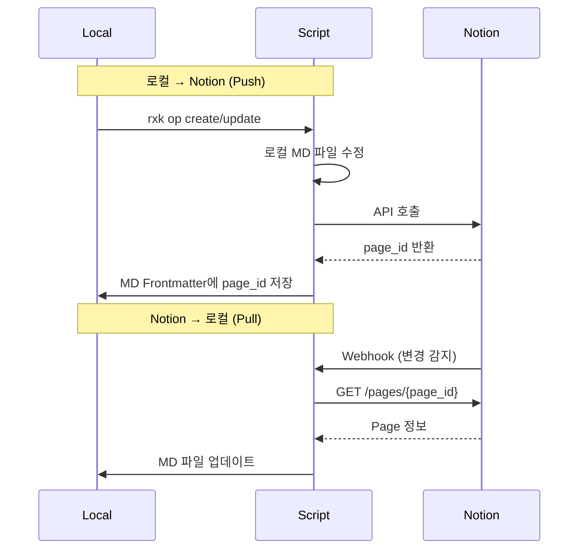
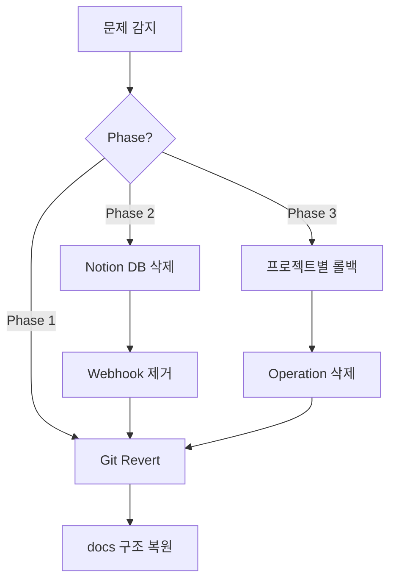

# 구현 로드맵

## 전체 개요



## Phase 1: 로컬 기반 시스템 (Week 1-2)

### 목표
Operation 개념을 로컬에서 완전히 검증

### 작업 목록

#### 1.1 docs 구조 재편 (3일)

**작업**:
```bash
# Before
AUTOCODER/
├── docs/
│   ├── architecture.md
│   ├── getting-started.md
│   └── ...
└── docs/research/
    └── topic-a/

# After
AUTOCODER/
├── docs/
│   ├── 00-PROJECT-OVERVIEW.md
│   ├── operations/
│   │   ├── active/
│   │   ├── planned/
│   │   ├── completed/
│   │   └── archived/
│   ├── research/
│   │   ├── op-xxx/
│   │   └── general/
│   └── guides/
│       ├── architecture.md
│       └── getting-started.md
```

**체크리스트**:
- [ ] `docs/00-PROJECT-OVERVIEW.md` 생성 (CLAUDE.md 요약)
- [ ] `docs/operations/` 디렉토리 구조 생성
- [ ] `docs/research/` → `docs/research/` 이동
- [ ] 기존 docs → `docs/guides/` 이동
- [ ] `.gitignore` 업데이트

#### 1.2 rxk CLI 기본 구현 (4일)

**파일 구조**:
```
.claude/
└── scripts/
    ├── rxk_op.py          # Operation 관리
    ├── rxk_research.py    # Research 관리
    └── lib/
        ├── operation.py   # Operation 클래스
        └── template.py    # 템플릿 관리
```

**명령어 구현 순서**:
```bash
# Day 1: Create
rxk op create "Operation Name" --priority P1

# Day 2: Lifecycle
rxk op activate op-xxx
rxk op complete op-xxx
rxk op archive op-xxx

# Day 3: Query
rxk op list
rxk op list --active
rxk op show op-xxx

# Day 4: Context
rxk op context op-xxx
```

**테스트 케이스**:
```bash
# TC1: Operation 생성
rxk op create "Test Operation" --priority P1
# 검증: docs/operations/planned/op-test-operation.md 생성

# TC2: 상태 전환
rxk op activate op-test-operation
# 검증: planned/ → active/ 이동

# TC3: 조회
rxk op list --active
# 검증: op-test-operation 출력

# TC4: Context 추출
rxk op context op-test-operation
# 검증: Context 섹션만 출력
```

#### 1.3 AUTOCODER Operation 추출 (3일)

**추출 대상**:
```markdown
# Day 1: 핵심 Operation 3개
- op-bucket-trigger
- op-codingbot
- op-reviewer

# Day 2: 서브 Operation 3개
- op-daily-log
- op-notion-integration
- op-demo-mode

# Day 3: 검증 및 조정
- 의존성 검증 (weak vs strong)
- Scope 검증 (파일 범위 적절한지)
- Success Criteria 작성
```

**검증 기준**:
- [ ] 각 Operation 크기: 5-15개 파일
- [ ] 의존성 수: 0-2개
- [ ] 완료 기간: 1-4주 예상
- [ ] Context 섹션 작성 완료

### Phase 1 완료 조건
- [ ] 전체 Operation 6개 추출 완료
- [ ] rxk CLI 12개 명령어 동작
- [ ] docs 구조 재편 완료
- [ ] Git commit: "feat: Phase 1 - Operation System 로컬 기반 완료"

## Phase 2: Notion 통합 (Week 3-4)

### 목표
Notion과 양방향 동기화 구현

### 작업 목록

#### 2.1 Notion DB 생성 (2일)

**DB 구조**:
```
Database: OPERATIONS
├── Property: Name (Title)
├── Property: Status (Select: Planned/Active/Completed/Archived)
├── Property: Priority (Select: P0/P1/P2/P3)
├── Property: Project (Relation → PROJECTS DB)
├── Property: Local Path (Text)
├── Property: GitHub URL (URL)
├── Property: Created (Date)
├── Property: Owner (Person)
└── Property: Dependencies (Relation → OPERATIONS DB)
```

**생성 스크립트**:
```python
# .claude/scripts/setup_notion_operations_db.py
import os
from notion_client import Client

notion = Client(auth=os.getenv("NOTION_TOKEN"))

# Database 생성
db = notion.databases.create(
    parent={"type": "page_id", "page_id": PARENT_PAGE_ID},
    title=[{"type": "text", "text": {"content": "OPERATIONS"}}],
    properties={
        "Name": {"title": {}},
        "Status": {
            "select": {
                "options": [
                    {"name": "Planned", "color": "gray"},
                    {"name": "Active", "color": "blue"},
                    {"name": "Completed", "color": "green"},
                    {"name": "Archived", "color": "brown"},
                ]
            }
        },
        # ... 나머지 Property
    },
)
```

#### 2.2 양방향 동기화 (5일)

**동기화 전략**:


**구현 파일**:
```python
# .claude/scripts/rxk_notion_sync.py

def push_to_notion(operation_md_path):
    """로컬 MD → Notion"""
    # 1. MD 파일 파싱 (Frontmatter + Content)
    # 2. Notion Page 생성/업데이트
    # 3. page_id를 Frontmatter에 저장
    pass

def pull_from_notion(page_id):
    """Notion → 로컬 MD"""
    # 1. Notion Page 조회
    # 2. Properties → MD Frontmatter 변환
    # 3. Blocks → MD Content 변환
    pass

def watch_notion_changes():
    """Notion Webhook 수신 (Cloud Run)"""
    # 1. Webhook 수신
    # 2. 변경된 page_id 추출
    # 3. pull_from_notion(page_id) 호출
    pass
```

**Webhook 설정**:
```yaml
# Notion → Local Webhook (Cloud Run)
service: notion-webhook-handler
trigger: POST /webhook/notion
env:
  - NOTION_TOKEN
  - GITHUB_TOKEN (로컬 MD 업데이트용)
```

#### 2.3 Claude 통합 (3일)

**Claude 워크플로우**:
```python
# Claude 내부 로직 (가상 코드)

def handle_user_request(user_input):
    # "op-codingbot 이어서 하자" 감지
    if "op-" in user_input and "이어서" in user_input:
        op_id = extract_operation_id(user_input)

        # Operation Context 로드
        context = run_bash(f"rxk op context {op_id}")

        # 관련 파일만 읽기
        files = parse_scope(context)
        for file in files:
            read_file(file)

        # 작업 수행
        perform_task(context, files)

        # Operation 상태 업데이트
        update_operation_status(op_id)
```

**CLAUDE.md 수정**:
```markdown
# CLAUDE.md

## Operation 시스템 사용법

사용자가 "op-xxx 이어서 하자" 요청 시:

1. `rxk op context op-xxx` 실행
2. Context 섹션 파싱
3. Scope 파일만 읽기
4. 작업 수행
5. Current Status 업데이트
6. History 추가

예시:
사용자: "op-codingbot 이어서 하자"
→ rxk op context op-codingbot
→ CODINGBOT/** 파일만 집중
```

### Phase 2 완료 조건
- [ ] Notion OPERATIONS DB 생성
- [ ] 로컬 → Notion 동기화 동작
- [ ] Notion → 로컬 동기화 동작 (Webhook)
- [ ] Claude가 Operation Context 자동 로드
- [ ] Git commit: "feat: Phase 2 - Notion 통합 완료"

## Phase 3: 전체 마이그레이션 (Week 5-6)

### 목표
모든 프로젝트에 Operation 시스템 적용

### 작업 목록

#### 3.1 다른 프로젝트 마이그레이션 (7일)

**대상 프로젝트** (DEV 하위):
```
DEV/
├── _AUTOCODER (완료)
├── guerrilla-DANTA-squad
├── kbo-prediction-db
├── OPCD-dreamdoc
└── ...
```

**일정**:
- Day 1-2: guerrilla-DANTA-squad
- Day 3-4: kbo-prediction-db
- Day 5-6: OPCD-dreamdoc
- Day 7: 검증 및 조정

**마이그레이션 체크리스트** (프로젝트당):
```bash
# 1. docs 구조 생성
mkdir -p docs/operations/{active,planned,completed,archived}
mkdir -p docs/research/{general}

# 2. Operation 추출
rxk op create "Operation 1" --priority P1
rxk op create "Operation 2" --priority P2

# 3. Notion 동기화
rxk notion sync --project {project_name}

# 4. 검증
rxk op list
```

#### 3.2 모니터링 대시보드 (3일)

**Streamlit 대시보드**:
```python
# .claude/scripts/operation_dashboard.py

import streamlit as st
from notion_client import Client

st.title("AUTOCODER Operation Dashboard")

# 전체 Operation 통계
total = len(list_operations())
active = len(list_operations(status="active"))
completed = len(list_operations(status="completed"))

col1, col2, col3 = st.columns(3)
col1.metric("Total", total)
col2.metric("Active", active)
col3.metric("Completed", completed)

# Operation 목록
st.subheader("Active Operations")
for op in list_operations(status="active"):
    with st.expander(op.name):
        st.write(f"Priority: {op.priority}")
        st.write(f"Owner: {op.owner}")
        st.write(f"Progress: {op.progress}%")
        st.button("Open in Notion", key=op.id)
```

**실행**:
```bash
cd .claude/scripts
streamlit run operation_dashboard.py
```

### Phase 3 완료 조건
- [ ] 모든 프로젝트 Operation 시스템 적용
- [ ] Notion에서 전체 Operation 조회 가능
- [ ] 대시보드에서 진행 상황 시각화
- [ ] Git commit: "feat: Phase 3 - 전체 마이그레이션 완료"

## 롤백 계획

### 문제 발생 시



### 롤백 명령어

```bash
# Phase 1 롤백
git revert HEAD~5..HEAD  # Phase 1 커밋 5개 되돌리기
rm -rf docs/operations docs/research
git mv docs/guides/* docs/

# Phase 2 롤백
python .claude/scripts/delete_notion_operations_db.py
gcloud run services delete notion-webhook-handler

# Phase 3 롤백
for project in guerrilla kbo-prediction opcd-dreamdoc; do
    cd ~/DEV/$project
    git revert HEAD
done
```

## 검증 계획

### 성공 지표

| 지표 | 목표값 | 측정 방법 |
|---|---|---|
| 작업 시작 시간 | <5분 | Claude 로그 분석 |
| 토큰 사용량 | <7,000 | OpenAI API 로그 |
| Operation 생성 시간 | <3분 | `time rxk op create` |
| Notion 동기화 지연 | <10초 | Webhook 응답 시간 |
| 개발자 만족도 | >90% | 설문조사 |

### 테스트 시나리오

```bash
# Scenario 1: 새 Operation 생성
time rxk op create "Test Op" --priority P1
# 예상: <3분

# Scenario 2: Claude 작업 시작
echo "op-test-op 이어서 하자" | claude
# 예상: Context 로드 <5초

# Scenario 3: Notion 동기화
rxk op activate op-test-op
sleep 10
# Notion에서 Status = "Active" 확인

# Scenario 4: 병렬 작업
rxk op activate op-1 &
rxk op activate op-2 &
wait
# 예상: 충돌 없음
```

---

**Next**: 09-references.md에서 참고 자료 정리
